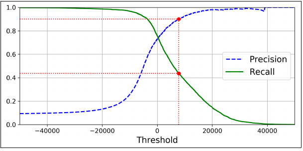
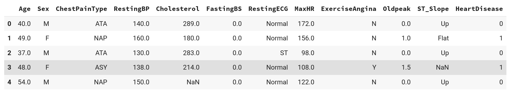
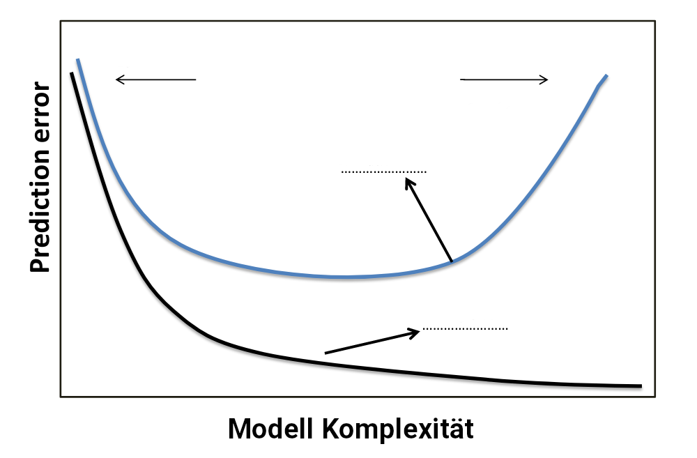
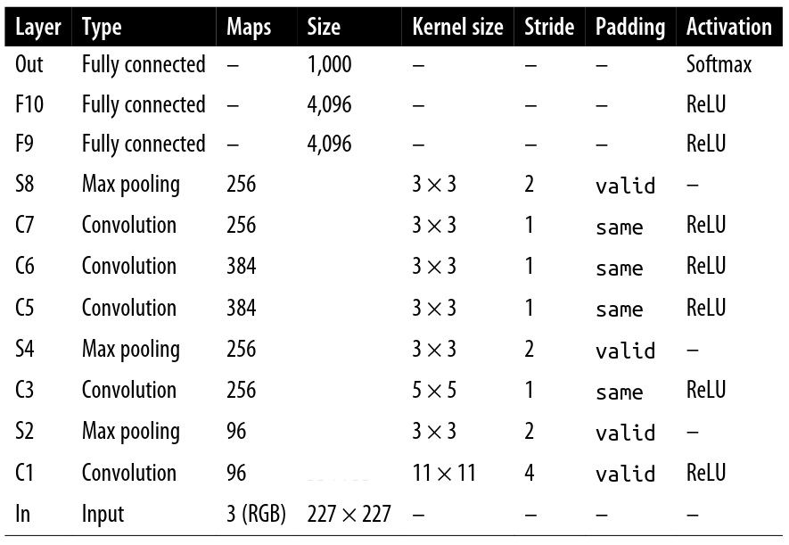
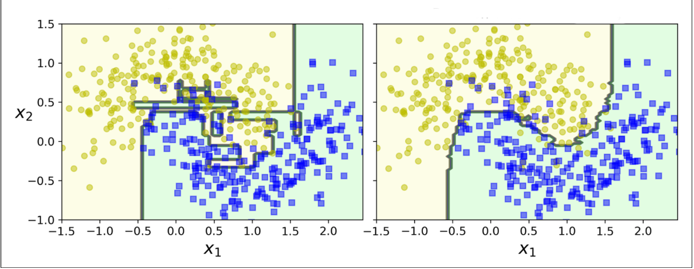

---
title:
  - Klausur zu Healthcare Data Analytics
author:
  - Dr. Michael Strobel
date:
  - 15.07.2022
---

# Organisatorisches

#### Vorname:

#### Nachname:

#### Matrikelnummer:

### Rahmenbedingungen

- Die Klausur dauert 90 Minuten.
- Die Klausur enthält 6 Aufgaben auf 18 Seiten. Bitte überprüfen Sie ob der Klausurbogen vollständig ist.
- Jede Aufgabe wird mit maximal 10 Punkten bewertet.
- Erlaubte Hilfsmittel: ein doppelseitig beschriebenes Din-A4 Blatt und ein (nicht programmierbarer) Taschenrechner.
- Weitere Hilfsmittel sind nicht erlaubt.

\newpage

# Aufgabe 1: Allgemeines Verständnis

#### Beantworten Sie die unten stehenden Fragen mit einer kurzen Antwort.

1. Was ist der Unterschied zwischen Trainings Set und Test Set?
2. Wofür dienen Label bei Supervised Learning?
3. Nennen Sie ein Beispiel für ein Unsupervised Learning.
4. Wie viel Prozent der Daten sollten in etwa für das Test Set beiseite gelegt werden?
5. Was ist der Unterschied zwischen Klassifikation und Regression?
6. Was verstehen wir unter Underfitting?
7. Was was verstehen wir unter Overfitting?
8. Was verstehen wir unter Regularisierung eines Modells?
9. Was ist Semi-Supervised Learning?
10. Was ist ein Data Warehouse?

\newpage
\newpage\null\newpage

# Aufgabe 2: Python Basics

## a) Python Pakete

In der Vorlesung haben wir zahlreiche Software Pakete kennengelernt. Beschreibungen Sie kurz die **Verwendungen** der unten stehen Pakete in der Vorlesung an. Desweiteren interpretieren Sie die **Kommandos** und deren **Output**.

### Numpy

#### Code Beispiel

```python
>>> import numpy as np
>>> age_in_years = np.array([10, 13, 18, 7, 19, 33, 45, 81, 60])
>>> np.where(age_in_years < 20, age_in_years, 0)
array([10, 13, 18,  7, 19,  0,  0,  0,  0])
```

##### Verwendung von Numpy:

```


```

##### Interpretation des Code Beispiels:

```


```

\newpage

### Pandas

#### Code Beispiel

```python
>>> import numpy as np
>>> import pandas as pd

>>> df = pd.DataFrame(np.arange(20).reshape(5,4), columns=["A","B","C","D"])
>>> df.loc[[0,1],"B"]
0    1
1    5
Name: B, dtype: int32
```

##### Verwendung von Pandas:

```


```

##### Interpretation des Code Beispiels:

```


```

\newpage

## b) Quicksort

Implementierung Sie Quicksort in Python 3

```python
def quicksort(arr):


>>> print(quicksort([3, 6, 8, 10, 1, 2, 1]))
[1, 1, 2, 3, 6, 8, 10]
```

**Hinweis**: der rekursive Quicksort Algorithmus in Haskell kann folgendermaßen implementiert werden

```haskell
-- Die leere liste ist bereits sortiert
quickSort []     = []
-- x:xs nimmst das erste Element aus der Liste und nennt es x,
-- xs ist dann der Rest der Liste ohne x
quickSort (x:xs) =
quickSort [a | a <- xs, a < x]   -- Sortiere die linke Seite
++ [x] ++                        -- Sortiere x in die Mitte
quickSort [a | a <- xs, a >= x]  -- Sortiere die rechte Seite
```

\newpage

# Aufgabe 3: Precision und Recall

## a) Precision / Recall Tradeoff

1. Wie ist Precision definiert? Wie kann Precision interpretiert werden?
2. Wie ist Recall definiert? Wie kann Recall interpretiert werden?
3. Was versteht man unter dem Precision- und Recall Trade-off? Interpretieren Sie hiefür das Schaubild aus der Vorlesung.

{ width=\pagewidth }

4. Sie haben einen Binären Klassifikator trainiert, der 1 ausgibt wenn eine Person krank ist und 0 wenn die Person gesund ist. In $y_{predicted}$ finden Sie die Vorhersagen des Algorithmus und in $y_{true}$ finden Sie den korrekten Wert.

$y_{predicted}= [0, 1, 1, 0, 1, 1]$

$y_{true} = [0, 1, 0, 0, 1, 0]$

Berechnen Sie folgende Werte

- True Positive (TP)
- False Positive (FP)
- False Negative (FN)
- Precision
- Recall

\newpage
\newpage\null\newpage

# Aufgabe 4: Data Pipelines

## a) Verständnis

1. Was verstehen wir unter einer Data Pipeline?
2. Was ist der Unterschied zwischen einer kategorischen und einer numerischen Features? Nennen Sie jeweils ein Beispiel.
3. Nennen Sie 3 Schritte die Sie in einer numerischen Data Pipeline ausführen sollten. Begründen Sie Ihre Antwort.
4. Nennen Sie 3 Schritte die Sie in einer kategorischen Data Pipeline ausführen sollten. Begründen Sie Ihre Antwort.

\pagebreak

## b) Pipeline in Python

Gegeben seien folgen Daten die wir in einen Pandas Dataframe mit dem Variablennamen `heart_data` laden:

{ width=\pagewidth }

Ergänzen Sie den unten stehenden Python 3 Code um sowohl eine kategorische als auch eine numerische Pipeline zu bauen und diese dann zu einer Gesamtpipeline zusammenzusetzen.

```python
import numpy as np
import pandas as pd
from sklearn.pipeline import Pipeline
from sklearn.preprocessing import (
    LabelEncoder,
    OneHotEncoder,
    OrdinalEncoder,
    StandardScaler,
)
from sklearn.impute import SimpleImputer

heart_data = pd.read_csv("data/heart_unclean.csv")

ordinal_features =
nominal_features =
numeric_features =

numeric_transformer = Pipeline(
    steps=[


    ]
)
nominal_transformer = Pipeline(
    steps=[


    ]
)
ordinal_transfomer = Pipeline(
    steps=[


    ]
)

full_pipeline = ColumnTransformer(
    transformers=[


    ]
)
```

\newpage
\newpage\null\newpage

# Aufgabe 5: Neuronale Netze

## a) Verständnis

{ width=\pagewidth }

In Schaubild A ist auf der x-Achse die Modell Komplexität aufgezeichnet und auf der y-Achse der Prediction Error, also der Fehler den das Modell macht.

- Welche der Kurven ist wahrscheinlicher der Trainingsfehler und welche ist der Validierungsfehler? Geben Sie dies im Diagramm an, indem Sie die gepunkteten Linien ausfüllen.
- In welchen Bereichen des Diagramms sind Bias und Varianz niedrig bzw. hoch? Geben Sie deutlich an auf dem Diagramm mit vier Beschriftungen: "geringe Varianz", "hohe Varianz", "geringer Bias", "hoher Bias".
- In welchen Bereich underfittet beziehungsweise overfitted das Modell? Geben Sie dies im Diagramm mit "Overfitting" und "Underfitting" an.

\pagebreak

## b) Keras

Auf dem Bild ist die Architektur eines Convolutional Neural Network zu sehen. Ergänzen Sie den unten stehenden TensorFlow Code um das CNN in Keras zu implementieren.

{ width=\pagewidth }

\pagebreak

```python
from keras.layers import Conv2D, MaxPool2D, Flatten, Dense

model = keras.models.Sequential([
  Conv2D(filters=96, kernel_size=(11,11), strides=(4,4), activation='relu',\
  input_shape=(227,227,3)),


  Dense(1000,activation='softmax')
])
```

\newpage

# Aufgabe 6: Decision Tree und Random Forrest

1. In der Vorlesung haben wir einige (positive und negative)) Eigenschaften von Decision Trees gesehen. Nennen Sie 4 dieser Eigenschaften.
2. Was verstehen wir unter dem Gini Koeffizient? Wie interpretieren Sie Gini 0.1 und Gini 0.5?
3. Wie kann ein Decision Tree Regularisiert werden?
4. Erklären Sie das Konzept von Bagging und Boosting. Was ist der Unterschied?
5. Wie werden Decision Trees konstruiert?
6. Betrachten Sie das Schaubild B. Welches Bilder zeigt einen Decision Tree und welches ein Random Forrest? Begründen Sie Ihre Antwort.

{ width=\pagewidth }

\newpage\null\newpage
