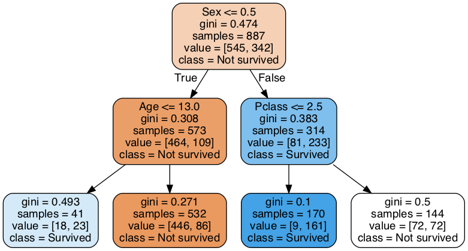

---
title:
  - Hinweise Klausur zu Healthcare Data Analytics
author:
  - Dr. Michael Strobel
date:
  - 15.07.2022
---

Liebe Studierende,

einige Hinweise zur Klausur zu Healthcare Data Analysis.

- Alles Themen die wir in der Vorlesung besprochen haben können Thema sein
- Die Fragen werden sich am Verständnis der Vorlesung orientieren und an den Übungsaufgaben
- Sie sollten besprochene Konzepte definieren können
- Sie können ein Din A4 Blatt, doppelseitig beschrieben, zur Klausur mitbringen und benutzen
- Sie können einen Taschenrechner (nicht programmierbar) benutzen

Folgend noch einige Aufgabentypen die Teil der Klausur sein könnten. Natürlich heißt das nicht, dass keine anderen Aufgabentypen gestellt werden können. Zudem werden die Aufgaben in der Klausur umfangreicher sein. Zudem wird es mehr Aufgaben geben und natürlich werden auch mehr Teile der Vorlesung vorkommen als hier.

# Aufgabetyp 1: Allgemeines Verständnis

1. Was ist der Unterschied zwischen einem Random Forest und einem Decision Tree?
2. Was verstehen wir unter einem Convolutional Neural Network?
3. Erklären Sie den Unterschied zwischen Hard- und Soft Voting.

# Aufgaben Typ 2: Python

## a) Python Pakete

In der Vorlesung haben wir zahlreiche Software Pakete kennengelernt. Beschreibungen Sie kurz die **Verwendungen** der unten stehen Pakete in der Vorlesung an. Desweiteren interpretieren Sie die **Kommandos** und deren **Output**.

### scikit learn

#### Code Beispiel

```python
>>> import numpy as np
>>> from sklearn.model_selection import train_test_split
>>> X, y = np.arange(10).reshape((5, 2)), range(5)
>>> X
array([[0, 1],
       [2, 3],
       [4, 5],
       [6, 7],
       [8, 9]])
>>> list(y)
[0, 1, 2, 3, 4]

>>> X_train, X_test, y_train, y_test = train_test_split(
...     X, y, test_size=0.33, random_state=42)
...
>>> X_train
array([[4, 5],
       [0, 1],
       [6, 7]])
>>> y_train
[2, 0, 3]
>>> X_test
array([[2, 3],
       [8, 9]])
>>> y_test
[1, 4]
>>> train_test_split(y, shuffle=False)
[[0, 1, 2], [3, 4]]
```

##### Verwendung von scitkit learn:

##### Interpretation des Code Beispiels:

## b) BubbleSort

Implementierung Sie BubbleSort in Python 3

```python
def bubblesort(arr):
  # TODO

print(bubblesort([3, 6, 8, 10, 1, 2, 1]))
>>> print(bubblesort([3, 6, 8, 10, 1, 2, 1]))
[1, 1, 2, 3, 6, 8, 10]
```

Hinweis: der Pseudocode für BubbleSort

```pseudocode
procedure bubbleSort(A : list of sortable items)
    n := length(A)
    repeat
        swapped := false
        for i := 1 to n-1 inclusive do
            /* if this pair is out of order */
            if A[i-1] > A[i] then
                /* swap them and remember something changed */
                swap(A[i-1], A[i])
                swapped := true
            end if
        end for
    until not swapped
end procedure
```

# Aufgabe 3: Decision Tree

1. Was verstehen wir unter dem Gini Koeffizient? Wie interpretieren Sie Gini 0.1 und Gini 0.5?
2. Wie kann ein Decision Tree Regularisiert werden?
3. Welche Vorteile bieten Random Forests gegenüber Decision Trees?
4. Erklären Sie anhand des unten stehenden Bildes wie ein Decision Tree eine Beobachtungseinheit klassifiziert

{ width=150px }

# Aufgabe 4: Spezifität und Sensitivität

1. Definieren Sie Spezifität und geben Sie eine intuitive Interpretation
2. Definieren Sie Sensitivität und geben sie eine intuitive Interpretation
3. _Datenbeispiel_ berechnen Sie Sensitivität und Spezifität anhand eines Beispiel (nicht Teil dieses Hinweis PDFs)

# Weitere Aufgaben

Aufgaben wie Aufgabe 3 und Aufgabe 4 prüfen sehr den Inhalt der Vorlesung, daher sind solche Aufgabentypen sehr interessant für eine Klausur. Rechnen Sie mit mehr dieser Art und breiteren Themenfeldern.
