---
title:
- Healthcare Data Analytics
author:
- Dr. Michael Strobel
subtitle:
- Einführung
date:
- 21.03.2022
classoption:
- aspectratio=1610,9pt
--- 

## Organisatorisches 
### Zeit 
- Vorlesung: Montag, 10-12 Uhr, Übung: Montag, 12-14 Uhr
- Sprechzeiten: nach der Übung und nach Vereinbarung (m.strobel@posteo.de)

#### Inhalt
Breiter Überblick zur Datenanalyse / Machine Learning für Anwendung im Gesundheitswesen

### Moodle etc.
Einrichtung läuft noch -> temporär [https://strobelm.de/hda](https://strobelm.de/hda)

### Übung
* Übungsblätter und Daten: vor der Übung online in Moodle
* Präsenzübung: interaktiv und in Kleingruppen mit jupyter-notebooks
* Hausaufgaben: vertiefende Inhalte basierend auf der Präsenzübung, individuell oder in Kleingruppen
* Lösungen zu den Hausaufgaben: nach einer Woche online in Moodle 

### Klausur
Form: wenn möglich mündlich, sonst schriftlich (TBD)

## Kurzes Intro zu mir

{ width=150px  } 

### Was macht eigentlich Ihr Dozent?
* Aktuell: Vice President Engineering bei der SmartReporting GmbH
* Stationen davor:
	*	Principal Software Engineer 
	*	Freelance Consultant Computer Vision 
	*	Doktor in Mathematik (Geometrie und Visualisierung) an der TU München
	*	Lead Developer einer MINT Visualisierungssoftware: CindyJS
<!-- * Geboren und aufgewachsen im Allgäu -->

## Healthcare Data Analytics -- Übersicht

{ width=350px  } 

## Datenanalyse und Machine learning in der Praxis
* Erkennung von Mustern in Patientenkohorten
* Interaktive Dashboards zur Informationsgewinnung
* Automatische Diagnose: Erkennung von Tumoren in CT-Scans
* Vorschläge für Therapiemaßnahmen
* Spracherkennung und Sprachsteuerung
* Vorhersage von benötigten Behandungskapazitäten
* ...

### Lernziele 
* Methoden der Datenanalyse verstehen und anwenden können
* Einsatzmöglichkeiten von Healthcare Data Analytics im klinischen Umfeld 
* Generelle Vorgehensweisen bei Data Analytics und Machine Learning Projekten

## Lerninhalte der Vorlesung

* Daten verstehen und in Datenstrukturen überführen 
* Aufbau von Data Pipelines
* Machine Learning verstehen und anwenden
	* Visualisierung 
	* Klassifikation / Regressions / Clustering
	* Decision Trees / Neuronale Netze
	* Training von Modellen
* Anwendungen aus der Praxis
	* Datenstandards
	* Computer Vision
	* Differential Privacy
	* Big Data Tools

### Welches Feld interessiert Sie am meisten? 

	
## Beispiel
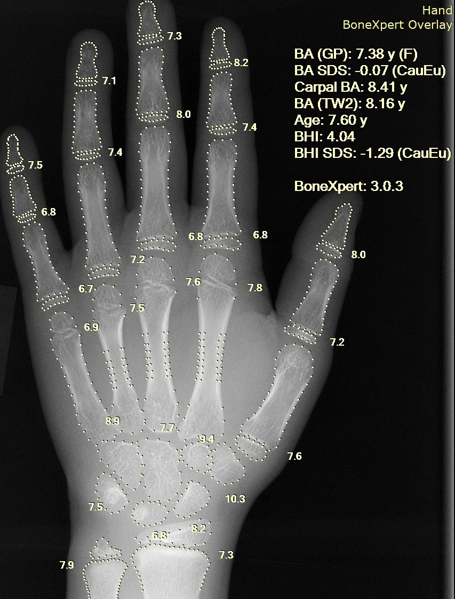{ width=200px  }

## Ablauf einen typischen Healthcare Data Analytics Projekts

### Definition: Ablauf einen Healthcare Data Analytics (HDA) Projekts
1. Übersicht verschaffen
2. Daten beschaffen und maschinell lesbar machen
3. Daten statistisch auswerten und visualisieren 
4. Vorbereitung der Daten für algorithmische Auswertung
5. Selektion der Modelle und Training
6. Beurteilung der Qualität des Modells und Fine Tuning
7. Präsentation der Ergebnisse
8. Deployment, Monitoring und Wartung des Systems

## Beispiel: Erkennung von Herzkrankheiten

{ width=300px  }

- Als einführendes Beispiel möchte ich mit Ihnen heute ein Machine Learning Projekt durchführen
- Wir erkennen ob ein Patient$\cdot$in  an einer Herzkrankheit leidet oder nicht
- Vorgehen richtet sich nach dem beschriebenen Muster eines HDA Projekts

## Analyse der Patientendaten und Feature Auswahl -- Feature Übersicht

### Übersicht verschaffen: ca. 900 Datensätze 
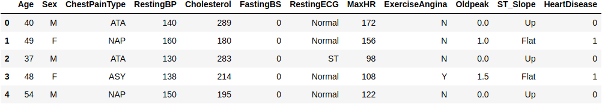{ width=550px  }

### Einige (nicht offensichtliche) Charakteristiken unseres Datensatzes

\small 

| Feature | Beschreibung | Einheit / Wertebereich |
|---|---|---|
| ChestPainType | Art der Brustschmerzen  | {TA, ATA, NAP, ASY} | 
| RestingBP | Ruheblutdruck | [mm Hg] | 
| RestingECG | Ruhe-EKG | {Normal, ST, LVH} |
| ExerciseAngina | Angina bei Belastung | {Y, N} |
| ST_Slope | Steigung im ST Wert | {Up, Flat, Down} |
| OldPeak | Abweichung im ST Wert | [-10, 10] |
| HeartDisease | Output | {1, 0} |

\normalsize

## Analyse der Patientendaten und Feature Auswahl -- ST Wert

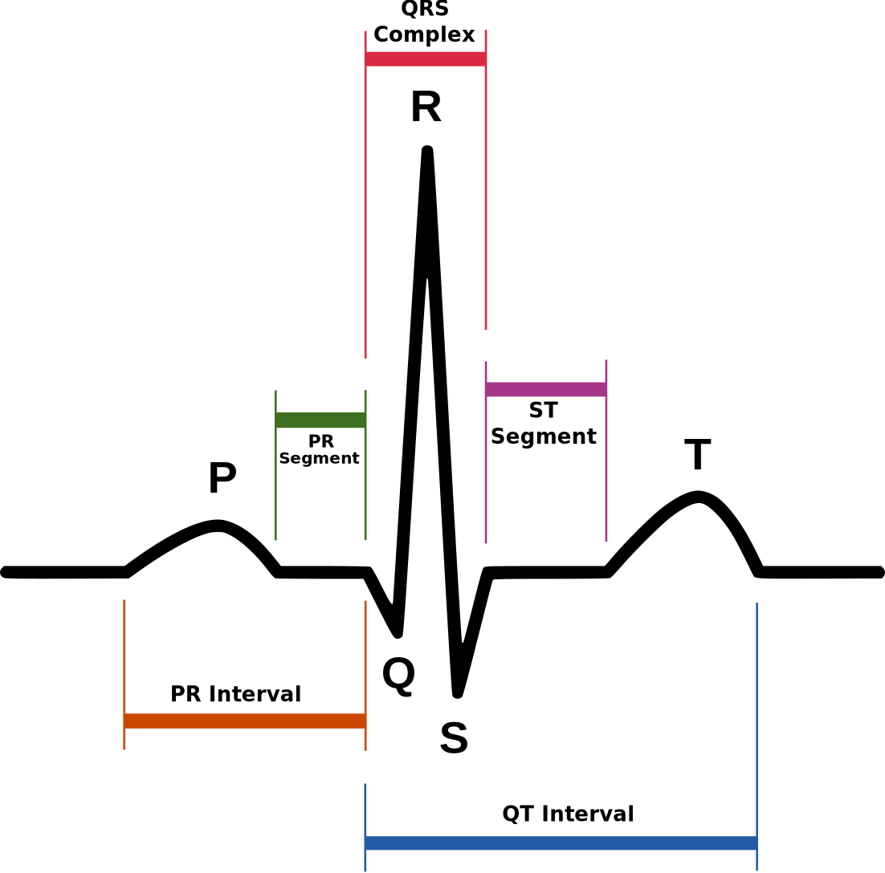{width=250px}

## Daten statistisch auswerten und visualisieren
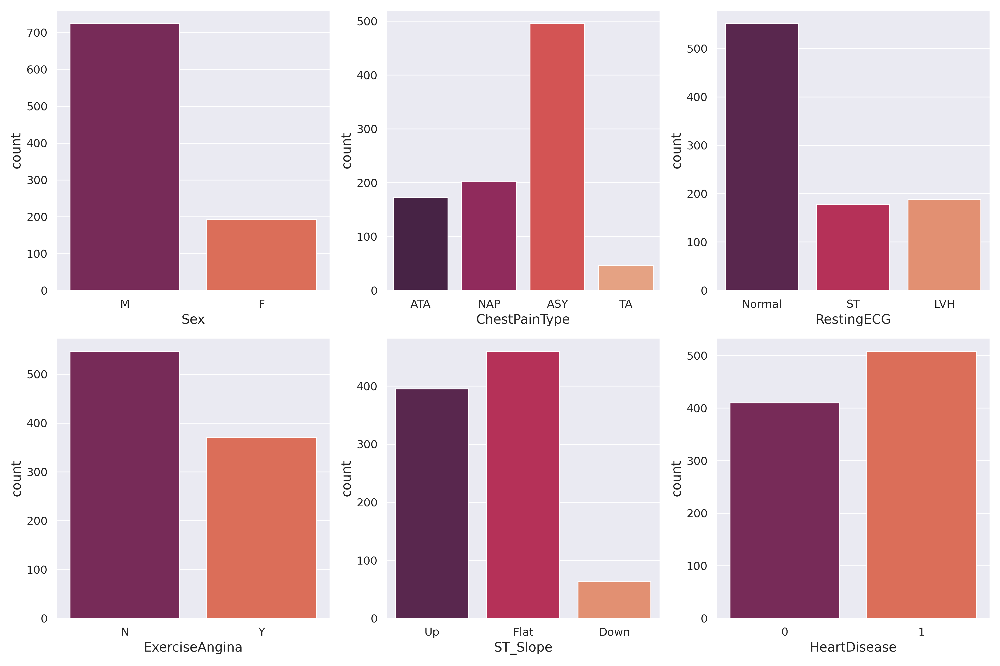{ width=400px  }

## Daten statistisch auswerten und visualisieren
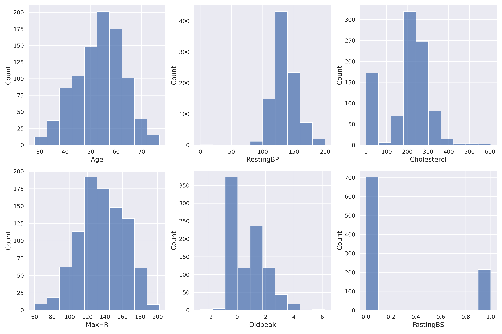{ width=400px  }

## Analyse der Patientendaten und Feature Auswahl -- Korrelation Herzkrankheit
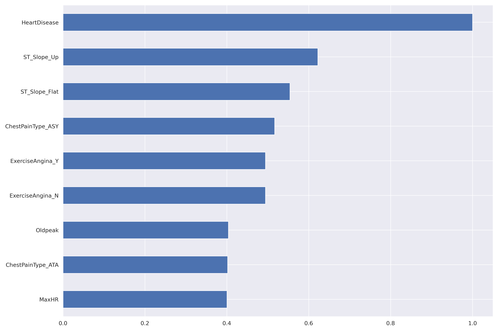{ width=350px  }

## Analyse der Patientendaten und Feature Auswahl -- Data Pipelines

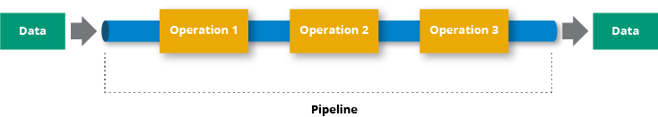{ width=400px  }

Nach der Auswahl von relevanten Features können die **Datapipelines** gebaut werden.

Eine **Datapipeline** ermöglicht es, den Prozess der Datengewinnung, -bereinigung und Transformation zu automatisieren.

* Bereinigung der Daten
* Umwandlung von Daten (z.B. von Kategorischen Daten in Numerische Daten)
* Skalierung von Daten z.B. zwischen 0 und 1

## Auswahl des Modells
Es gibt eine Vielzahl von Modellen: Decision Trees, Random Forests, Support Vector Machines, ...

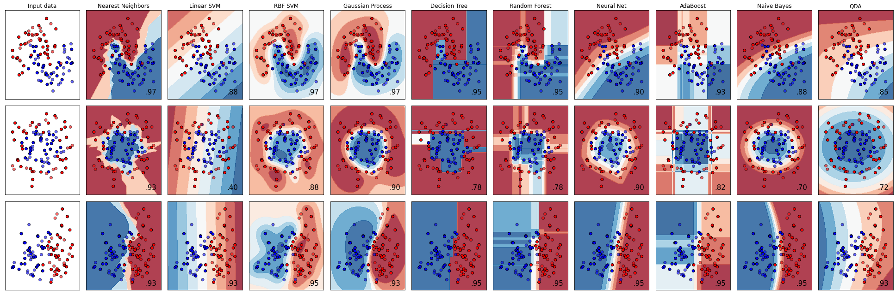{ width=500px  }

- Eine Auswahl auf einem kleinen repräsentativen Datensatz stattfinden.
- Wir schauen uns heute die Ergebnisse eines **künstlichen neuronalen Netzes** an.
	
## Künstliches Neuronales Netz
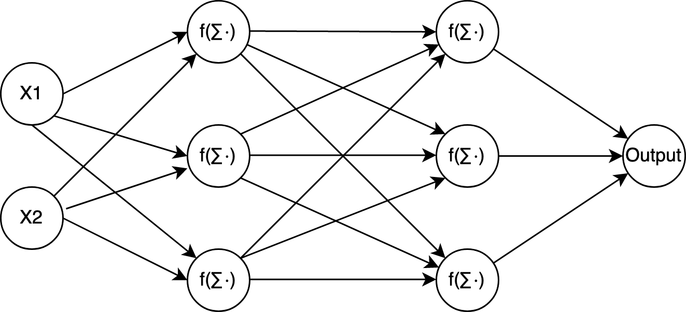{ width=250px  }

- **Trainingsschritt** mit Hilfe von Trainingsdaten und einem **Optimierungsalgorithmus** wird Vorhersageleistung des Netzes verbessert.
- Netzwerkgestaltung und Optimierungsalgorithmen sind aktuelle Forschungsthemen.
<!-- ### Kategorische Features -->
<!-- - Data cleansing und hinzufügen fehlender Werte z.B. durch Einfügen des häufigsten Wertes -->
<!-- - Umwandlung von kategorischen in numerische Features, z.B. One Hot Encoding --> 

<!-- ### Numerische Features --> 
<!-- - Data cleansing und hinzufügen fehlender Werte z.B. durch Einfügen des Medians -->
<!-- - Skalierung der Werte, z.B. min-max scaling oder standardization -->

<!-- # Metriken zur Beurteilung der Modellqualität -->

<!-- ## Klassifikationsaufgaben --> 

<!-- **Definition**: Die Zuweisung eines Inputvektor $x \in \mathbb{R}^n$ zu einer diskreten Klassen $C_k$ ($k = 1,\ldots, K$) nennen wir **Klassifikationsaufgabe**. -->

<!-- **Definition**: Ein Modell welches eine Klassifikationsaufgabe löst nennen wir **Klassifikator**. -->

<!-- In unserem Fall handelt um eine *binäre Klassifikationsaufgabe*: liegt eine Herzkrankheit vor oder nicht? -->

<!-- 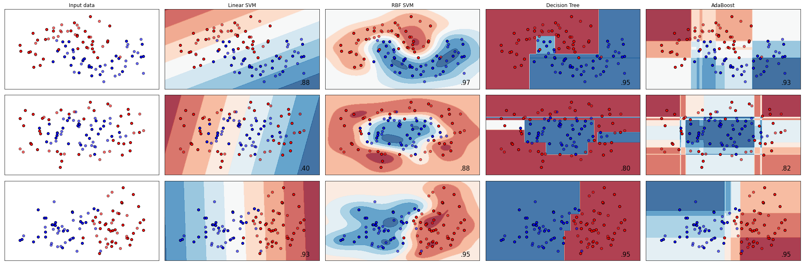{ width=500px  } -->

## Qualität von Ergebnissen von Machine Learning Modellen 
### Mögliche Ergebnisse einer Binären Klassifikation 

* **Richtig positiv (TP)**: Der Patient ist krank, und der Test hat dies richtig angezeigt.
* **Falsch negativ (FN)**: Der Patient ist krank, aber der Test hat ihn fälschlicherweise als gesund eingestuft.
* **Falsch positiv (FP)**: Der Patient ist gesund, aber der Test hat ihn fälschlicherweise als krank eingestuft.
* **Richtig negativ (TN)**: Der Patient ist gesund, und der Test hat dies richtig angezeigt.

<!-- ### Metrik --> 
<!-- Wir benutzen verschiedene **relative Häufigkeiten** um die Qualität eines Klassifikators zu beurteilen. -->

<!-- ### Konfusionsmatrix -->

<!-- |   	| Person ist krank: $r_p + f_n$   	| Person ist gesund: $f_p + r_n$   	|  	| -->
<!-- |---	|---	|---	|---	| -->
<!-- |  Test positiv: $r_p + f_p$ 	| richtig positiv: $r_p$   	| falsch positiv: $f_p$   	|  $\sum$ sind alle positiven Tests  	| -->
<!-- |  Test negativ: $f_p + r_n$ 	| falsch negativ: $f_n$   	| richtig negativ: $r_n$   	|  $\sum$ alle negativen Tests  	| -->
<!-- |   	| $\sum$ alle kranken Personen   	| $\sum$ alle gesunden Personen|   	| -->

<!-- ## Qualität von Ergebnissen von Machine Learning Modellen -- Precision und Recall -->

<!-- ### Visualisierung über Konfusionsmatrix --> 
<!-- 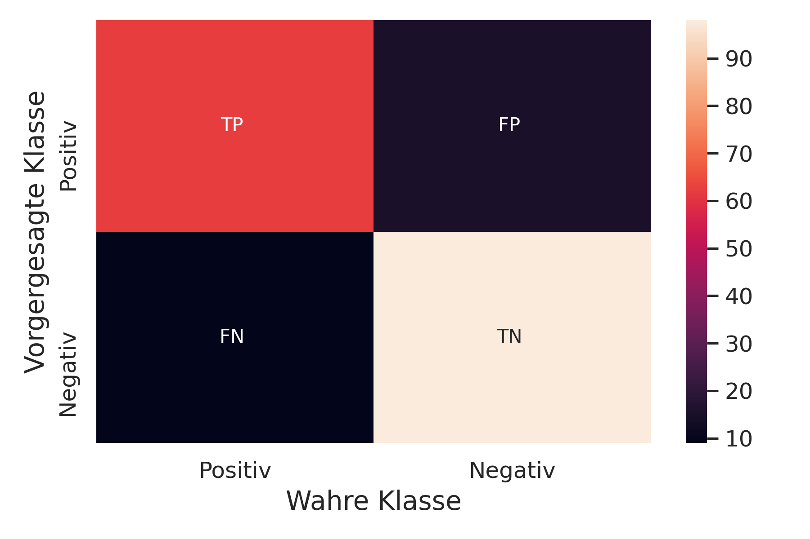{ width=250px  } -->

<!-- ## Qualität von Ergebnissen von Machine Learning Modellen -- Tranings- und Testdaten -->

<!-- <!-1- - Im Kontext von Klassifikationsproblemen lässt sich die Qualität von Klassifikatoren vergleichen. -1-> -->
<!-- - Zur Qualitätsbestimmung wird der Datensatz aufgeteilt in **Trainingsdaten** und **Testdaten**. -->
<!-- <!-1- - Testdaten werden nicht zum Training der Klassifikators verwendet. -1-> -->
<!-- - Es muss darauf geachtet werden, dass Trainings und Testdaten **stratifiziert** werden: jeder Menge enthält ungefähr den gleichen Prozentsatz an Stichproben jeder Zielklasse wie der vollständige Datensatz. -->

<!-- ## Qualität von Ergebnissen von Machine Learning Modellen -- Eigenschaften -->

<!-- ### Einige Anmerkungen zu Metriken in der Klassifikation -->

<!-- - Bei asymmetrisch verteilten Datensätzen ist eine **Verzerrung** der Ergebnisse möglich. -->
<!-- - Es gibt viele **weitere Metriken** z.B. Accuracy, F-Measure, ... -->
<!-- - Im Gesundheitswesen ist der **Recall** meist besonders wichtig. --> 

<!-- ## Auswahl des Klassifikators -->
<!-- Es gibt eine Vielzahl von Klassifikatoren: Decision Trees, Random Forests, Support Vector Machines, ... -->

<!-- { width=500px  } -->

<!-- - Eine Auswahl kann über **cross validation** auf einem kleinen repräsentativen Datensatz stattfinden. -->
<!-- - Wir schauen uns heute die Ergebnisse eines **künstlichen neuronalen Netzes** an. -->

<!-- ## Artificial Neural Networks - Künstliches Neuron -->
<!-- Sei $n \in \mathbb{N}, d_1, ..., d_n \in \mathbb{N}$, dann definieren wir --> 
<!-- $x_i\in \mathbb{R}^{d_i}$ als den **Input** (numerische Repräsentation der Features), --> 
<!-- $w_i\in \mathbb{R}^{d_i}$ als den **Gewichtung** des Input (numerische Repräsentation der Features) und --> 
<!-- $b \in \mathbb{R}$ als **Bias**. -->

<!-- { width=200px  } -->

<!-- **Schritt 1**: $S := \sum_{k=1}^n  x_i \cdot w_i  + b$ -->

<!-- Desweiteren definieren wir $f: \mathbb{R} \rightarrow \mathbb{R}$ als **Aktivierungsfunktion**, z.B. sigmoid, relu oder tanh -->

<!-- **Schritt 2**: Output $y := f(S) = f(\sum_{k=1}^n  x_i \cdot w_i  + b)$ -->

## Künstliches Neuronales Netz - Ergebnisse

<!-- Beispielnetz: 3 hidden layer (50 Neuronen), relu Aktivierungsfunktion --> 

<!-- **Ergebnisse**: Precision: 87 %, Recall: 92 % -->

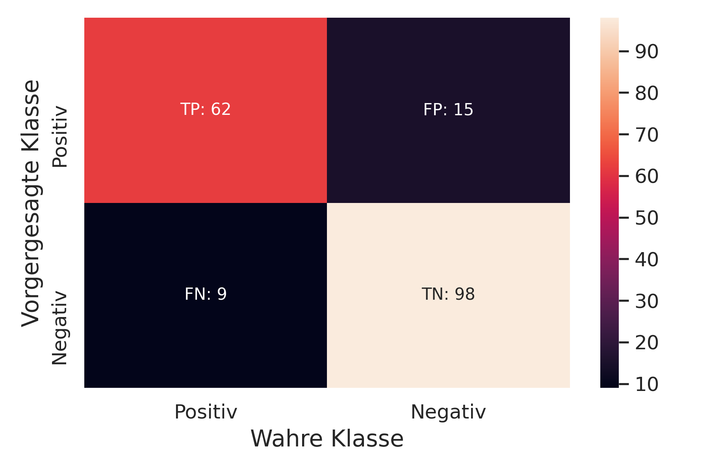{ width=250px}

- Wir haben 158 (59 TP + 98 TN) Personen richtig vorhergesagt.
- Bei 27 (18 FP + 9 FN) Vorhersagen lagen wir falsch.

Quellcode: https://github.com/strobelm/heart-failure-prediction

<!-- ## Ausblick und offene Fragestellungen -->

<!-- ### Machine Learning --> 
<!-- - Explainability --> 
<!-- - Ethische Fragen -->
<!-- - Quantum Computing: Quantum Boltzmann Machine -->

<!-- ### Datenstandards -->
<!-- - Digital Imaging and Communications in Medicine (DICOM) -->
<!-- - Health Level Seven International (HL7) -->
<!-- - Fast Healthcare Interoperability Resources (FHIR) -->

<!-- ## Schluss & Quellen -->

<!-- ### Vielen Dank für die Aufmerksamkeit, gibt es Fragen? -->

## Software Eco System

{ width=300px  } 

**Unser Fokus**: Python, TensorFlow, scikit-learn und pandas -> Übungen

## Literaturempfehlung 

{ width=150px  } 

Géron, A. (2019). Hands-on machine learning with Scikit-Learn, Keras, and TensorFlow: Concepts, tools, and techniques to build intelligent systems. O'Reilly Media.

## Vorlesungsausrichtung

### Umfrage zur Vorlesung

* Ich werde Sie öfters im Feedback fragen und Ihre Vorschläge einarbeiten 
* Welche Spezialthemen wünschen Sie sich?
* Generelles Feedback: Geschwindigkeit und Inhalt

Link für erste Vorlesung: [https://forms.gle/9XmCq4kibCr6XViAA](https://forms.gle/9XmCq4kibCr6XViAA)

#### Fragen / Anmerkungen?

## Übung

{ width=150px  } 

- Wir benutzen Python ($>= 3.6$) und gängige Data Science Bibliotheken für die Übungen
- Interaktive Eingabe und Exploration mit jupyter-notebooks
- Online über den Webbrowser: [https://colab.research.google.com](https://colab.research.google.com)
- Erstes Notebook finden Sie auf [https://strobelm/hda](https://strobelm/hda) -> 01-Intro (Python Crashkurs)

## Quellen
\footnotesize
- Kardash, M., Elamin, M. S., Mary, D. A. S. G., Whitaker, W., Smith, D. R., Boyle, R., ... & Linden, R. J. (1982). The slope of ST segment/heart rate relationship during exercise in the prediction of severity of coronary artery disease. European heart journal, 3(5), 449-458.
- Géron, A. (2019). Hands-on machine learning with Scikit-Learn, Keras, and TensorFlow: Concepts, tools, and techniques to build intelligent systems. O'Reilly Media.
- Bishop, C. M. (2006). Pattern recognition. Machine learning.
- fedesoriano. (September 2021). Heart Failure Prediction Dataset. https://www.kaggle.com/fedesoriano/heart-failure-prediction.
\normalsize 

<!-- ## Precision Recall --> 
<!-- 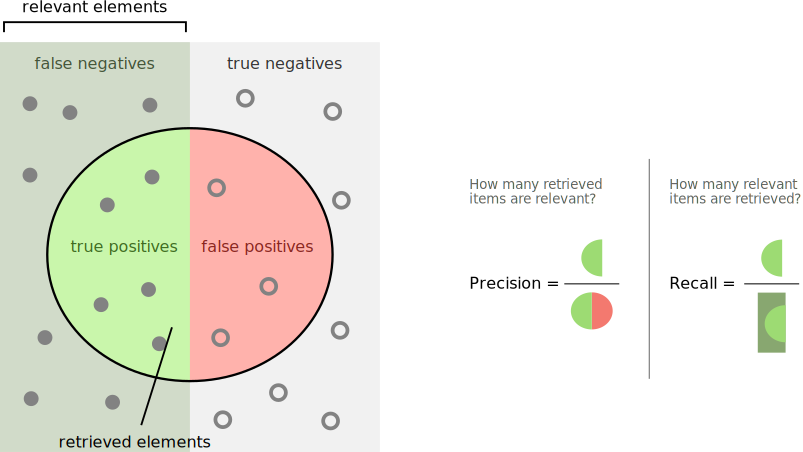{ width=350px  } -->
