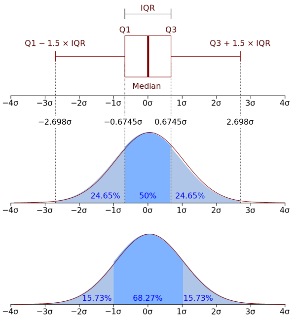

---
title:
- Healthcare Data Analytics
author:
- Dr. Michael Strobel
subtitle:
- Stochastik Toolbox und Daten Processing
date:
- 28.03.2022
classoption:
- aspectratio=1610,9pt
--- 

## Inhalt 

### Letzte Woche
- Problemstellung
- Organisatorisches
- Inhalte der Vorlesung
- Übung: Basic Python

### Diese Woche
- Stochastik Tools (Wiederholung)
- Plotting 
- Data Processing / Encoding 
- Übung: pandas, scikit-learn, numpy 

# Stochastik Toolbox

## Disclaimer 

- Dies ist keine Stochastik Vorlesung, ich muss darauf vertrauen, dass sie eine grundlegende Vorstellung von Stochastischen Prozessen haben. 
- Viele der Konzepte aus der Stochastik, also der Wahrscheinlichkeitstheorie und Statistik, sind wichtig für Machine Learning Prozesse.
- Wir machen eine kleine Wiederholung, welche aber natürlich nicht vollständig sein kann.

## Erwartungswert

### Intuition
Bei Zufalls Experimenten stellt sich oft eine Regelmäßigkeit bezüglich des langfristigen Durchschnitts ein. Beispielsweise bei einem Münzwurf mit einer fairen Münze kann langfristig beobachtet werden, dass Kopf und Zahl gleich oft auftreten. 

## Erwartungswert, Definition 

### Formale Definition
Sei $X$ eine reele diskrete Zufallsvariable, die die Werte $x_i$ mit Wahrscheinlichkeit $p_i (i \in \mathbb{I} \subset \mathbb{N})$ annimmt. So definieren wir den Erwartungswert $E(X)$

$$E(X) = \sum_{i \in \mathbb{I}} x_i \cdot p_i = \sum_{i \in \mathbb{I}} x_i \cdot P(X = x_i)$$

### Beispiel: Würfeln
$$\begin{array}{lcl}\operatorname{E}(X) & = & 1\cdot P(X=1)+2\cdot P(X=2)+3\cdot P(X=3)+4\cdot P(X=4)+5\cdot P(X=5)+6\cdot P(X=6)\\
                                                                    & = & (1 + 2 + 3 + 4 + 5 + 6)\cdot \tfrac16 = 3{,}5.
\end{array}$$

## Mittlere Quadratische Abweichung
Wenn ein Vektor von $N$ Vorhersagen aus einer Stichprobe von $N$ Datenpunkten für alle Variablen erzeugt wird und $Y$ der Vektor der beobachteten Werte der vorherzusagenden Variablen ist, wobei $\hat{Y}$ die vorhergesagten Werte sind, dann wird die mittlere Quadratische Abweisung (engl. Mean Square Error, MSE) des Vorhersagewertes innerhalb der Stichprobe berechnet als

$$\operatorname{MSE}(Y, \hat Y):=\frac{1}{n}\sum_{i=1}^n(Y_i-\hat{Y_i})^2$$

### Beispiel
Echt Werte:
$Y = (3, -0.5, 2, 7)^T$

Gemessene Werte:
$\hat Y = (2.5, 0.0, 2, 8)^T$

MSE = $\frac{1}{3}\big((3-2.5)^2+(-0.5-0.0)^2+(7-8)^2\big) =  0.375$

## Mittlere Quadratische Abweichung, Anwendung
### Anwendung
Die mittlere Quadratische Abweichung wird oft bei Machine Learning Problemen verwendet um das Modell zu tranieren. Um so kleiner der MSE ist um so besser kann das Modell die verarbeiteten Trainingsdaten bereits vorhersagen. 

#### Vorsicht
Ein MSE von 0 ist hier oft nicht erwünscht, weil dies ein Indikator ist, dass das Modell schlecht generalisiert. 

## Varianz / Standardabweichung
### Intuition
Die Varianz ist ein Maß wie groß die Streuung einer Zufallsvariable um den Schwerpunkt herum ist.

{ width=300px  } 

## Varianz / Standardabweichung, Formale Definition
Sei $X$ eine diskrete Zufallsvariablen mit der Verteilung $P(X = x_1)= p_1, \ldots, P(X = x_n)= p_n$, dann definieren wir die Varianz $\operatorname{Var}$ mit 

$$\operatorname{Var}(X) := \sigma^2 := \sum_{i=1}^n p_i\cdot(x_i - \mu)^2$$

Und die Standardabweichung $\sigma$ als 
$$\sigma = \sqrt{\operatorname{Var(X)}}$$

## Varianz, Beispiel: Würfel

Ein fairer Würfel kann als diskrete Zufallsvariable $X$ modelliert werden, mit den Ergebnissen 1 bis 6, jeweils mit der gleichen Wahrscheinlichkeit $\frac{1}{6}$.  Der Erwartungswert von ist, wie bereits berechnet, gegeben durch $E(X) = 3.5$.  Daher ist die Varianz von $X$: 

$$\operatorname{Var}(X) = \sum_{i=1}^6 \frac{1}{6}\left(i - \frac{7}{2}\right)^2 
 = \frac{1}{6}\left((-5/2)^2 + (-3/2)^2 + (-1/2)^2 + (1/2)^2 + (3/2)^2 + (5/2)^2\right) 
 = \frac{35}{12} \approx 2.92.$$

## Tschebyscheff-Ungleichung 
Kann man über Erwartungswert und Varianz Aussagen treffen die auf die gesamte Zufallsvariable zutreffen? Dies ist möglich, z.B. mit der Tschebyscheff-Ungleichung.

### Definition: Tschebyscheff Ungleichung
Sei $X$ eine Zufallsvariable mit Erwartungswert $\operatorname{E(X)}= \mu$ und endlicher Varianz $\sigma^2 = \operatorname{Var}(X)$.

Dann gilt für alle reellen Zahlen $r > 0$:

$$\operatorname{P}\left(\left|X-\mu\right|\geq r\right) \leq \frac{\sigma^2}{r^2}$$

## Tschebyscheff-Ungleichung, Beispiel
### Wie hoch ist die Wahrscheinlichkeit, dass bei einem Würfel die Zahl 1 oder 6 erscheint? 

Wir kennen die Antwort, sie ist $1/3$. 

### Die Tschebyscheff Ungleichung kann eine Abschätzung liefern

- Wir wissen, dass der Erwartungswert $\operatorname{E(X)} = 3.5$ und die Varianz $\sigma^2 = \frac{35}{12}$. 
- Das Ereignis, dass eine 1 oder 6 Erscheint heißt, dass wir vom Erwartungswert $2.5$ entfernt sind ($1=3.5-2.5$ und $6=3.5+2.5$). 
- Daher $P(X = 1$ oder $X = 6) = P(|X-\operatorname{E(X)}| \ge 2.5) \le \frac{1}{2.5^2} \cdot \frac{35}{12} \approx 0.47$

## Einige Verteilungen

- In der Praxis spielen oft Wahrscheinlichkeitsverteilungen eine wichtige Rolle
- Sie werden verwendet um Zufallsprozesse zu modellieren
- Es gibt einen ganzen Zoo von Wahrscheinlichkeitsverteilungen die unterschiedliche Anwendungen haben
- **Wichtig**: oft wir fälschlicherweise angenommen, dass Daten *normal-* oder *gleich-* verteilt sind.

Es ist wichtig einige gängige Verteilungen zu kennen und sie zu *erkennen*.

## Normalverteilung

#### Modellierung vieler natürlicher und statistischer Prozesse
- Körpergrößen innerhalb eines Geschlechts
- Intelligenzquotienten durchschnittliche 
- Sonnenscheindauer an einem bestimmten Tag des Jahres
- ...
<!-- Schreibweise: $X\sim\mathcal{N}\left(\mu,\sigma^2\right)$ -->

<!-- #### Dichtefunktion -->
<!-- $f_{\mu, \sigma^2}(x) = \frac{1}{\sigma \sqrt{2\pi} } e^{-\frac{1}{2}\left(\frac{x-\mu}{\sigma}\right)^2}$ -->

<!-- #### Eigenschaften -->

<!-- Erwartungswert: $\operatorname E(X) = \mu$ und Varianz: $\operatorname{Var}(X) = \sigma^2$ -->

{ width=350px}

## Exponentialverteilung
#### Modellierung von Wartezeiten

{ width=350px}

## Gammaverteilung
#### Auch Modellierung Wartezeiten 

{ width=350px}

## Poissonverteilung 
#### Anzahl von Ereignissen die in einem festen Zeitintervall oder räumlichen Gebiet eintreten

{ width=350px}

# Normalisierung / Standardisierung

## Normalisierung / Standardisierung Anwendung
- Viele Machine Learning Algorithmen liefern schlechtere Ergebnisse wenn die Datenpunkte weit auseinander liegen
- Zudem kann es zu numerischen Problemen wie overflow / underflow oder Auslöschung kommen
- Normalisierung und Standardisierung sind Verfahren um die Effekte Abzumildern 
- Daher werden Normalisierung und Standardisierung werden oft zum Preprocessing von Daten verwendet

## Normalisierung
Sei $M\subset \mathbb R$ eine Menge von reelen Zahlen, definiere
$M' = \frac{M - \text{min}(M)}{\text{max}(M)-\text{min}(M)}$

Dann gilt: $M\subset [0,1]$.

### Beispiel
$M = [-10, -20, 20, 10] \Rightarrow M' = [0.25, 0, 1, 0.75]$

### Auslöschung
**Problem**: es kann zu Auslöschung kommen wenn stark unterschiedlich verteilt sind. 

Beispiel zum selber rechnen: $[1, 10, 10^{100}]$

## Standardisierung
Alternativ kann man die Daten mit Erwartungswert und Varianz normalisieren. Dies ist etwas robuster gegenüber Ausreißern.

### Definition
Sei $X$ eine Zufallsvariable mit Erwartungswert $\operatorname{E(X)}= \mu$ und endlicher Varianz $\sigma^2 = \operatorname{Var}(X)> 0$.
Dann definieren wir die normalisierte Zufallsvariable $Z$ als

$$Z:= \left(\frac{X-\mu}{\sigma}\right)$$

### Korollar 
Für eine normalisierte Zufallsvariable Z gilt:  $\operatorname{E(Z)}=0$ und $\operatorname{Var}(Z) = 1$.

# Ausreißer und Plotting 

## Boxplots 

{ width=300px  } 

- Minimum ($Q_0$): der niedrigste Datenpunkt im Datensatz ohne Ausreißer
- Maximum ($Q_4$): der höchste Datenpunkt des Datensatzes ohne Ausreißer
- Median ($Q_2$ oder 50. Quantil): der mittlere Wert des Datensatzes
- Erstes Quartil ($Q_1$): 25% der Werte sind kleiner-gleich als dieser Wert
- Drittes Quartil ($Q_3$): 75% der Werte sind kleiner-gleich als dieser Wert

## Boxplots, Whisker / Ausreißer:

{ width=300px  } 

- Definition nicht einheitlich
- interquantile range: $\operatorname{IQR} := Q_3 - Q_1$ 
- Whisker: $1.5 \cdot \operatorname{IQR}$ (schwache Ausreißer), $3 \cdot \operatorname{IQR}$ (starke Ausreißer)

## Outlier Detection mit dem IQR

- Wir können mithilfe des IQR Extremwerte bestimmen 
- Ob dies gut funktioniert liegt sehr stark an der Verteilung der Daten
- Überlegen Sie sich daher welche Distribution der Daten vorliegt

{ height=400px  } 

# Daten Encoding 

## Definition Feature 

**Definition**: Ein *Feature* ist ein individuell messbare Eigenschaft oder Charakteristik eines Phänomens. 

### Kategorisches Feature
Ein *Kategorisches Feature* lässt sich über eine diskreten Menge ausdrücken.

### Numerisches Feature
Ein *Numerisches Feature* lässt ist nur über eine kontinuierliche Menge ausdrücken.

### Beispiele 
Gewicht in Kilogram, Größe in Metern sind numerische Features. 

Hoher Blutdruck ja oder nein, {weiblich, männlich, divers} beim Geschlecht sind kategorische Features.

## Behandlung von kategorischen Daten
Es gibt zwei Arten von kategorischen Daten

* **Nominal**. Eine Variable kann als nominal behandelt werden, wenn ihre Werte Kategorien darstellen, die sich nicht in eine natürliche Reihenfolge bringen lassen, z. B. die Firmenabteilung, in der eine Person arbeitet. Beispiele für nominale Variablen sind Region, Postleitzahl oder Religionszugehörigkeit.
* **Ordinal**. Eine Variable kann als ordinal behandelt werden, wenn ihre Werte für Kategorien stehen, die eine natürliche Reihenfolge aufweisen (z. B. Grad der Zufriedenheit mit Kategorien von sehr unzufrieden bis sehr zufrieden). Ordinale Variablen treten beispielsweise bei Einstellungsmessungen (Zufriedenheit oder Vertrauen) und bei Präferenzbeurteilungen auf.

Quelle und weiterführende Themen: [IBM SPSS Dokumentation](https://www.ibm.com/docs/de/spss-statistics/25.0.0?topic=view-variable-measurement-level)

## Label Encoding
Sei $M$ eine diskrete Menge von kategorischen Labeln, dann ist das **Label Encoding** eine injektive Funktion $f: M \rightarrow \mathbb N$

### Beispiel: M = {Apfel, Birne, Zitrone}
|Label   |   Label Encoding | 
|:-:|:-:|
| Apfel  | 1  | 
| Birne   | 2  | 
| Zitrone  | 3  | 

### Verwendung 
Label Encoding kann vor allem für für **Ordinale Daten** verwendet werden, da diese eine natürliche Reihenfolge aufweisen.

## One-Hot-Encoding
Sei $M$ eine diskrete Menge mit $n$ kategorischen Labeln, dann ist das **One-Hot Encoding** injektive Funktion $f: M \rightarrow \{0,1\}^n$

### Beispiel: M = {Apfel, Birne, Zitrone}
| Apfel  | Birne  | Zitrone  |
|:-:|:-:|:-:|
| 1  | 0 | 0 |
| 0  | 1 | 0 |
| 0  | 0 | 1 |

### Verwendung 
OneHot Encoding kann vor allem für für **Nominale Daten** verwendet werden, da diese *keine* natürliche Reihenfolge aufweisen.

## Referenzen
- Fischer, Gerd, Matthias Lehner, and Angela Puchert. Einführung in die Stochastik. Springer, 2015.
- Géron, Aurélien: Praxiseinstieg Machine Learning mit Scikit-Learn, Keras und TensorFlow : Konzepte, Tools und Techniken für intelligente Systeme. Aktuell zu TensorFlow 2. Sebastopol: O'Reilly, 2020.
- Georgii, Hans-Otto. Stochastik. de Gruyter, 2015.
- IBM SPSS Dokumentation: https://www.ibm.com/docs/de/spss-statistics/25.0.0?topic=view-variable-measurement-level
- NumPy Quickstart: https://numpy.org/doc/stable/user/quickstart.html
- 10 Minutes to Pandas: https://pandas.pydata.org/pandas-docs/stable/user_guide/10min.html
