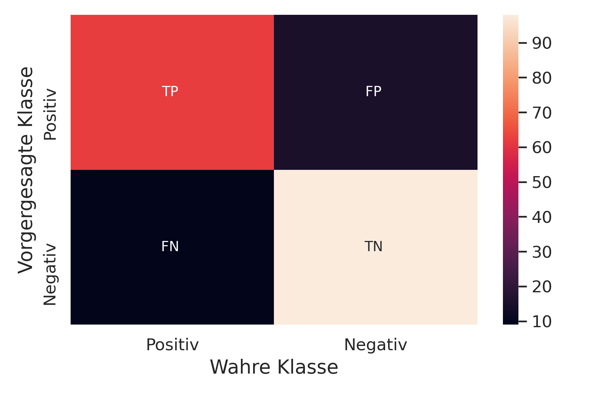

---
title:
- Healthcare Data Analytics
author:
- Dr. Michael Strobel
subtitle:
- Data Cleaning, Data Pipelines und Binäre Klassifikation 
date:
- 03.04.2022
classoption:
- aspectratio=1610,9pt
--- 

## Inhalt 

### Letzte Woche
- Stochastik Tools (Wiederholung)
- Plotting 
- Data Processing / Encoding 
- Übung: pandas, numpy, matplotlib

### Diese Woche
- Umgang mit fehlenden Datenpunkten
- Daten Pipelines
- Binäre Klassifikationsaufgaben  
- Konfusionsmatrix 
- Precision / Recall 

# Fehlende und fehlerhafte Daten 

## Beobachtungseinheit
### Definition: Beobachtungseinheit
Die kleinste Einheit einer statistischen Auswertung, an der Beobachtungen durchgeführt werden, ist die *Beobachtungseinheit (oder Versuchseinheit)*. 

Eine Beobachtungseinheit kann z.B. der einzelne Patient sein, wenn er nur einmal beobachtet wurde, oder der Patient zu einem bestimmten Zeitpunkt, wenn der Patient mehrfach untersucht wurde und besteht aus einem oder mehr Features.

## Umgang mit fehlenden Daten
### Definition: fehlende Daten 
In der Statistik treten fehlende Daten oder fehlende Werte auf, wenn kein Datenwert für eines oder mehrere Feature in einer Beobachtungseinheit gespeichert ist. 

Fehlende Daten kommen häufig vor und können sich erheblich auf die aus den Daten zu ziehenden Schlussfolgerungen auswirken.

## Ursache fehlender Daten

### Fehlende Daten haben unterschiedliche Ursachen 
- Nichterhebung einzelner Feature
- Probleme bei der Speicherung
    - Datentyp ungeeignet 
    - Overflow / Underflow
    - Fehlerhafte Serialisierung 
- Übertragungsfehler 
- Konvertierungsfehler 
- ...

## Repräsentation von fehlenden Daten in Python 

### Python spezifische Datentypen
- `NaN` (not a number) in numerischen arrays
- `None` oder `NaN` in Objekten 
- `NaT` (not a time) in Zeitstempeln 
- Implizit über andere Datentypen die leer initialisiert werden: `[], {}, ""`

Andere Programmiersprachen nutzen andere Schlüsselwörter, z.B. `null`, `Nil`, `undefined`

{ width=300px  } 

## Umgang mit fehlenden Daten 
Viele Algorithmen erwarten, dass es keine fehlenden Daten einer Beobachtungseinheit gibt. Daher müssen diese Vorverarbeitet (engl. preprocessed) werden. 
Diese Arbeitsschritt wird als *data cleaning* bezeichnet und enthält oft auch die Behandlung von Outliern. 

Es gibt zwei gängige Möglichkeiten mit fehlenden Daten umzugehen:

- Entfernung der Beobachtungseinheit
- Ersatz der fehlenden Features in der Beobachtungseinheit

## Ersatz fehlender Features in einer Beobachtungseinheit
Es gibt zahlreiche Möglichkeit fehlende Daten zu ersetzen, die einzige formale Einschränkung ist ein passender Datentyp. Klassischerweise werden folgende Strategien verwendet:

- Numerische Daten: `mean`, `median`, `min/max` oder konstanter Wert
- Kategorische Daten: häufigster Wert, konstanter Wert

# Data Pipelines

## Basic Data Pipeline

### Intro
{ width=400px  } 

## Daten Pipeline 
Eine *Datenpipeline* ist eine Reihe von Datenverarbeitungsschritten, die in Reihe geschaltet sind, wobei der Output eines Schrittes der Input des nächsten Elements ist.

Formal: seien $X_1,..., X_n$ beliebige nicht leere Mengen. Seien $f_1, ..., f_n$ Funktionen mit $f_1: X_1 \rightarrow X_2, f_2: X_2 \rightarrow X_3, ..., f_n: X_{n-1} \rightarrow X_n$. 

Wir definieren dann die Datenpipline als $p: X_1 \rightarrow X_n$ mit $p(d):= f_n(f_{n-1}(...(f_1(d))))$

Konkret heißt das: $X_1$ ist die Menge der Input Daten und $X_n$ ist die Menge die dann von einem Machine Learning Algorithmus verarbeitet werden kann.

## Aufbau von Data Pipelines 
- Typischerweise werden die Daten mindest über mindestens zwei separate Pipelines aufgeteilt
    - numerische Features 
    - kategorische Features
- Diese werden am Ende wieder zusammengeführt zu einer großen Pipeline für die Input Daten 
- Desweiteren wird gibt es auch oft eine Pipeline für die das prediction Target 

## Beispiel: Heart Data
{ width=400px  } 

## Data Pipelines in der Praxis
In der Praxis kommen mindestens folgende Schritte in der Pipeline vor:

### Numerische Data Pipelines
1. Behandlung / Ersatz von Fehlenden Daten 
2. Normalisierung / Standardisierung

### Kategorische Data Pipelines
1. Behandlung / Ersatz von Fehlenden Daten 
2. OneHot- oder Label Encoding

## Data Pipelines in der Praxis, cont'd
Darüber hinaus kann es sehr viel weitere Schritte in den jeweiligen Pipeline geben

- Hinzufügen von kombinierten Features, d.h. ein Feature wird aus anderen Features generiert
- Diskretisierung von kontinuierlichen Variablen (z.B. Haus steht nah an einem See: ja oder nein (statt Kilometerangabe))
- Komplexe nichtlineare Funktionen (Details nicht in der Vorlesung)
- ...

# Supervised Learning

## Problemstellung

#### Supervised Learning Problemstellung
Beim überwachten Lernen geht es darum, die Verbindung zwischen zwei Datensätzen zu erlernen: die beobachteten Daten $X$, der sogenannte *Input*, und eine weitere Variable $y$, die wir vorhersagen wollen und die als *target* bezeichnet wird.

## Beispiel
{ width=400px  } 

## Klassifikation 
### Definition: Klassifizierung
- Gegeben seien Inputdaten $X$ die zu zwei oder mehreren verschiedenen **diskreten** Klassen gehören und Angaben (Labels) zu welcher Klasse sie gehören
- Ziel ist es bei weiteren Inputdaten, die nicht klassifiziert (gelabelt) wurden, die passende Klasse vorherzusagen 
- Gibt es nur zwei verschiedene Klassen sprechen wir von *Binärer Klassifikation*: positives und negatives Label

#### Beispiele:  
- Klassifikation: Handschrift in ASCII Zeichen Umwandeln
- Binäre Klassifikation: Herzkrankheit ja oder nein 

## Test / Training Split

### Zu Anfang jedes Machine Learning Projektes sollten Sie die Daten aufteilen
- Aufteilung erfolgt in einen *Trainingsdatensatz* und einen *Testdatensatz*
- Der Trainingsdatensatz wird zur Definition und Verbesserung eines Machine Learning Algorithmus eingesetzt
- Der Testdatensatz wird benutzt um die Qualität des Machine Learning Algorithmus zu beurteilen
- Eine gute Richtlinie sind: 80% Trainingsdatensatz und 20% Testdatensatz
- Es ist wichtig, dass Sie den Testdatensatz **nicht** zum Training des Machine Learning Modells verwenden

## Qualität von Ergebnissen von Machine Learning Modellen -- Binäre Klassifikation
### Mögliche Ergebnisse einer Binären Klassifikation 

* **Richtig positiv (TP)**: Als korrektes positives Label klassifiziert
* **Falsch negativ (FN)**: Als falsches negatives Label klassifiziert
* **Falsch positiv (FP)**: Als falsches positives Label klassifiziert
* **Richtig negativ (TN)**: Als korrektes negatives Label klassifiziert

<!-- ### Metrik --> 
<!-- Wir benutzen verschiedene **relative Häufigkeiten** um die Qualität eines Klassifikators zu beurteilen. -->

## Konfusionsmatrix

### Definition: binäre Konfusionsmatrix
|   	| Echt positiv: $r_p + f_n$   	| Echt negativ: $f_p + r_n$   	|  	|
|---	|---	|---	|---	|
|  Vorhersage positiv: $r_p + f_p$ 	| richtig positiv: $r_p$   	| falsch positiv: $f_p$   	|  $\sum$ alle positiven Vorhersagen |
|  Vorhersage negativ: $f_p + r_n$ 	| falsch negativ: $f_n$   	| richtig negativ: $r_n$   	|  $\sum$ alle negativen Vorhersagen |
|   	| $\sum$ alle positiven Labels | $\sum$ alle negativen Labels|   	|

## Visualisierung Konfusionsmatrix 
{ width=350px  }

## Precision und Recall

Klassische Qualitätsmetriken für binäre Klassifikation sind **Precision** und **Recall**.

Wir benutzen verschiedene **relative Häufigkeiten** um die Qualität eines Klassifikators zu beurteilen.

#### Precision: Wie viele der erkannten Objekte sind relevant?
$$\text{Precision := }\frac{TP}{TP+FP}$$ 

#### Recall: Wie viele der relevanten Objekte wurden erkannt?
$$\text{Recall := }\frac{TP}{TP+FN}$$ 

## Precision Recall, Visualisierung
{ width=350px  }

## Referenzen
- Fischer, Gerd, Matthias Lehner, and Angela Puchert. Einführung in die Stochastik. Springer, 2015.
- Géron, Aurélien: Praxiseinstieg Machine Learning mit Scikit-Learn, Keras und TensorFlow : Konzepte, Tools und Techniken für intelligente Systeme. Aktuell zu TensorFlow 2. Sebastopol: O'Reilly, 2020.
- Georgii, Hans-Otto. Stochastik. de Gruyter, 2015.
