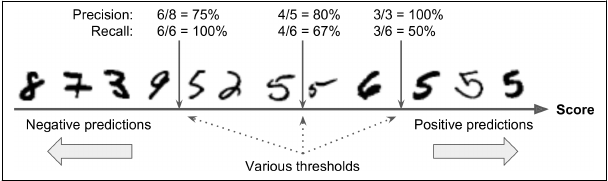
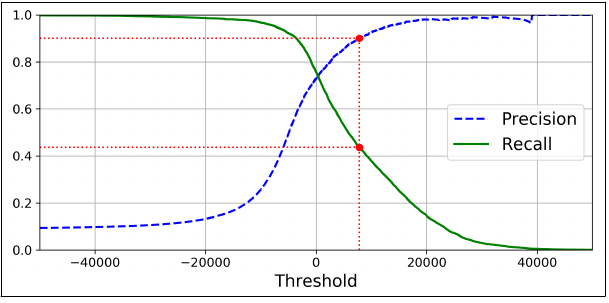
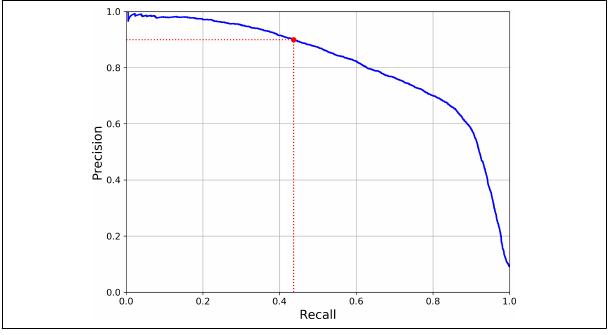
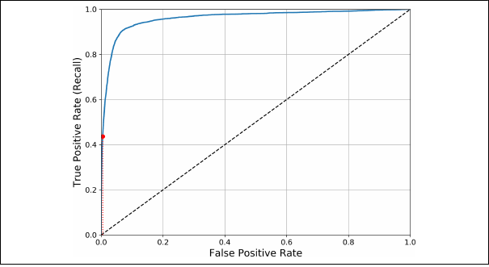

---
title:
  - Healthcare Data Analytics
author:
  - Dr. Michael Strobel
subtitle:
  - Precision / Recall tradeoff und mehr als binäre Klassifikation
date:
  - 11.04.2022
classoption:
  - aspectratio=1610,9pt
---

## Inhalt

### Letzte Woche

- Umgang mit fehlenden Datenpunkten
- Daten Pipelines
- Binäre Klassifikationsaufgaben
- Konfusionsmatrix
- Precision / Recall

### Diese Woche

- Precision / Recall tradeoff
- Multi-Klassen Klassifikation
- Training von Modellen

# Precision / Recall tradeoff

## Erinnerung: Precision / Recall

#### Precision: Wie viele der erkannten Objekte sind relevant?

$$\text{Precision := }\frac{TP}{TP+FP}$$

#### Recall: Wie viele der relevanten Objekte wurden erkannt?

$$\text{Recall := }\frac{TP}{TP+FN}$$

## Precision Recall, Visualisierung

{ width=350px }

## Precision / Recall tradeoff

- Manche Problemstellungen erfordern entweder hohe Precision oder hohen Recall
  - Jugendschutz Filter: hohe Precision / geringer Recall
  - Diebstahl Erkennung auf Video: geringe Precision / hoher Recall
- Die Erhöhung der Precision verringert den Recall
- Die Erhöhung des Recall verringert den Precision
- Dies nennen wir den _Precision / Recall tradeoff_

## Precision / Recall tradeoff, Entscheidungsfindung

### Wie entscheidet ein Klassifikator zu welcher Klasse eine Beobachtungseinheit gehört?

#### Binärer Klassifikator - Definition: Entscheidungsfunktion

Gegeben sei eine Menge $X$ von Input Daten. Wir nennen eine Funktion $f: X \rightarrow \mathbb R$ eine _Entscheidungsfunktion_.

#### Binärer Klassifikator

Gegeben seien eine Entscheidungsfunktion $f$ und ein Schwellwert $T \in \mathbb R$. Ein _binärer Klassifikator mit Entscheidungsfunktion_ ist eine Funktion $K_{f,T}: X \rightarrow \{0,1\}$

$$
K_{f, T} (x):=
\begin{cases}
1, \text{ falls } f(x) \geq T\\
0, \text{ sonst}
\end{cases}
$$

## Precision / Recall tradeoff, Beispiel

{ width=400px }

## Precision / Recall tradeoff, Plot Precision und Recall

{ width=400px }

## Precision / Recall tradeoff, Plot Precision gegen Recall

{ width=400px }

## ROC Curve / AUC Score

- receiver operating characteristic (ROC) ist ein weiteres Mittel zur Visualisierung der Performance von binären Klassifikatoren
- True Positive Rate (= Recall) gegen Falsch Positiv Rate (FPR)
- Die Fläche unter der ROC Kurve wird als _area under the curve (AUC)_ bezeichnet

## ROC Curve / AUC Score, cont'd

{ width=400px }
TODO: Bild

## ROC Curve / AUC Score, Metrik

- Ein fehlerfreier binärer Klassifikator hat einen AUC von $1$
- Pures Raten hat ein AUC von $0.5$
- Werte von $\leq 0.5$ sind Anzeichen eines schlechten binären Klassifikators

  <!-- { width=400px } -->
