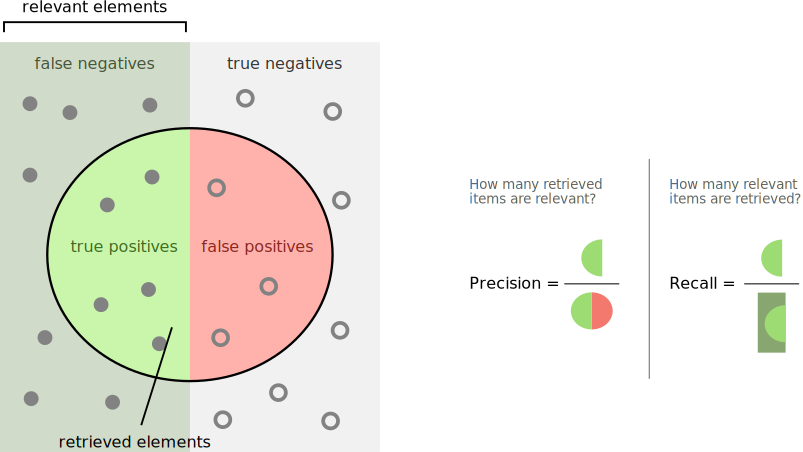

---
title:
  - Healthcare Data Analytics
author:
  - Dr. Michael Strobel
subtitle:
  - Precision / Recall tradeoff und mehr als binäre Klassifikation
date:
  - 11.04.2022
classoption:
  - aspectratio=1610,9pt
---

## Inhalt

### Letzte Woche

- Umgang mit fehlenden Datenpunkten
- Daten Pipelines
- Binäre Klassifikationsaufgaben
- Konfusionsmatrix
- Precision / Recall

### Diese Woche

- Precision / Recall tradeoff
- Multi-Klassen Klassifikation
- Training von Modellen

# Precision / Recall tradeoff

## Erinnerung: Precision / Recall

#### Precision: Wie viele der erkannten Objekte sind relevant?

$$\text{Precision := }\frac{TP}{TP+FP}$$

#### Recall: Wie viele der relevanten Objekte wurden erkannt?

$$\text{Recall := }\frac{TP}{TP+FN}$$

## Precision Recall, Visualisierung

{ width=350px }

## Precision / Recall tradeoff

- Manche Problemstellungen erfordern entweder hohe Precision oder hohen Recall
  - Jugendschutzfilter: hohe Precision / geringer Recall
  - Diebstahlerkennung auf Video: geringe Precision / hoher Recall
- Die Erhöhung der Precision verringert den Recall
- Die Erhöhung des Recall verringert den Precision
- Dies nennen wir den _Precision / Recall tradeoff_

TODO: Bild

## ROC Curve / AUC Score

- receiver operating characteristic (ROC) ist ein weiteres Mittel zur Visualisierung der Performance von binären Klassifikatoren
- True Positive Rate (= Recall) gegen Falsch Positiv Rate (FPR)

TODO: Bild

  <!-- { width=400px } -->
