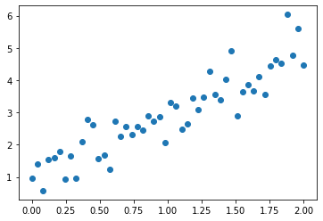
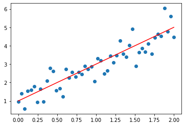
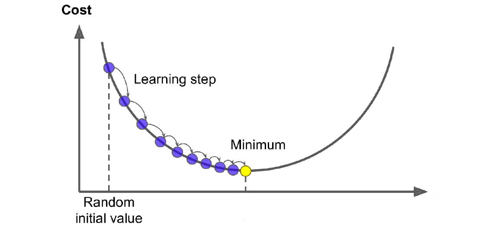
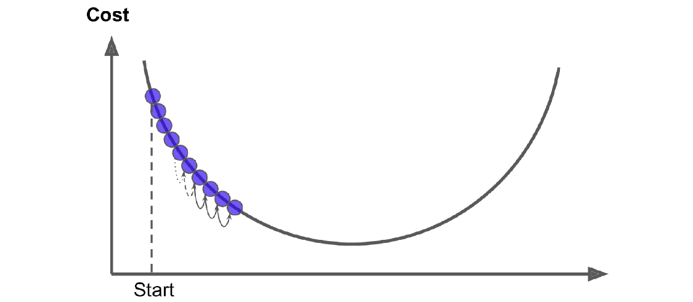
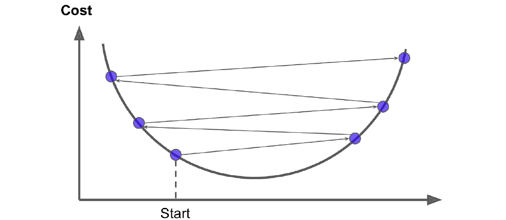
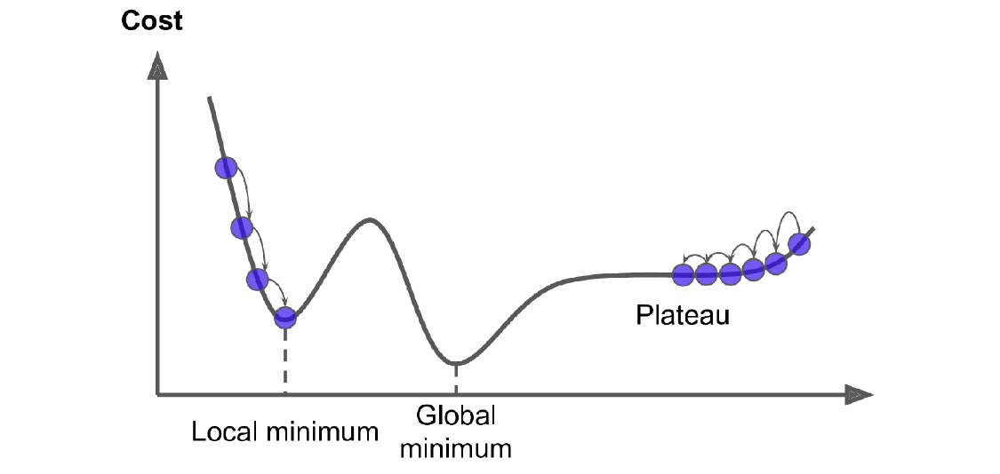
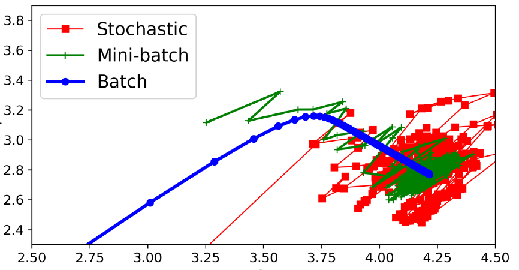
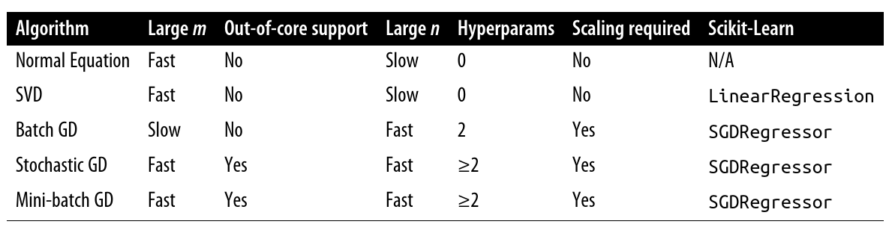

---
title:
  - Healthcare Data Analytics
author:
  - Dr. Michael Strobel
subtitle:
  - Regression und Training von Modellen
date:
  - 25.04.2022
classoption:
  - aspectratio=1610,9pt
---

## Inhalt

### Letzte Woche

- Precision / Recall tradeoff
- Multi-Klassen Klassifikation

### Diese Woche

- Regression
- Gradientenabstieg
- Training von Modellen

## Intro

- Bis jetzt war für uns Machine Learning eine "Black-Box"
- Sie haben verschiedene Methoden benutzt wie z.B.
  - Decision Trees
  - Random Forests
  - Support Vector Machinen
  - ...
- Jetzt kümmern wir uns darum wie man diese Verfahren trainiert werden
- Beispielhaft schauen wir uns die _Lineare Regression_ an

## Lineare Regression - Beispiel

{ width=400px }

## Lineare Regression - Beispiel

{ width=400px }

## Features Verallgemeinerung

Bis jetzt haben wir angenommen, dass für jedes Feature $x_1, \ldots, x_n$ gilt dass $x_i \in \mathbb R \forall i$.

Ab jetzt nehmen wir an, dass jedes Feature $x_1, \ldots, x_n \in \mathbb R^m$ für $m \in \mathbb N$.

Wir definieren die _Featurematrix_ $X \in \mathbb R^{n \times m}$ als

$$
X = \begin{pmatrix}
 x_1^T \\
 x_2^T \\
 \ldots \\
 x_n^T \\
\end{pmatrix}
$$

Beispiel:

$x_1 = (1,2,3)^T, x_2 = (4,5,6)^T$. Damit ist $n=2$ und $m=3$. Daher ist $X \in \mathbb R^{2\times 3}$ und es gilt

$$
X = \begin{pmatrix}
1&2&3 \\
4&5&6 \\
\end{pmatrix}
$$

## Lineare Regression - Definition

Gegeben seien features $x_1, \ldots, x_n \in \mathbb R^m, n,m \in \mathbb N$ eine target variable $y(x_1, \ldots, x_n) \in \mathbb R$. Wir definieren das _lineare Regressionsmodell_ mit Hypothese $h_\alpha$ als

$$\hat y = \alpha_0 + \alpha_1 \cdot x_1 + ... + \alpha_N \cdot x_n$$

oder in Kurzschreibweise über die Matrix Multiplikation mit $\alpha = (\alpha_0, ..., \alpha_N)$ und $X = (1, x_1, ..., x_N)$

$$ \hat y = X \alpha \in \mathbb R $$

Damit kann nun ein Label vorhergesagt werden. Wie kommen wir jetzt an so ein $\alpha$? Über Training!

## Lineare Regression - Optimierungsproblem

Erinnern Sie sich an Ihre Numerik beziehungsweise Statistik Einführungvorlesung. Hier haben Sie die _lineare Ausgleichsrechnung_ kennengelernt. Wenn Sie die "beste" Lösung $\hat \alpha$ für alle Traningsdaten erhalten wollen müssen Sie den MSE minimieren.

$$ \underset{\alpha \in \mathbb R^n}{\min} \operatorname{MSE}(\alpha X, \hat y)= \underset{\alpha \in \mathbb R^n}{\min} \frac{1}{n}{{\sum_{i=1}}}^n((\alpha X)^{n}-(\hat{{y_{i}}} )^{n})^2 $$

$$\Leftrightarrow \underset{\alpha \in \mathbb R^n}{\min} \| \alpha \cdot X - \hat y\|_{2}^{2}$$

<!-- $\underset{\alpha \in \mathbb R}{\min} \| \alpha \cdot X - \hat y\|_{2}$ -->

## Lineare Regression - Geschlossene Lösung

Wir wissen aus den genannten Einführungvorlesung, dass die geschlossene Lösung von $\hat \alpha$ wie folgt lautet

$$\hat \alpha = (X^T X )^{-1} X^T y$$

Was ist das Problem mit dieser Formel?

## Lineare Regression - Geschlossene Lösung Beweis

_Beweis an der Tafel_

## Lineare Regression - Geschlossene Lösung Praxis

Matrix $X^T X$ zu invertieren ist

- teuer zu berechnen: $O(n^3)$
- Anfällig für numerische Instabilität (Konditionszahl)
- Für Machine Learning Algorithmen kann die Datenmenge zu groß werden

Daher wird in der Praxis hierfür ein _iterativer_ und _approximativer_ Algorithmus verwendet. Hier ist insbesondere der _Gradientenabstieg_ zu nennen.

## Gradientenabstieg - Idee

Gegeben sei eine Funktion $f: \mathbb R^n \rightarrow \mathbb R$. Gesucht wird das Optimum

$$\underset{x \in \mathbb R^n}{\min} f(x)$$

#### Gradientenverfahren

Gegeben sei ein Startpunkt $x^0\in\mathbb R^n$. Dann definiert sich das _Gradientenverfahren_ mit der Iterationsvorschrift

$$x^{k+1} = x^k+\eta^kd^k,\quad k=0,1,\ldots$$

wobei $\eta^k > 0$ die _Schrittweite_ bezeichnet und $d^k$ eine _Abstiegsrichtung_. Im Kontext von Machine Learning nennt man die Schrittweite _learning rate_.

Meist wird $d^k$ wie folgt gewählt: $d^k = -D^k\nabla f(x^k)$ wobei $D \in \mathbb R^{n\times n}$ wird. Für $D = I$ (Einheitsmatrix) bekommen wir das klassische Gradientenverfahren mit der _Richtung des steilsten Abstiegs_.

## Gradientenabstieg

- Der Gradientenabstieg ist das meist genutzte Verfahren im Machine Learning
- Die Konvergenz, also das finden des Minimums, ist nicht trivial
- Probleme die Auftreten können

  - Schrittweite zu klein
  - Schrittweite zu groß
  - Lokale Minima / Wendepunkte

- Daten im Machine Learning sind normalerweise hochdimensional, daher ist Konvergenz des Gradientenabstiegs Forschungsthema
- Viele der Fortschritte im Machine Learning gehen auch auf Verbesserungen im Gradientenabstieg zurück

## Gradientenabstieg - Visualisierung 1

#### Normaler Gradientenabstieg

{ width=400px }

## Gradientenabstieg - Visualisierung 2

#### Schrittweite zu gering

{ width=400px }

## Gradientenabstieg - Visualisierung 3

#### Schrittweite zu hoch

{ width=400px }

## Gradientenabstieg - Visualisierung 4

#### Lokales Minimum

{ width=400px }

## Gradientenabstieg - MSE

Für unser Beispiel der lineare Regression gilt dann
$$\nabla_\alpha \operatorname{MSE}(\alpha X, y) = \frac{2}{m}X^T(X\alpha-y)$$

Und somit gilt für die Regression:

$$\alpha^{k+1} = \alpha^k-\eta^k\frac{2}{m}X^T(X\alpha-y),\quad k=0,1,\ldots$$

wobei wir $\alpha^{0}$ z.B. mit $(1,\ldots, 1)$ initialisieren.

## Gradientenabstieg - Verschiedene Ausprägungen

Neben der Schrittweitensteuerung ist die Auswahl der Trainingsdaten ein wichtiger Parameter, hier gibt es mehrere gängige Verfahren

- Batch Gradient Descent
- Stochastic Gradient Descent
- Mini Batch Gradient Descent

## Gradientenabstieg - Batch Gradient Descent

Beim _Batch Gradient Descent_ die gesamten Trainingsdaten **gesamte** auf einmal verarbeitet.

Der Gradient bei der Linearen Regression ist folgender:
$$\nabla_\alpha \operatorname{MSE}(\alpha X, y) = \frac{2}{m}X^T(X\alpha-y)$$

Daher wird in **jedem Schritt der gesamte Datensatz verarbeitet**.

Dies kann bei sehr großen Datensätzen sehr viel Aufwand bedeuten: Speicher- und CPU/GPU Zeit steigt linear mit der Anzahl der Beobachtungseinheiten.

## Gradientenabstieg - Stochastic Gradient Descent

Beim _Stochastic Gradient Descent_ wird nur **eine** Beobachtungseinheit auf einmal verarbeitet.

Speicher- und CPU/GPU Zeit sind hier **sehr gering**, aber das Konvergenzverhalten ist nicht optimal, d.h. das Optimum wird selten erreicht.

## Gradientenabstieg - Epoch / Online Learning / Out of Core

#### Definition: Epoch

Wir nennen das Training mit nur einem Teil der Trainingsdaten _Epoch_.

#### Definition: Online Learning

Wenn wir ein Modell _inkrementell_ trainiert werden kann nennen wir dies _online learning_.

#### Definition: Out of Core

Wenn ein Modell auch trainiert werden kann, wenn der Datensatz der zum Training genutzt wird **nicht** in den Hauptspeicher des Computers geladen werden kann, nennen wir dies _out-of-core_ learning.

## Gradientenabstieg - Mini-Batch Gradient Descent

Kombiniert man diese Ideen erhält man den _Mini-Batch Gradient Descent_. Hier wird nur einer **Teilmenge** der Beobachtungseinheiten in jeder Epoch trainiert.

Speicher- und CPU/GPU Zeit sind hier **gering**, aber das Konvergenzverhalten liegt zwischen Stochastic Gradient Descent und Batch Gradient Descent.

## Gradientenabstieg - Vergleichsbild

#### Verschiedene Gradientenabstiegsmethoden im Vergleich

{ width=400px }

## Gradientenabstieg - Auswahl

Seien $m$ die Anzahl der Beobachtungseinheit und $n$ die Anzahl der Features, dann

{ width=500px }

<!-- ## Early Stopping -->

<!-- ## Gradientenabstieg - Verbesserungen -->

<!-- - Momentum -->
<!-- - ADAM -->
<!-- - RMSProps -->

<!-- ## Regression Verallgemeinerung -->

<!-- ## Polynomielle Regression -->

<!-- ## Logistische Regression -->

<!-- ## Softmax Klassifikation -->

<!-- ## Regularisierung - Intro -->

<!-- ## Regularisierung - $L_1$ -->

<!-- ## Regularisierung - $L_2$ -->
