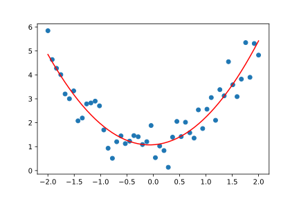
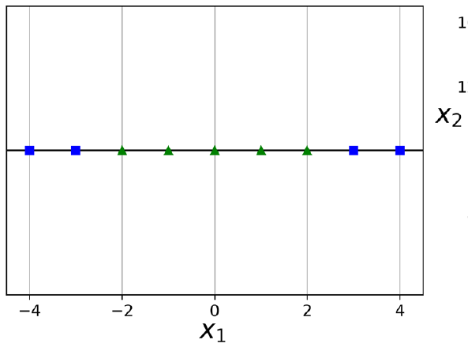
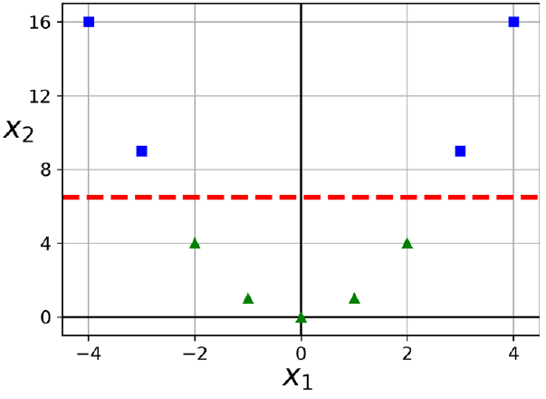
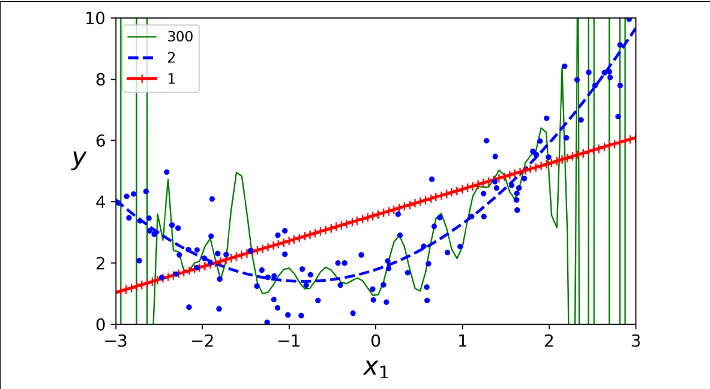
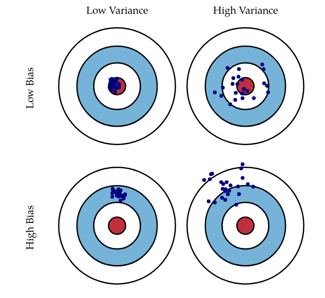
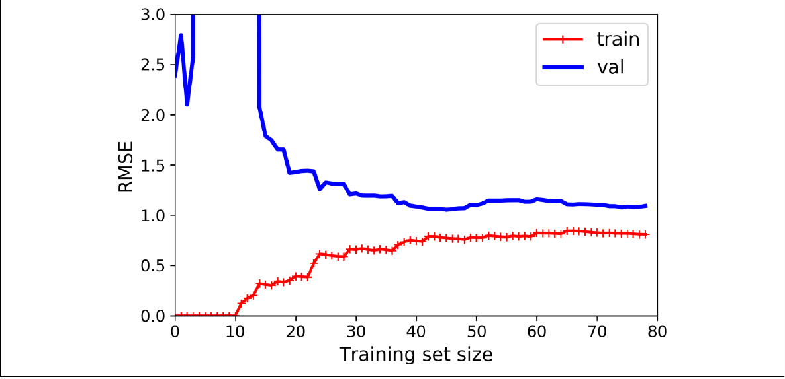
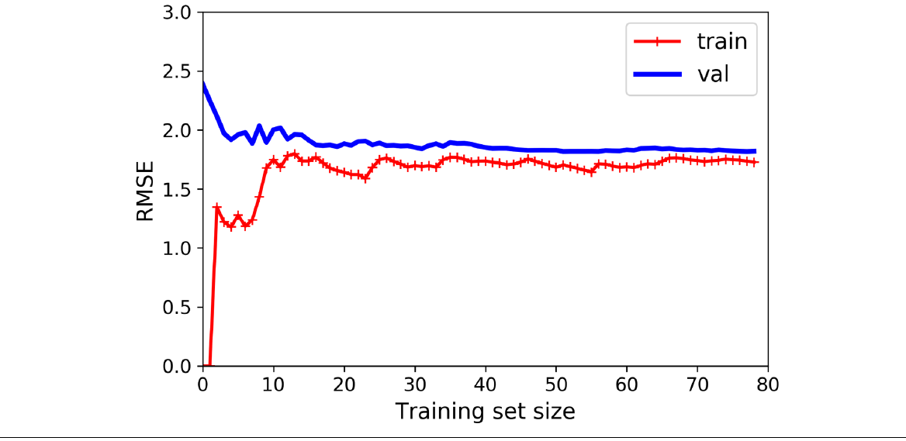
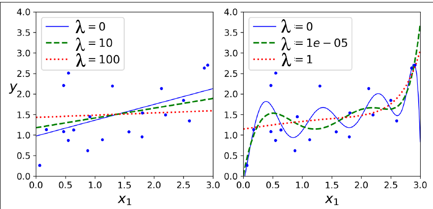
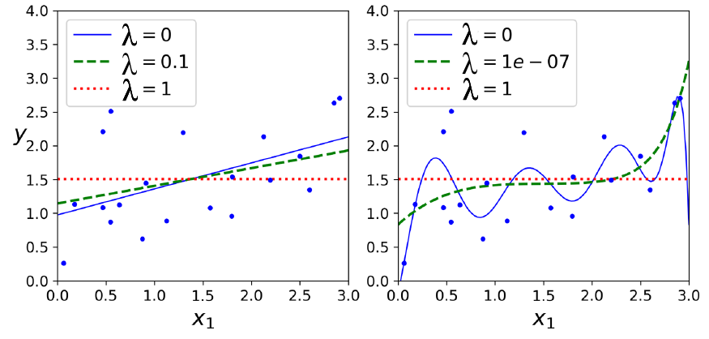
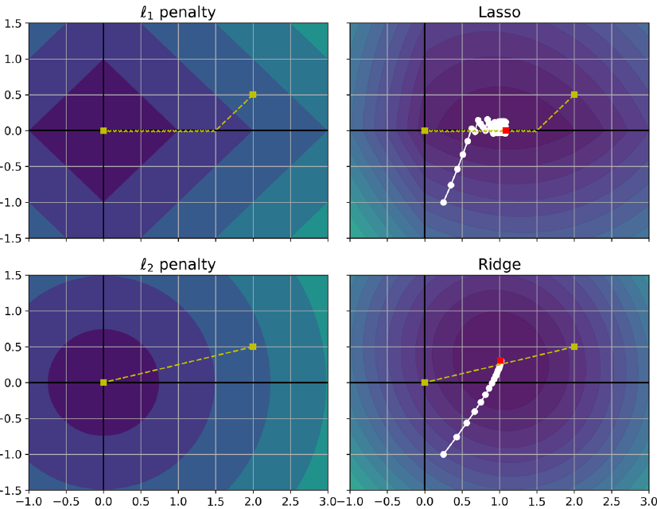

---
title:
  - Healthcare Data Analytics
author:
  - Dr. Michael Strobel
subtitle:
  - Regression und Training von Modellen
date:
  - 02.05.2022
classoption:
  - aspectratio=1610,9pt
---

## Inhalt

### Letzte Woche

- Regression
- Gradientenabstieg
- Training von Modellen

### Diese Woche

- Polynomielle Regression
- Overfitting
- Underfitting
- Regularisierung

## Polynomielle Regression - Beispiel

{ width=500px }

## Polynomielle Regression

Die Idee zur Verallgemeinerung der linearen Regression den Ansatz einer _Polynombasis_: $P(X_1, \dotsc, X_n) = \sum_{0 \leq i_1,\dotsc,i_n \leq n}a_{i_1,\dotsc,i_n}X_1^{i_1}\dotsm X_n^{i_n}$ Und die Bestimmung der $a_{i_1,\dotsc,i_n}$ über lineare Regression.

Formale Definition: nicht hier.

### Polynomielle Features

Wir nennen Features die über eine Polynombasis definiert wurden _Polynomielle Features_.

#### Beispiele

##### Ein Feature, Grad zwei

$(X_1) \mapsto (1,X_1, X_1^2)$

##### Zwei Feature, Grad zwei

$(X_1, X_2) \mapsto (1,X_1, X_2, X_1^2, X_1 X^2, X_2^2)$

## Polynomielle Regression - Zahlenbeispiel

Zwei Features und Grad Zwei

$$
X =
\begin{pmatrix}
0 & 1 \\
2 & 3 \\
4 & 5 \\
\end{pmatrix}
\mapsto
\begin{pmatrix}
1&  0&  1&  0&  0&  1 \\
1&  2&  3&  4&  6&  9  \\
1&  4&  5& 16& 20& 25
\end{pmatrix} =: X_{\text{poly}}
$$

## Verfahren zur Lösung

#### Geschlossene Lösung

Analog zur letzen Vorlesung bestimmt sich die _geschlossene Lösung_ wie
$$\hat \alpha = (X^T X )^{-1} X^T y$$

#### Gradientenabstieg

Analog lässt sich auch die Konvergenztheorie des Gradientenabstiegs der letzen Vorlesung nutzen.

## Polynomielle Features

Polynomielle Features lassen sich auch benutzen um nichtlineare Zusammenhänge zwischen Features zu erfassen.

{ width=400px }

## Polynomielle Features

{ width=400px }

## Underfitting / Overfitting

#### Definition: Underfitting

Wir nennen ein Model _underfitting_ wenn es sowohl auf Traningsdaten als auch auf den Testdaten schlechte Performance zeigt.

#### Definition: Overfitting

Wir nennen ein Model _overfitting_ wenn es gute Performance auf den Trainingsdaten, aber schlechte Performance auf den Testdaten zeigt.

## Overfitting: Visualisierung

{ width=400px }

## Strategien gegen Underfitting

- Passendes Modell zum gestellten Problem finden
- Genug Trainingsdaten
- Pre-Processing optimieren
- Feature Engineering: erzeugen von neuen Features aus bestehenden Features
- Mehr CPU/GPU Trainingszeit

## Strategien gegen Overfitting

Wir sehen uns heute zwei Klassen von Methoden gegen Overfitting an

- Explizite Regularisierung: $L_1$ und $L_2$ (Tikhonov) Regularisierung
- Implizite Regularisierung: Early Stopping

## Regularisierung - Intro

#### Was ist Regularisierung?

Machine Learning Modelle können extrem komplexe Datensätze erfassen und modellieren. Dies ist natürlich wünschenswert, aber gleichzeitig auch ein Nachteil: wenn das Modell versucht auf allen Trainingsdaten extrem gut abschneidet kann es sein, dass dies nicht für die Testdaten gilt (und damit auch für den Einsatz in der Praxis). Dies liegt daran, dass ein **zu komplexes** Modell vom Algorithmus bestimmt wurde.

## Bias / Varianz: Arten von Fehlern im Modell

#### Definition: Bias

Der Bias-Fehler ist der Fehler, der durch fehlerhafte Annahmen im Machine Learning entsteht. Ein hoher Bias-Fehler kann dazu führen, dass ein Algorithmus die relevanten Beziehungen zwischen Features und Labels übersieht. Dies ist die Ursache von Underfitting.

#### Definition: Varianz

Die Varianz ist der Fehler, der auf die Empfindlichkeit gegenüber kleinen Schwankungen in den Trainingsdaten zurückzuführen ist. Eine hohe Varianz kann daraus resultieren, dass ein Algorithmus das Zufallsrauschen in den Trainingsdaten modelliert. Dies ist die Ursache von Overfitting.

## Bias / Varianz: Visualisierung

{ width=300px }

## Bias / Varianz: trade-off

#### Definition: Bias / Varianz Trade-off

Die Erhöhung der Komplexität des Modells führt typischerweise dazu, dass der Bias sinkt, aber die Varianz steigt. Genauso führt die Verringerung der Komplexität des Modells typischerweise dazu, dass der Bias steigt, aber die Varianz sinkt.

Dies nennt man den _Bias / Varianz Trade-off_.

## Learning Curve

#### Wie erkennt man nun, dass man einen guten Kompromiss zwischen Bias und Varianz gefunden hat?

Ein Weg zu sehen wie gut unser Modell ist und wie der Bias / Varianz Trade-off sich verhält ist die _Learning Curve_. Hierfür vergleicht man den Fehler den das Modell bei steigender Anzahl von Trainingsdaten auf den Tranings- und Testdaten macht.

{ width=400px }

## Interpretation: Learning Curve

Generell möchte man bei der Learning Curve mit mehr Trainingsdaten einen **abfallenden Fehler** beobachten. Dies ist ein Zeichen, dass der Algorithmus mit mehr Trainingsdaten lernt. Zudem möchte man, dass die Kurve der Trainingsdaten sich annähert und keine Lücke hat. Dies ist ein Zeichen von gutem Bias / Varianz tradeoff.

Typische Probleme:

- Fehler des Modells ist in Trainingsdaten und Testdaten hoch: Underfitting.
- Fehler in den Testdaten höher als in den Trainingsdaten: Overfitting

## Learning Curve: Lineare Regression

#### Lineare Regression: Underfitting

{ width=400px }

## Learning Curve: Polynomielle Regression

#### Polynomielle Regression: Overfitting

{ width=400px }

## Erinnerung: $L_1$ und $L_2$ Norm

**Erinnerung**: Für einen Vektor $x \in \mathbb R^n$ gilt

$$ \| x \|_1 = \sum_{i=1}^n |x_i|$$

$$ \|x\|_2 = \sqrt{\sum_{i=1}^n x_i^2}$$

## Definition: $L_2$ Regularisierung

#### Erinnerung: Minimierungsproblem

$$\hat \alpha = \underset{\alpha \in \mathbb R^n}{\min} \| X \alpha   - \hat y\|_{2}^{2}$$

## Definition: $L_2$ Minimierungsproblem

Sei $\lambda \geq 0$, dann definieren wir das _$L_2$ regulierte Minimierungsproblem_
$$\hat \alpha = \underset{\alpha \in \mathbb R^n}{\min} \| X \alpha   - \hat y\|_{2}^{2} + \lambda \|\alpha \|_2^2$$

Weitere Namen sind auch _Tikhonov-_ oder _Ridge-_ Regularisierung.

## Geschlossene Lösung: $L_2$ Minimierungsproblem

Sei $\lambda \geq 0$ und gegeben _$L_2$ regulierte Minimierungsproblem_
$$\hat \alpha = \underset{\alpha \in \mathbb R^n}{\min} \| X \alpha   - \hat y\|_{2}^{2} + \lambda \|\alpha \|_2^2$$

Dann ist die geschlossene optimale Lösung des Minimierungsproblems gegeben durch

$$\hat \alpha = (X^T X + \operatorname{Id}\lambda)^{-1} X^T \hat y$$

**Beweis**: an der Tafel

## Visualisierung: $L_2$ Minimierungsproblem

Visualisierung der $L_2$ Regularisierung mit verschiedenen Parametern
{ width=400px }

## Definition: $L_1$ Minimierungsproblem

Sei $\lambda \geq 0$, dann definieren wir das _$L_1$ regulierte Minimierungsproblem_
$$\hat \alpha = \underset{\alpha \in \mathbb R^n}{\min} \| X \alpha   - \hat y\|_{2}^{2} + \lambda \|\alpha \|_1$$

Ein weiterer gebräuchlicher Name ist _Lasso_ (Least Absolute Shrinkage and Selection Operator Regression).

## Visualisierung: $L_1$ Minimierungsproblem

Visualisierung der $L_1$ Regularisierung mit verschiedenen Parametern
{ width=400px }

## $L_1$ vs $L_2$ Regularisierung

Generell neigt die $L_1$ Regularisierung dazu möglichst viele Koeffizienten auf $0$ zu drücken und führt damit zu einem _dünnbesetzten (engl. sparse)_ Modell. Die $L_2$ Regularisierung wiederum neigt dazu die Koeffizienten stärker gleichmäßig zu minimieren was zu mehr gleichverteilten Koeffizienten führt.

## Visualisierung: $L_1$ vs $L_2$ Regularisierung

{ width=400px }

## Referenzen

- Géron, A. (2019). Hands-on machine learning with Scikit-Learn, Keras, and TensorFlow: Concepts, tools, and techniques to build intelligent systems. O'Reilly Media.
