---
title:
  - Healthcare Data Analytics
author:
  - Dr. Michael Strobel
subtitle:
  - Decision Tress
date:
  - 09.05.2022
classoption:
  - aspectratio=1610,9pt
---

## Inhalt

### Letzte Woche

- Polynomielle Regression
- Overfitting
- Underfitting
- Regularisierung

### Diese Woche

- Wiederholung Regularisierung
- Decision Trees

## Wiederholung Definition: $L_2$ Regularisierung

#### Erinnerung: Minimierungsproblem

$$\hat \alpha = \underset{\alpha \in \mathbb R^n}{\min} \| X \alpha   - \hat y\|_{2}^{2}$$

## Definition: $L_2$ Minimierungsproblem

Sei $\lambda \geq 0$, dann definieren wir das _$L_2$ regulierte Minimierungsproblem_
$$\hat \alpha = \underset{\alpha \in \mathbb R^n}{\min} \| X \alpha   - \hat y\|_{2}^{2} + \lambda \|\alpha \|_2^2$$

Weitere Namen sind auch _Tikhonov-_ oder _Ridge-_ Regularisierung.

## Geschlossene Lösung: $L_2$ Minimierungsproblem

Sei $\lambda \geq 0$ und gegeben _$L_2$ regulierte Minimierungsproblem_
$$\hat \alpha = \underset{\alpha \in \mathbb R^n}{\min} \| X \alpha   - \hat y\|_{2}^{2} + \lambda \|\alpha \|_2^2$$

Dann ist die geschlossene optimale Lösung des Minimierungsproblems gegeben durch

$$\hat \alpha = (X^T X + \operatorname{Id}\lambda)^{-1} X^T \hat y$$

## Visualisierung: $L_2$ Minimierungsproblem

Visualisierung der $L_2$ Regularisierung mit verschiedenen Parametern
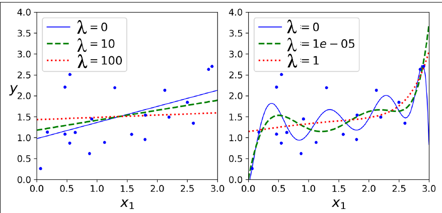{ width=400px }

## Definition: $L_1$ Minimierungsproblem

Sei $\lambda \geq 0$, dann definieren wir das _$L_1$ regulierte Minimierungsproblem_
$$\hat \alpha = \underset{\alpha \in \mathbb R^n}{\min} \| X \alpha   - \hat y\|_{2}^{2} + \lambda \|\alpha \|_1$$

Ein weiterer gebräuchlicher Name ist _Lasso_ (Least Absolute Shrinkage and Selection Operator Regression).

## Visualisierung: $L_1$ Minimierungsproblem

Visualisierung der $L_1$ Regularisierung mit verschiedenen Parametern
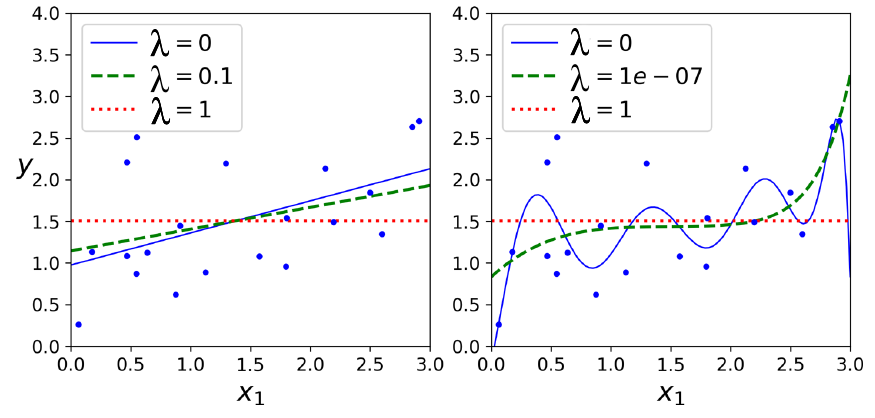{ width=400px }

## $L_1$ vs $L_2$ Regularisierung

Generell neigt die $L_1$ Regularisierung dazu möglichst viele Koeffizienten auf $0$ zu drücken und führt damit zu einem _dünnbesetzten (engl. sparse)_ Modell. Die $L_2$ Regularisierung wiederum neigt dazu die Koeffizienten stärker gleichmäßig zu minimieren was zu mehr gleichverteilten Koeffizienten führt.

## Visualisierung: $L_1$ vs $L_2$ Regularisierung

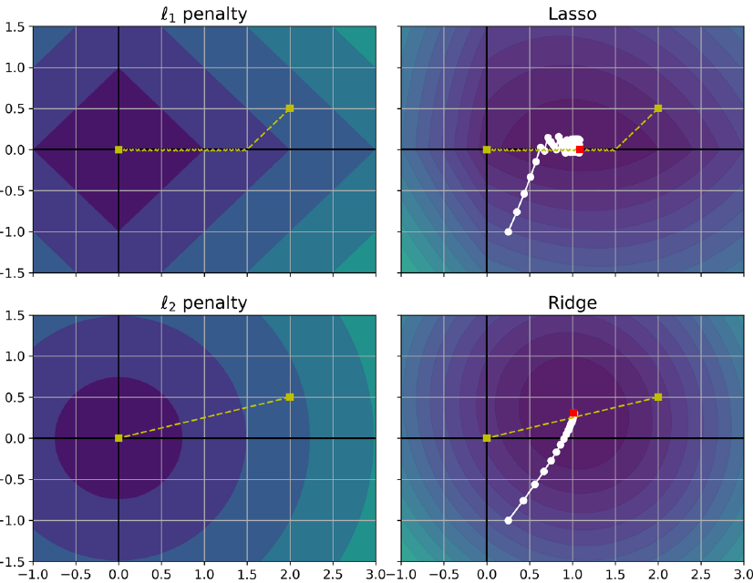{ width=400px }

## Early Stopping

Ein weiterer Weg das Modell zu regularisieren ist _early stopping_. Hierbei stoppt man den Gradientenabstieg sobald der Fehler in der **Testmenge** nicht mehr sinkt beziehungsweise sogar steigt.

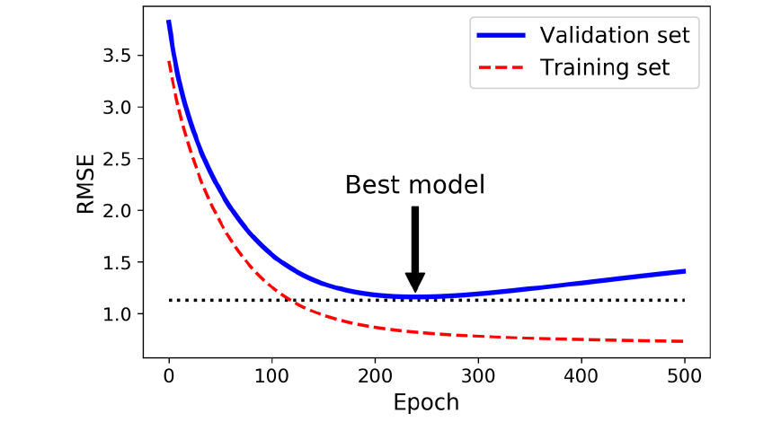{ width=400px }

## Decision Trees

- Bis jetzt haben wir Machine Learning Methoden nur angewandt
- Jetzt gehen wir zumindest für eine Methoden ins Detail
- Eine sehr bekannte Methode sind _Decision Trees_
- Decision Trees eignen sich für Regression und auch für Mehrklassen-Klassifikation

## Decision Trees - Visualisierung Klassifikation

### Decision Tree auf dem Titanic Dataset

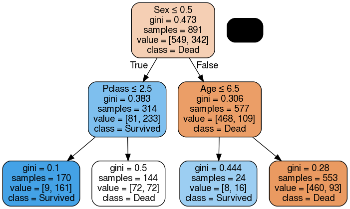{ width=400px }

## Decision Trees - Visualisierung 2

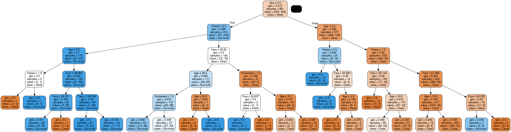{ width=550px }

## Decision Trees - Wie liest man einen Decision Tree

- Man starte an der Wurzel
- Die erste Zeile zeigt die **Ja oder Nein Frage**
  - links der der Unterbaum der die Frage mit **ja** beantwortet
  - rechts der der Unterbaum der die Frage mit **nein** beantwortet
- Die Blätter enthalten die jeweilige Klasse

{ width=250px }

## Decision Tree - weitere Daten

Der Decision Tree enthält weitere Informationen

- wie viele Testdaten wurden dem Blatt zugeordnet (samples)
- welcher Klasse wurden diese zugeordnet (value)
- mit diesen Daten können Wahrscheinlichkeiten berechnet werden (klassisches Urnenmodell)

{ width=250px }

## Decision Trees - Gini Impurity

#### Wie beurteilt man ob der Baum gute Entscheidungen trifft?

#### Gini Impurity

- Über die Anzahl aller Testdaten und Samples im Knoten können wir eine Klassen-Wahrscheinlichkeit $p_{i,k}$ berechnen, genauer $p_{i,k}$ ist das Verhältnis der Klasse $k$ unter allen Traningsdaten im Knoten $i$
- Wir definieren die _Gini Impurity_ im Knoten $i$ als $G_i := 1 - \sum_{k=1}^n p_{i,k}^2$
- $G = 0$ heißt, dass alle Testdaten in die gleiche Kategorie fallen, also _pure_ sind.
- $G = 0.5$ heißt, dass die Angabe essentiell geraten it.

{ width=250px }

## Gini Impurity - Beispiel

- Beispiel am Blatt links unten: $G = 1 - (\frac{9}{170})^2 - (\frac{161}{170})^2 = 0.1$
- Ein Wert von $0.1$ ist gut, der Decision Tree ist sich sicher
- Der Nachbarknoten hat einen Gini Wert von $0.5$, d.h. er rät
- Das finden des optimalen Baumes ist NP Schwer, es gibt polynomielle Algorithmen die gute Lösungen finden

{ width=250px }

## Decision Trees -- Entscheidungsgrenzen

#### Entscheidungsgrenzen

Da der Baum Stückweise lineare Funktionen repräsentieren können diese gut visualisiert werden

Hier ein Beispiel mit drei Klassen: Iris Dataset

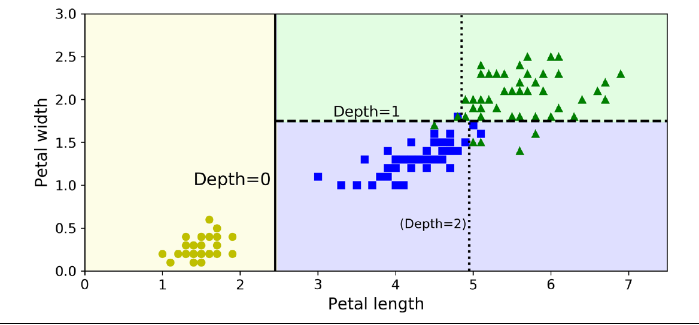{ width=400px }

## Decision Trees -- Overfitting

Decision Tree neigen zu extremen Overfitting wenn der Parameterraum nicht begrenzt wird

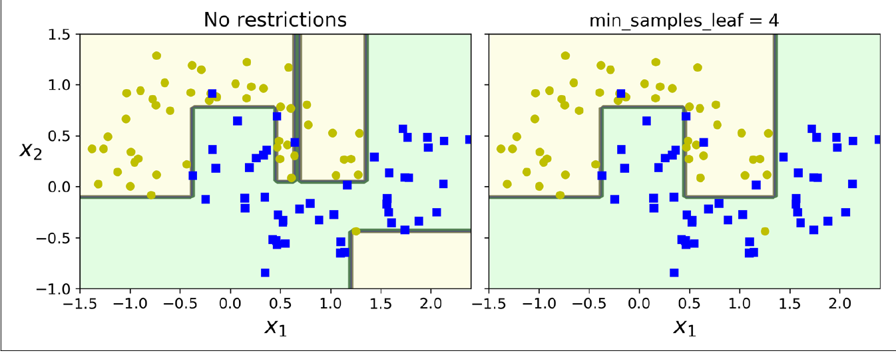{ width=400px }

## Decision Trees -- Regularisierung

#### Decision Tree können über verschiedene Parameter regularisiert werden

- Maximale Tiefe des Baums (max_depth)
- Minimale Anzahl der Beobachtungseinheiten um einen Knoten aufzuteilen (min_samples_split)
- Minimale Anzahl der Beobachtungseinheiten in einem Blatt (min_samples_leaf)
- Maximale Anzahl der Features (max_features)
- ...

## Decision Trees -- Regression

#### Der Decision Tree kann auch zur Regression verwendet werden

Der Tree zur Regression ähnelt dem der Klassifikation: statt einer Klasse wird ein **Wert** zugeordnet.

#### Beispiel: Regression auf $f(x)=x^2$ mit etwas Rauschen

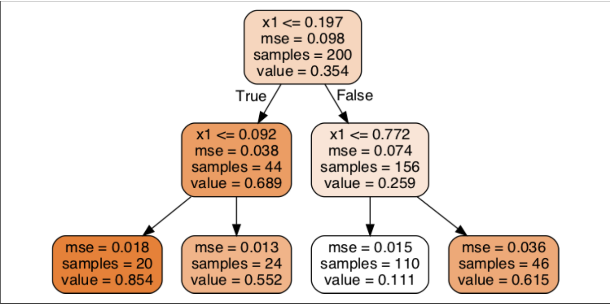{ width=400px }

## Decision Trees -- Regression Visualisierung

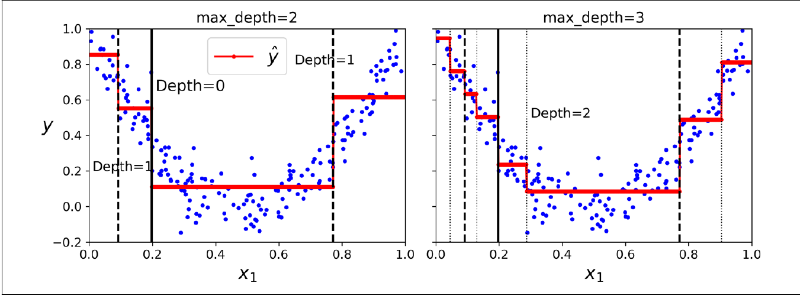{ width=500px }

## Decision Trees -- Regression Rauschen

#### Decision Trees neigen zu extremen Overfitting

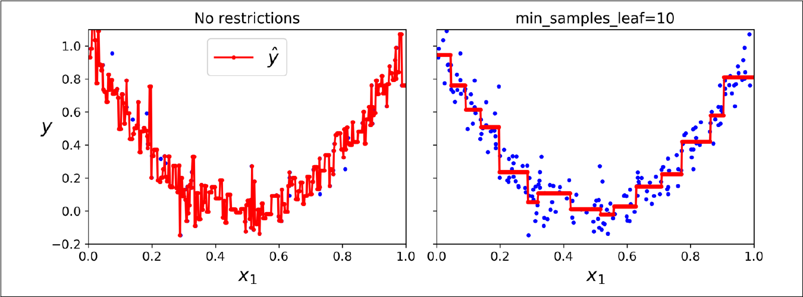{ width=500px }

## Decision Trees -- Eigenschaften

Decision Trees haben einige interessante Eigenschaften:

- Features müssen vorher nicht skaliert oder normalisiert werden
- Sie haben eine extreme Anpassungsfähigkeit an die Daten
- Sie können direkt Mehrklassen-Klassifikation leisten

Nachteile sind z.B.:

- Neigen zu starkem Overfitting wenn sie nicht regularisiert werden
- Sind nicht invariant unter Rotation (nächste Folie)

## Decision Trees -- Instabilität

Das Training von Decision Trees ist nicht _rotationsinvariant_ d.h. eine Rotation der Trainingsdaten führt nicht zur gleichen Rotation der Entscheidungsgrenzen

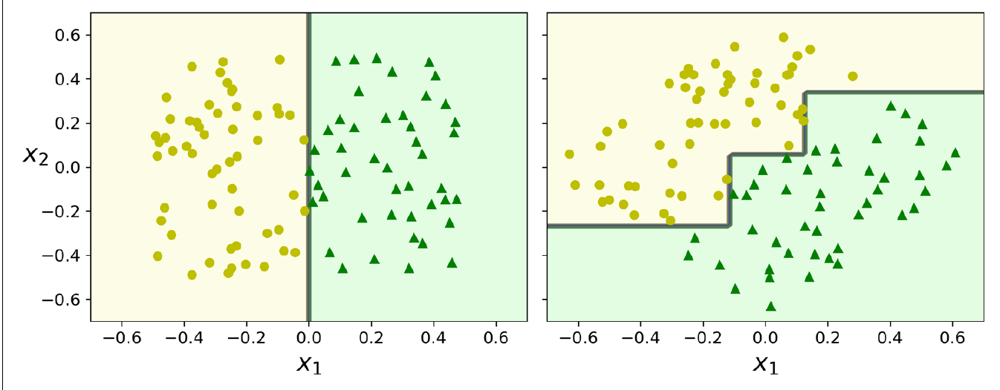{ width=500px }

## Referenzen

- Géron, A. (2019). Hands-on machine learning with Scikit-Learn, Keras, and TensorFlow: Concepts, tools, and techniques to build intelligent systems. O'Reilly Media.
