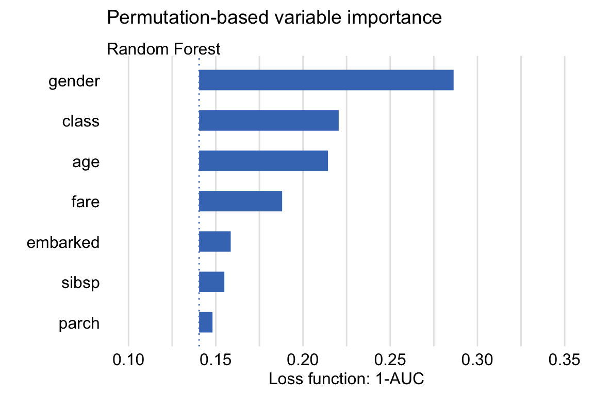
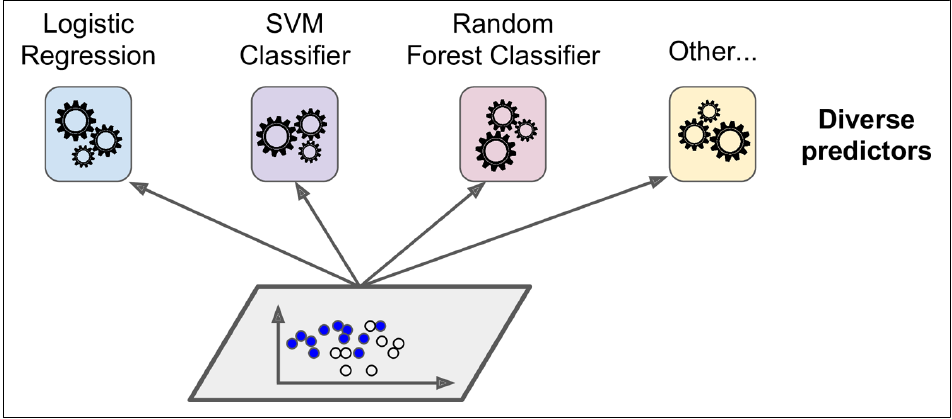
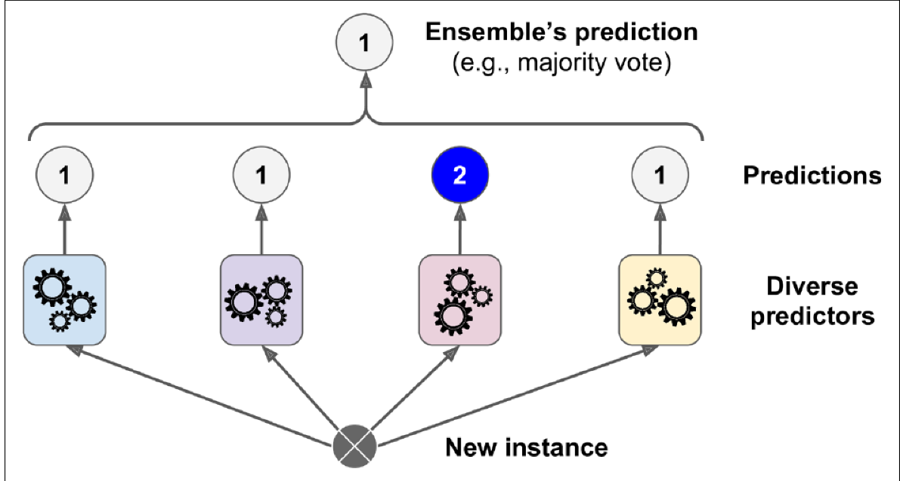
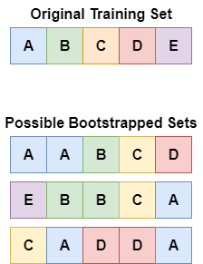
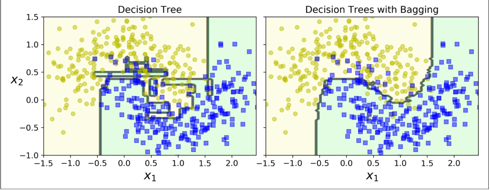
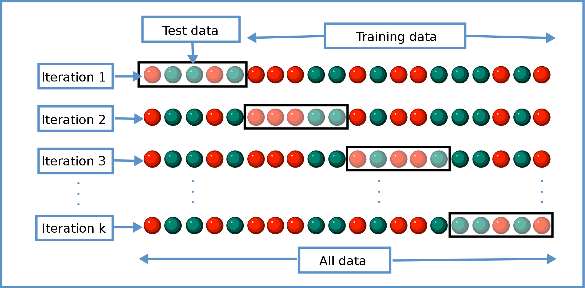

---
title:
  - Healthcare Data Analytics
author:
  - Dr. Michael Strobel
subtitle:
  - Feature Engineering, Random Forests und Data Science Checkliste
date:
  - 16.05.2022
classoption:
  - aspectratio=1610,9pt
---

## Inhalt

### Letzte Woche

- Wiederholung Regularisierung
- Decision Trees

### Diese Woche

- Feature Importance
- Feature Engineering
- Random Forests
- Data Science Projekt Checkliste

## Feature Engineering

Unter _Feature Engineering_ verstehen wir Transformationen die aus Input Features neue Features generieren. Einige Methoden sind

- Diskretisieren von kontinuierlichen Features. z.B. Alter in Jahren $\rightarrow$ Kohorten (Baby, Kleinkind, Jugendlicher, Erwachsener, Rentner)
- Extraktion von Text Features: "Duff Gordon, Sir. Cosmo Edmund" $\rightarrow$ Sir
- Kombination von Features: $(Fare, SibSp, Parch) \rightarrow \frac{Fare}{SibSp + Parch + 1}$ "Entgeld pro Person"

## Feature Importance

- Features unterscheiden sich wie wichtig sie für einen Algorithmus sind.
- Manche Algorithmen erlauben es zu sehen für wie wichtig Sie ein Feature halten.
- Dies nennen wir _Feature Importance_
- Dies dient mehreren Zwecken
  - können unwichtige Features einfach weg lassen (spart Trainingszeit / Speicher)
  - Es hilft später Erklärungen abzugeben wie der Algorithmus entschieden hat

## Feature Importance: Random Forest und Titanic Dataset

{ width=350px }

## Random Forests, Intro

### "Mehrere Köpfe entscheiden besser als einer"

#### Ensemble Methoden

- Sogenannte _Ensemble Methoden_ kombinieren mehrere Machine Learning Algorithmen
- Dabei können verschiedene Methoden (SVM, Decision Tree, Regression...) oder
- Mehrere Instanzen einer Methode kombiniert werden

{ width=300px }

## Ensemble Methoden, Entscheidungsfindung

Wie entscheiden Ensemble Methoden?

### Klassikation

- _Hard Voting_: Klassifikatoren Stimmen ab und die Mehrheit gewinnt
- _Soft Voting_: Wahrscheinlichkeit aufgrund der relativen Häufigkeit

### Regression

- Bei der Regression wird in der Regel der Mittelwert gebildet
- Es sind natürlich weitere Methoden möglich (gewichteter Mittelwert, geometrisches Mittel, ...)

## Voting Classifier, Beispiel

{ width=250px }

**Titanic Dataset**: hat Person X überlebt?

- Klassifikator 1: Ja!
- Klassifikator 2: Nein!
- Klassifikator 3: Ja!

**Hard Voting**: Ja, **Soft Voting**: [2/3 Ja, 1/3 Nein]

## Bagging und Pasting

- Beim _Bagging (boostrap aggregating) oder Pasting_ wird _ein Algorithmus und mehrere Instanzen_ trainiert
- Hierbei werden die Trainingsdaten zufällig in kleinere Mengen aufgeteilt.
- Wenn diese Mengen _mit Zurücklegen_ bestimmt werden sprechen wir von _Bagging_
- Wenn diese Mengen _ohne Zurücklegen_ bestimmt werden sprechen wir von _Pasting_

## Bagging und Pasting, Visualisierung

### Bei Bagging können Beobachtungseinheiten mehrfach vorkommen, bei Pasting nicht

{ width=150px }

## Bagging und Pasting, Beispiel

### Decision Tree und 500 Decision Trees mit Bagging

- Bagging mit Decision Trees senkt sowohl Bias als auch Varianz
- Trainingskosten sind deutlich höher, da viele Decision Trees trainiert und dann kombiniert werden

{ width=400px }

## Out Of Bag Auswertung

**Kurze Erinnerung an die Übung**: Bei Cross-Validation (Kreuzvalidierung) wird ein Teil **Trainingsdaten** nicht zum Traning aber zur Validierung verwendet. Dabei bleiben die Testdaten unberührt.

{width=300px }

Um die Performance von Bagging und Pasting bereits beim Training zu beobachten kann _Out-of-Bag_ Evaluation verwendet werden: hier werden ein Algorithmus nur mit ca. 2/3 der Instanzen trainiert und 1/3 zur Cross-Validierung verwendet.

## Random Forest

- Ein _Random Forest_ sind Decision Trees die mit Bagging kombiniert werden
- Jeder Decision Tree wird nur mit einer begrenzten Menge von Features trainiert, dies führt zu deutlich unterschiedlichen Trees
- Jeder Baum hat zwar damit eine Höhere Varianz und Bias aber kombiniert sinkt die Varianz und Bias deutlich
- Klassifikation erfolgt über Hard Voting (predict), aber auch Soft Voting ist möglich (predict_proba)

## Random Forest, Visualisierung

{ width=400px }

## Machine Learning Projekt Checkliste

1. Einordnung des Problems und Blick auf das große Ganze
2. Daten laden
3. Datenexploration
4. Daten Vorbereiten für die Machine Learning Pipelines
5. Sichtung und Auswahl der besten Modelle für das Problem
6. Fine-Tuning der Modelle und Kombination zu einem besseren Gesamtmodell
7. Präsentation der Resultate
8. Deployment des Modells, monitoring und Wartung des Modells (noch nicht besprochen)

## Das Problem Einordnen und das Gesamtbild betrachten

1. Definieren Sie das Ziel
2. Wie wird Ihre Lösung verwendet?
3. Was sind die derzeitigen Lösungen/Workarounds (falls vorhanden)?
4. Wie sollten Sie dieses Problem angehen (supervised/unsupervides, online/offline, usw.)?
5. Wie sollte die Qualität des Modells gemessen werden?
6. Steht die Qualitätsmessung im Einklang mit dem Unternehmensziel?
7. Welche Mindestleistung ist erforderlich, um das Unternehmensziel zu erreichen?
8. Was sind vergleichbare Probleme? Können Sie Erfahrungen oder Werkzeuge wiederverwenden?
9. Ist menschliches Fachwissen verfügbar?
10. Wie würden Sie das Problem manuell lösen?
11. Listen Sie die Annahmen auf, die Sie (oder andere) bisher gemacht haben.
12. Überprüfen Sie die Annahmen, wenn möglich.

## Abrufen der Daten

Hinweis: Automatisieren Sie so viel wie möglich, damit Sie leicht an neue Daten gelangen können.

1. Listen Sie auf, welche Daten Sie benötigen und wie viele Sie benötigen.
2. Finden und dokumentieren Sie, wo Sie diese Daten bekommen können.
3. Prüfen Sie, wie viel Platz sie benötigen.
4. Prüfen Sie die rechtlichen Verpflichtungen und holen Sie ggf. eine Genehmigung ein.
5. Zugangsberechtigungen einholen.
6. Erstellen Sie einen Workspace (mit genügend Speicherplatz).
7. Holen Sie die Daten.
8. Konvertieren Sie die Daten in ein Format, das Sie leicht bearbeiten können
9. Sicherstellen, dass sensible Informationen gelöscht oder geschützt werden (z. B. anonymisiert).
10. Überprüfen Sie den Umfang und die Art der Daten (Zeitreihen, Stichproben, geografische Daten usw.).
11. Nehmen Sie eine Stichprobe, legen Sie sie beiseite und sehen Sie sie nie an!

## Erkunden Sie die Daten

#### Hinweis

Versuchen Sie, für diese Schritte Einblicke von einem Experten vor Ort zu erhalten.

1. Erstellen Sie eine Kopie der Daten für die Exploration (ggf. durch Verkleinerung auf eine überschaubare Größe)
2. Erstellen Sie ein Jupyter-Notebook, um Ihre Datenexploration zu dokumentieren.
3. Untersuchen Sie jedes Feature und seine Eigenschaften:

- Name
- Typ (kategorisch, int/float, usw.)
- % der fehlenden Werte
- Rauschen und Art des Rauschens (stochastisch, Ausreißer, Rundungsfehler, usw.)
- Nützlichkeit für die Aufgabe
- Art der Verteilung (Gauß, gleichmäßig, logarithmisch, usw.)

## Erkunden Sie die Daten, Teil 2

4. Bei supervised learning Target Variable(n) bestimmen
5. Visualisierung der Daten.
6. Untersuchen Sie die Korrelationen zwischen den Attributen.
7. Studieren Sie, wie Sie das Problem von Hand lösen würden.
8. Identifizieren Sie die Transformationen, die Sie eventuell anwenden möchten (Polynomielle Features, usw.)
9. Identifizieren Sie zusätzliche Daten, die nützlich wären (Feature Engineering)
10. Dokumentieren Sie, was Sie herausgefunden haben.

## Daten Vorbereiten

#### Wichtige Regeln:

- Arbeiten Sie mit Kopien der Daten (lassen Sie den Originaldatensatz unangetastet ).
- Schreiben Sie Funktionen für alle Transformationen, die Sie anwenden:
  - Damit Sie die Daten leicht vorbereiten können, wenn Sie das nächste Mal einen neuen Datensatz erhalten
  - Damit Sie diese Transformationen in zukünftigen Projekten anwenden können
  - Um den Testdatensatz zu bereinigen und vorzubereiten
  - Um neue Beobachtungseinheiten zu bereinigen und vorzubereiten, sobald Ihr Modell in Betrieb ist

## Daten Vorbereiten, Teil 2

1. Datenbereinigung:

- Ausreißer korrigieren oder entfernen (optional).
- Füllen Sie fehlende Werte auf (z. B. 0, Mittelwert, Median...) oder entfernen Sie ihre Zeilen (oder Spalten).

2. Auswahl der Feature (optional):

- Entfernen Sie die Features, die keine nützlichen Informationen für die Aufgabe liefern.

3. Feature-Engineering:

- Diskretisieren Sie kontinuierliche Feature.
- Aufteilen von Features (z. B. kategorisch, Datum/Zeit, usw.).
- Hinzufügen Transformationen von Features (z. B. log(x), sqrt(x), $x^2$, usw.).
- Aggregieren von Features zu neuen Features.

4. Skalierung von Features:

- Standardisierung oder Normalisierung von Features.

## Auswahl der besten Modelle

1. Trainieren Sie viele Quick-and-Dirty-Modelle aus verschiedenen Kategorien (z. B. linear, naive Bayes, SVM, Random Forest, neuronale Netze, etc.) mit Standardparametern.
2. Messen und vergleichen Sie deren Leistung.

- Verwenden Sie für jedes Modell eine Cross-Validation und berechnen Sie den Mittelwert und die Standardabweichung des Performance.

3. Analysieren Sie die wichtigsten Features für jeden Algorithmus.
4. Analysieren Sie die Arten von Fehlern, die die Modelle machen.

- Welche Daten hätte ein Mensch verwendet, um diese Fehler zu vermeiden?

5. Führen Sie Featureauswahl und Feature-Engineering durch.
6. Führen Sie ein oder zwei weitere Iterationen der fünf vorherigen Schritte durch.
7. Wählen Sie die drei bis fünf vielversprechendsten Modelle aus, wobei Sie Modelle bevorzugen, die
   die verschiedene Arten von Fehlern machen.

## Fine Tuning der Modelle

<!-- #### Anmerkungen: -->

<!-- - Für diesen Schritt sollten Sie so viele Daten wie möglich verwenden, insbesondere wenn Sie sich dem Ende der -->
<!--   gegen Ende der Fine Tuning -->
<!-- - Wie immer gilt: Automatisieren Sie alles was Sie können. -->

1. Fine Tuning der Parameter durch Cross-Validation/GridSearch um beste Parameter für das Modell zu finden. Sie können auch Teile der Pipeline als Parameter behandeln (Auffüllen von Werten, Skalierung, Feature Auswahl etc.)
2. Versuchen Sie Ensemble-Methoden. Die Kombination Ihrer besten Modelle führt oft zu einer besseren Leistung.
3. Wenn Sie von Ihrem endgültigen Modell fertig sind, messen Sie seine Leistung auf den Testdaten, um den Generalisierungsfehler zu schätzen.

## Dokumentieren Sie die Ergebnisse

1. Dokumentieren Sie, was Sie getan haben.
2. Erstellen Sie eine Präsentation für den Kunden.

- Stellen Sie sicher, dass Sie zuerst das große Ganze hervorheben.

3. Erklären Sie, warum Ihre Lösung das Unternehmensziel erreicht.
4. Vergessen Sie nicht, interessante Punkte zu erwähnen, die Ihnen während der Arbeit aufgefallen sind.

- Beschreiben Sie, was funktioniert hat und was nicht.
- Nennen Sie Ihre Annahmen und die Grenzen Ihres Systems.

5.  Stellen Sie sicher, dass Ihre wichtigsten Ergebnisse durch schöne Visualisierungen oder einprägsame Aussagen (z. B. "Die Klasse auf der Titanic und das Geschlecht spielen eine Entscheidende Rolle")

## Referenzen

- Géron, A. (2019). Hands-on machine learning with Scikit-Learn, Keras, and TensorFlow: Concepts, tools, and techniques to build intelligent systems. O'Reilly Media.
