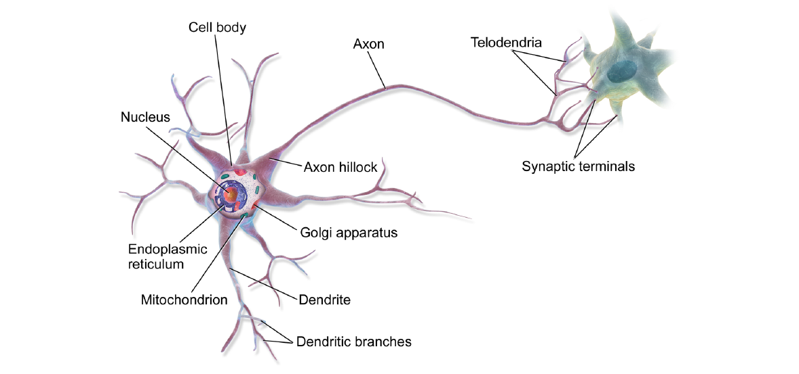
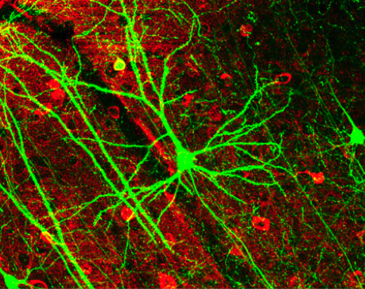
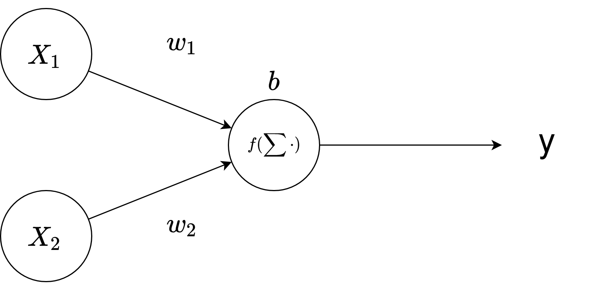
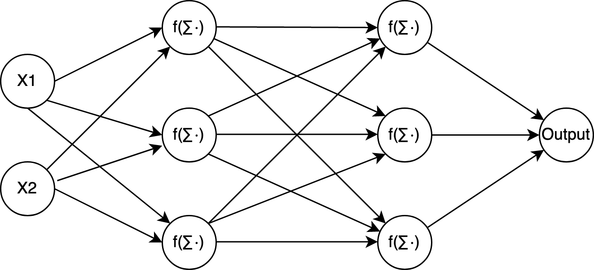
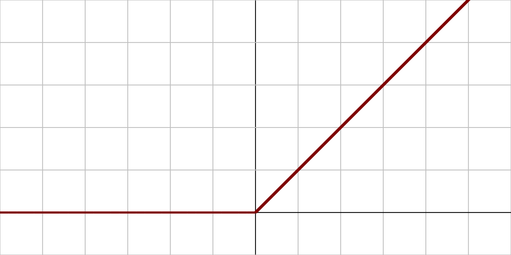
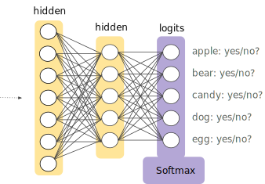
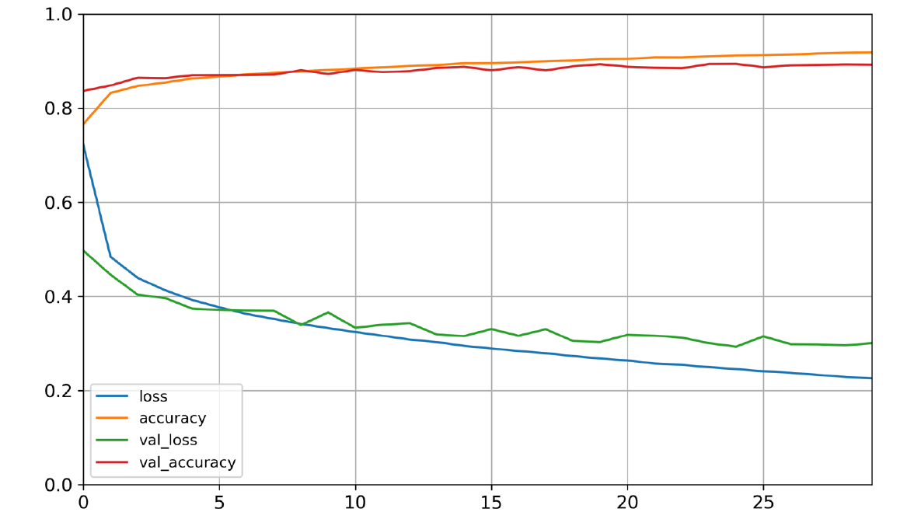
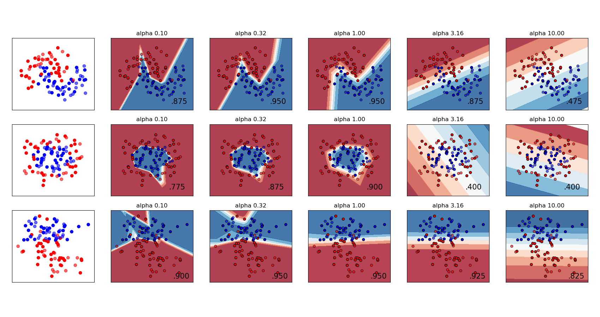

---
title:
  - Healthcare Data Analytics
author:
  - Dr. Michael Strobel
subtitle:
  - Feature Engineering, Random Forests und Data Science Checkliste
date:
  - 16.05.2022
classoption:
  - aspectratio=1610,9pt
---

## Inhalt

### Letzte Woche

- Feature Importance
- Feature Engineering
- Random Forests
- Data Science Projekt Checkliste

### Diese Woche

- Fortsetzung Data Science Projekt Checkliste
- Neuronale Netze

## Machine Learning Projekt Checkliste

1. Einordnung des Problems und Blick auf das große Ganze
2. Daten laden
3. Datenexploration
4. Daten Vorbereiten für die Machine Learning Pipelines
5. Sichtung und Auswahl der besten Modelle für das Problem
6. Fine-Tuning der Modelle und Kombination zu einem besseren Gesamtmodell
7. Präsentation der Resultate
8. Deployment des Modells, monitoring und Wartung des Modells (noch nicht besprochen)

## Das Problem Einordnen und das Gesamtbild betrachten

1. Definieren Sie das Ziel
2. Wie wird Ihre Lösung verwendet?
3. Was sind die derzeitigen Lösungen/Workarounds (falls vorhanden)?
4. Wie sollten Sie dieses Problem angehen (supervised/unsupervides, online/offline, usw.)?
5. Wie sollte die Qualität des Modells gemessen werden?
6. Steht die Qualitätsmessung im Einklang mit dem Unternehmensziel?
7. Welche Mindestleistung ist erforderlich, um das Unternehmensziel zu erreichen?
8. Was sind vergleichbare Probleme? Können Sie Erfahrungen oder Werkzeuge wiederverwenden?
9. Ist menschliches Fachwissen verfügbar?
10. Wie würden Sie das Problem manuell lösen?
11. Listen Sie die Annahmen auf, die Sie (oder andere) bisher gemacht haben.
12. Überprüfen Sie die Annahmen, wenn möglich.

## Abrufen der Daten

Hinweis: Automatisieren Sie so viel wie möglich, damit Sie leicht an neue Daten gelangen können.

1. Listen Sie auf, welche Daten Sie benötigen und wie viele Sie benötigen.
2. Finden und dokumentieren Sie, wo Sie diese Daten bekommen können.
3. Prüfen Sie, wie viel Platz sie benötigen.
4. Prüfen Sie die rechtlichen Verpflichtungen und holen Sie ggf. eine Genehmigung ein.
5. Zugangsberechtigungen einholen.
6. Erstellen Sie einen Workspace (mit genügend Speicherplatz).
7. Holen Sie die Daten.
8. Konvertieren Sie die Daten in ein Format, das Sie leicht bearbeiten können
9. Sicherstellen, dass sensible Informationen gelöscht oder geschützt werden (z. B. anonymisiert).
10. Überprüfen Sie den Umfang und die Art der Daten (Zeitreihen, Stichproben, geografische Daten usw.).
11. Testdaten erstellen, legen Sie sie beiseite und sehen Sie sie nie an!

## Erkunden Sie die Daten

#### Hinweis

Versuchen Sie, für diese Schritte Wissen von einem Experten zu erhalten.

1. Erstellen Sie eine Kopie der Daten für die Exploration (ggf. durch Verkleinerung auf eine überschaubare Größe)
2. Erstellen Sie ein Jupyter-Notebook, um Ihre Datenexploration zu dokumentieren.
3. Untersuchen Sie jedes Feature und seine Eigenschaften:

- Name
- Typ (kategorisch, int/float, usw.)
- % der fehlenden Werte
- Rauschen und Art des Rauschens (stochastisch, Ausreißer, Rundungsfehler, usw.)
- Beitrag für die Fragestellung
- Art der Verteilung (Gauß, gleichmäßig, logarithmisch, usw.)

## Erkunden Sie die Daten, Teil 2

4. Bei supervised learning Target Variable(n) bestimmen
5. Visualisierung der Daten.
6. Untersuchen Sie die Korrelationen zwischen den Attributen.
7. Wie würden Sie das Problem von Hand lösen?
8. Identifizieren Sie die Transformationen, die Sie eventuell anwenden möchten (Polynomielle Features, usw.)
9. Identifizieren Sie zusätzliche Daten, die nützlich wären (Feature Engineering)
10. Dokumentieren Sie, was Sie herausgefunden haben.

## Daten Vorbereiten

#### Wichtige Regeln:

- Arbeiten Sie mit Kopien der Daten (lassen Sie den Originaldatensatz unangetastet ).
- Schreiben Sie Funktionen für alle Transformationen, die Sie anwenden, damit
  - Sie die Daten leicht vorbereiten können, wenn Sie das nächste Mal einen neuen Datensatz erhalten
  - Sie diese Transformationen in zukünftigen Projekten anwenden können
  - Um den Testdatensatz zu bereinigen und vorzubereiten
  - Um neue Beobachtungseinheiten zu bereinigen und vorzubereiten, sobald Ihr Modell in Betrieb ist

## Daten Vorbereiten, Teil 2

1. Datenbereinigung:

- Ausreißer korrigieren oder entfernen (optional).
- Füllen Sie fehlende Werte auf (z. B. 0, Mittelwert, Median...) oder entfernen Sie ihre Zeilen (oder Spalten).

2. Auswahl der Feature (optional):

- Entfernen Sie die Features, die keine nützlichen Informationen für die Aufgabe liefern.

3. Feature-Engineering:

- Diskretisieren Sie kontinuierliche Feature.
- Aufteilen von Features (z. B. kategorisch, Datum/Zeit, usw.).
- Hinzufügen Transformationen von Features (z. B. log(x), sqrt(x), $x^2$, usw.).
- Aggregieren von Features zu neuen Features.

4. Skalierung von Features:

- Standardisierung oder Normalisierung von Features.

## Auswahl der besten Modelle

1. Trainieren Sie viele Quick-and-Dirty-Modelle aus verschiedenen Kategorien (z. B. lineare Regression, SVM, Random Forest, neuronale Netze, etc.) mit Standardparametern.
2. Messen und vergleichen Sie deren Leistung.

- Verwenden Sie für jedes Modell eine Cross-Validation und berechnen Sie den Mittelwert und die Standardabweichung des Performance.

3. Analysieren Sie die wichtigsten Features für jeden Algorithmus.
4. Analysieren Sie die Arten von Fehlern, die die Modelle machen.

- Welche Daten hätte ein Mensch verwendet, um diese Fehler zu vermeiden?

5. Führen Sie Featureauswahl und Feature-Engineering durch.
6. Führen Sie ein oder zwei weitere Iterationen der fünf vorherigen Schritte durch.
7. Wählen Sie die drei bis fünf vielversprechendsten Modelle aus, wobei Sie Modelle bevorzugen, die
   die verschiedene Arten von Fehlern machen.

## Fine Tuning der Modelle

1. Fine Tuning der Parameter durch Cross-Validation/GridSearch um beste Parameter für das Modell zu finden. Sie können auch Teile der Pipeline als Parameter behandeln (Auffüllen von Werten, Skalierung, Feature Auswahl etc.)
2. Versuchen Sie Ensemble-Methoden. Die Kombination Ihrer besten Modelle führt oft zu einer besseren Leistung.
3. Wenn Sie von Ihrem endgültigen Modell fertig sind, messen Sie seine Leistung auf den Testdaten, um den Generalisierungsfehler zu schätzen.

## Dokumentieren Sie die Ergebnisse

1. Dokumentieren Sie, was Sie getan haben.
2. Erstellen Sie eine Präsentation für den Kunden.

- Stellen Sie sicher, dass Sie zuerst das große Ganze hervorheben.

3. Erklären Sie, warum Ihre Lösung das Unternehmensziel erreicht.
4. Vergessen Sie nicht, interessante Punkte zu erwähnen, die Ihnen während der Arbeit aufgefallen sind.

- Beschreiben Sie, was funktioniert hat und was nicht.
- Nennen Sie Ihre Annahmen und die Grenzen Ihres Systems.

5.  Stellen Sie sicher, dass Ihre wichtigsten Ergebnisse durch schöne Visualisierungen oder einprägsame Aussagen (z. B. "Die Klasse auf der Titanic und das Geschlecht spielen eine Entscheidende Rolle")

## Artificial Neural Networks - Intro

#### Neuron

{ width=350px }

## Artificial Neural Networks - Intro, cont'd

{ width=300px }

## Artificial Neural Networks - Anwendung

#### Neuronale Netze werden heutzutage breit eingesetzt

- Bilderkennung
- Spracherkennung
- Sprachsynthese
- Textgenerierung
- Spiele: Schach / Go
- ...

## Artificial Neural Networks - Künstliches Neuron

Sei $n \in \mathbb{N}, d_1, ..., d_n \in \mathbb{N}$, dann definieren wir
$x_i\in \mathbb{R}^{d_i}$ als den **Input** (numerische Repräsentation der Features),
$w_i\in \mathbb{R}^{d_i}$ als den **Gewichtung** des Input (numerische Repräsentation der Features) und
$b \in \mathbb{R}$ als **Bias**.

{ width=200px }

**Schritt 1**: $S := \sum_{k=1}^n  x_i \cdot w_i  + b$

Desweiteren definieren wir $f: \mathbb{R} \rightarrow \mathbb{R}$ als **Aktivierungsfunktion**, z.B. sigmoid, relu oder tanh

**Schritt 2**: Output $y := f(S) = f(\sum_{k=1}^n  x_i \cdot w_i  + b)$

## Artificial Neural Networks - Netz

Kombinieren wir mehrere dieser künstlichen Neuronen ensteht ein _künstliches neuronales Netz_.

{ width=250px }

- **Trainingsschritt** mit Hilfe von Trainingsdaten und einem **Optimierungsalgorithmus** werden die Gewichte und der Bias angepasst um die Vorhersageleistung des Netzes zu verbesseren.
- Zum Training wird eine sog. _Loss Funktion_ definiert, die am **Output** misst wie gut oder schlecht das Netz vorhersagt.
- Training erfolgt über **Mini Batch Stochastic Gradient Descent**
- Netzwerkgestaltung und Optimierungsalgorithmen sind aktuelle Forschungsthemen.

## Aktivierungsfunktion - Intro

- Ein neuronales Netzwerk besteht aus linearen Funktionen und daher ist die Kombination auch linear
- Um nichtlineare Regression oder Klssifikation zu ermöglichen werden nichtlineare _Aktivierungsfunktionen_ auf die Knoten des Netzwerkes angewandt

## Aktivierungsfunktion - Sigmoid

#### Sigmoid Funktion

$$
S(x):= \frac{1}{1+\exp({-x})}
$$

- Klassische Aktivierungsfunktion und modelliert menschliche Neuronen
- Teuer zu berechnen
- Ableitung ist sehr flach und es kommt zum sog. _vanishing gradient_ Problem d.h. das Training für große Netze wird sehr langsam, da die Gradienten klein werden

{ height=150px }

## Aktivierungsfunktion - ReLU

#### ReLU - rectified linear unit

$$R(x):= \max(0,x)$$

- Schnell und einfach zu berechnen
- Gradient einfach und schnell zu berechnen
- Wird heute meist in der Praxis eingesetzt
- Es kann immer noch zu vanishing gradient Problemen kommen

{width=250px }

## Aktivierungsfunktion - weitere Beispiele

### Weitere Aktivierungsfunktionen

- Klassische Aktivierungsfunktionen: tanh, Treppenfunktion
- Moderne Aktivierungsfunktionen: leaky ReLU (nicht 0 for $x < 0$)

{ width=450px }

## Klassifikation: Loss Funktion / Kreuzentropie

- Unsere neuronalen Netzwerke geben Wahrscheinlichkeiten aus für die Klassifikation
- Um zu messen wie gut das Netz vorhersagen kann und um zu Trainieren wird die _log loss_ Funktion eingesetzt, diese wird auch _Kreuzentropie_ genannt

$$\mathbf{Loss}(y,\hat y)\ = -y\log\hat{y} - (1-y)\log(1-\hat{y})$$

{ width=250px }

## Multi Label Klassifikation - Softmax

- Die Softmax Funktion wird verwendet um Multi-Klassen Klassifikationsaufgaben zu lösen und wird in der Regel nur im **Output Layer** verwendet
- Sie ist ähnlich zu $\arg \max$, aber differenzierbar
- Sie gibt die Wahrscheinlichkeit an dass eine Beobachtungseinheiten $x$ von der Klasse $i$ ist, gegeben der Gewichte $w$
- Softmax sorgt dafür, dass der Outputlayer Werte zwischen 0 und 1 ausgibt und diese sich zu 1 addieren (also eine Wahrscheinlichkeitsverteilung darstellen)

$$P(y=i\mid \mathbf{x}) = \frac{e^{\mathbf{x} \cdot \mathbf{w}_i}}{\sum_{k=1}^K e^{\mathbf{x} \cdot \mathbf{w}_k}}$$

## Klassifikation - Visualisierung

#### Moderne Klassifikation mit Neuronalem Netz

<!-- { width=300px } -->

{ width=400px }

## Klassifikation - Topologie

#### Typische Topologie für Klassifikation

|             Parameter             |  Binäre Klassifikation   | Multi-Klassen Klassifikation |
| :-------------------------------: | :----------------------: | :--------------------------: |
|          Input Neuronen           |    Eines pro Feature     |      Eines pro Feature       |
|           Hidden Layers           |           1-5            |             1-5              |
|        Neuronen pro Layer         |          10-100          |            10-100            |
|          Output Neuronen          |            1             |              1               |
| Hidden Layer Aktivierungsfunktion |           ReLU           |             ReLU             |
|    Output Aktivierungsfunktion    |         Sigmoid          |           Softmax            |
|               Loss                | Log Loss = Kreuzentropie |   Log Loss = Kreuzentropie   |

**Hinweis**: bei Bildern entspricht 1 Pixel = 1 Feature

## Regression

#### Typische Topologie

|             Parameter             |  Typischer Wert   |
| :-------------------------------: | :---------------: |
|          Input Neuronen           | Eines pro Feature |
|           Hidden Layers           |        1-5        |
|        Neuronen pro Layer         |      10-100       |
|          Output Neuronen          |         1         |
| Hidden Layer Aktivierungsfunktion |       ReLU        |
|    Output Aktivierungsfunktion    |       Keine       |
|               Loss                | Mean Square Error |

**Hinweis**: ein neuronales Netz kann mehrere Regressionen Gleichzeitig ausführen, dafür müssen nur mehrere Output Neuronen definiert werden.

## Trainingsschritte

1. Modell initialisieren (Gewichte / Bias)
2. Aufteilung in Mini-Batches
3. Training des Netzwerks mit Minibatches und Loss Funktion mit Gradient Descent
4. Update der Gewichte und Bias anhand von 3.
5. Sind alle Epochen durchlaufen oder Validierungsfehler steigt? $\rightarrow$ Abbruch
6. Wiederholung mit dem nächsten Mini-Batch

{ width=300px }

## Regularisierung

#### Für neuronale Netze gibt es verschiedene Regularisierungen

- $L_2$ Regularisierung
- Early Stopping
- Moderne Neuronale Netze benutzen den sog. _Dropout_ zur Regularisierung, hierbei werden Teile des Neuronalen Netzwerks temporär eingefroren und nicht trainiert

{ width=300px }
