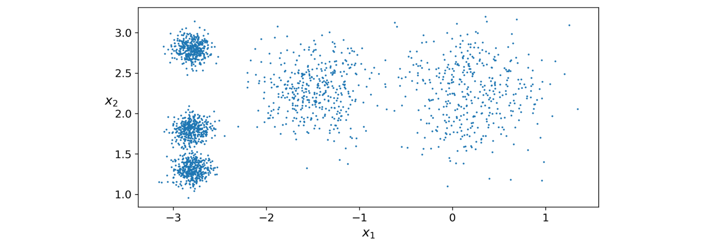
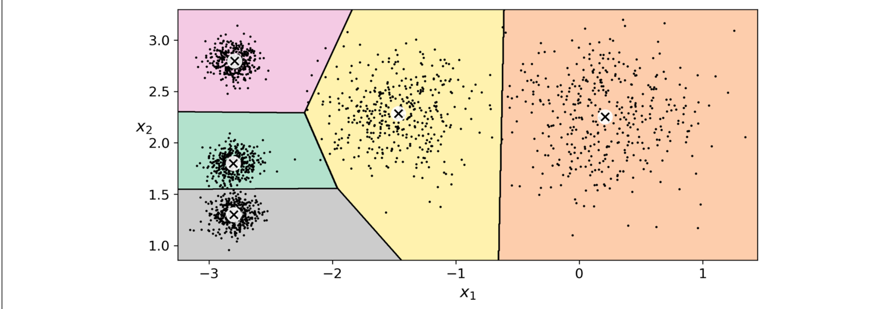
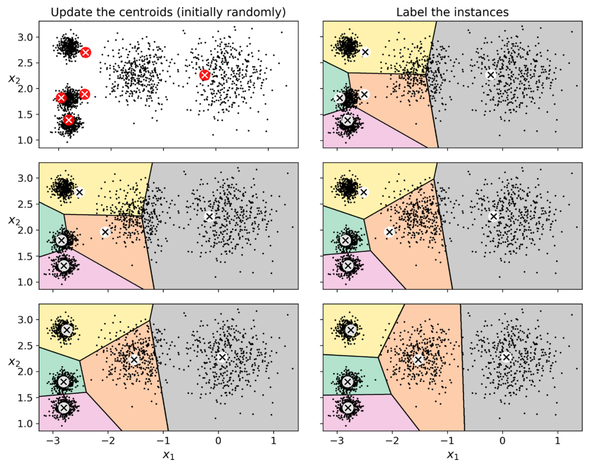
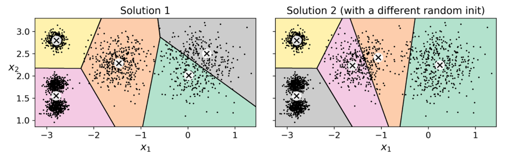
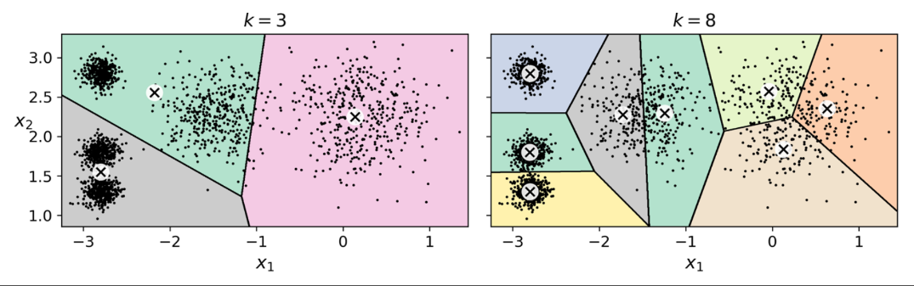
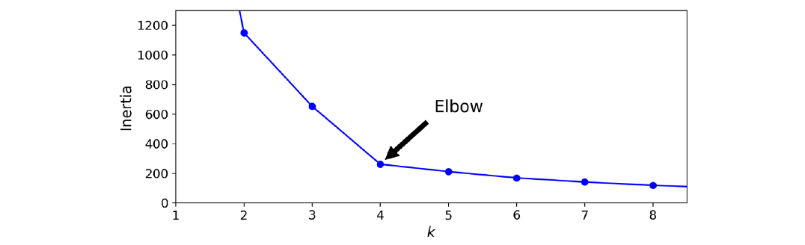
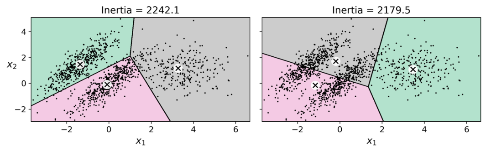

---
title:
  - Healthcare Data Analytics
author:
  - Dr. Michael Strobel
subtitle:
  - Unüberwachtes Lernen und Semi-Überwachtes Lernen
date:
  - 13.06.2022
classoption:
  - aspectratio=1610,9pt
---

## Inhalt

### Letzte Woche

- Fortsetzung Data Science Projekt Checkliste
- Neuronale Netze

### Diese Woche

- Neuronale Netze (Fortsetzung)
- Unüberwachtes Lernen
- Semi-Überwachtes Lernen

## Unsupervised Learning vs. Supervised Learning

> "Wenn Intelligenz ein Kuchen wäre, dann wäre unüberwachtes Lernen der Kuchen und überwachtes Lernen wäre die Glasur..." -- Yann LeCun

## Das Problem von Supervised Learning

- Bis jetzt haben wir uns noch Techniken für überwachtes Lernen angeschaut, hier wird davon ausgegangen, dass wir einen Datensatz $X$ und einen Labelvektor $y$ haben
- Labels müssen (meistens) manuell, von teuren Expert\*innen, generiert werden
- Datenmengen können so groß sein, dass labeln von Hand kaum möglich ist (z.B. Erkennung von Schäden an Werkstücken an einem schnellen Fließband)
- Änderungen an den Daten können die Label unbrauchbar machen

## Clustering

Clustering hat sehr viele Anwendungen in der Praxis: Datenanalyse, Aufteilung von Patientenkohorten, Empfehlungen von Behandlungen, Suchmaschinen, Segmentierung von Bildern, ...

Ähnlich wie bei den bereits bekannten Kategorisierungsaufgaben werden hier Beobachtungseinheiten in Klassen eingeteilt. Der große Unterschied beim Clutering ist aber, dass nur mit der Beobachtungseinheit gelernt wird und **kein** Label für das Training verwendet wird. Die meisten Algorithmen erwarten, dass die Anzahl der Label vorgegeben wird, finden dann die Kategorien selbständig.

Also unter Clustering verstehen wir die automatische _Einteilung von Beobachtungseinheiten in Kategorien ohne Labeldaten_.

## Clustering Anwendung

#### Einteilung von Patientenkohorten

Man kann Patienten mit der Hilfe von Clustering in Kohorten aufteilen und auch Behandlungsempfehlungen abgeben. Es können auch bislang unbekannte Zusammenhänge zwischen Krankheiten erkannt werden.

#### Datenanalyse

Für einen komplett neuen Datensatz kann es hilfreich sein ihn zuerst in Cluter aufzuteilen und dann einzeln zu analysieren.

## Clustering Anwendung, cont'd

#### Dimensionsreduktion

Mit manchen Clustering Algorithmen kann man die Distanz angeben wie nahe ein Vektor dem Zentrum (Definition später) eines Clusters steht. Wenn es $k$ Cluster gibt, dann reduziert sich der Feature Vektor auf die Größe $k$ in dem man die Distanzen zu den Zentren einträgt. Dies ist meist deutlich kleiner als die eigentliche Beobachtungseinheit und somit reduziert sich die Dimension.

### Anomalie Erkennung

Erkennung von Objekten die von einer Norm abweichen, z.B. ist das Bild einer Leber normal, oder gibt es eine Abweichung die auf eine Krankheit hinweisen kann?

## K-Means Algorithmus

Einer der bekanntesten und schnellsten Algorithmen für Clustering ist _K-Means_. Es hat als Eingabe nur die Anzahl $k$ der Cluster. Hier bietet sich $k=5$ an.

 width=200px }

## K-Means Algorithmus, Ergebnis

Ergebnis sind 5 Zentren der Cluster. Aus diesen kann ein sogenanntes _Voronoi Diagramm_ erstellt werden. Das Voronoi Diagramm stellt die Region da in der die Punkte minimalen Abstand zum nächsten Zentrum haben.

 width=200px }

## K-Means Algorithmus

#### Input: $X$ die Beobachtungseinheiten, $k$ als Anzahl der Cluster

1. Wähle zufällig $k$ verschiedene initiale Zentren $Z_i^{(0)}$ für $i = 1,...,k$.

für $s = 0,...,\infty$:

2. Zuweisungsschritt: bestimme für jede Beobachtungseinheit $x$ von $X$ das Zentrum $Z_i^{(s)}$ mit dem geringsten Abstand und weise ihnen dem Cluster $i$ zu.
3. Updateschritt: für alle Beobachtungseinheiten im Cluster $i$ bestimme das neue Zentrum $Z_i^{(s+1)}$ als Schwerpunkt alle dem Cluster zugewiesenen Punkte.
4. Abbruch: wenn sich die neu bestimmten Zentren zum Schritt davor nicht mehr signifikant ändern, dann breche ab.

Eine Metrik zur Beurteilung der Qualität der Lösung ist die _Inertia_ (Trägheit) der Lösung und ist definiert als _Summe der (quadrierten) Abstände der Beobachtungseinheiten zum jeweils nächsten Cluster_. Desweiteren ist es wichtig die Daten vorher zu skalieren um die Performance zu verbessern.

## K-Means Algorithmus, Visualisierung

 height=100px }

## K-Means Algorithmus, Wahl der Zentren

#### Qualität hängt stark von den initialen Zentren ab

 width=200px }

#### Mögliche Lösung

Algorithmus mehrfach laufen lassen und die beste Lösung wählen (mit geringstem Inertia).

#### Bessere Lösung

Initiale Zentren besser wählen $\rightarrow$ _K-Means++_ (nicht hier)

## K-Means Algorithmus, Wahl der von $k$

#### Was ist wenn wir den Anzahl der Zenten nicht kennen?

Wenn uns die richtige Anzahl der Cluster unbekannt ist und nur raten, dann ist das Clustering ineffektiv sein.

 width=200px }

<!-- ## K-Means Algorithmus, Wahl der von $k$ -->

<!-- #### Was ist wenn wir den Anzahl der Zentren nicht kennen? -->

<!--  width=200px } -->

## K-Means Algorithmus, Wahl der von $k$ cont'd

Es gibt mehrere Möglichkeiten die Anzahl der Cluster zu bestimmen

#### Wendepunktmethode: für den Plot der Inertias wähle den Wendepunkt als Anzahl der Cluster

 width=200px }

Dieses Methode ist auch Ellenbogen (Elbow) Kriterium bekannt. Es gibt auch noch weitere Methoden wie z.B. den Silhoutte Score.

## Die Grenzen von K-Means

K-Means ist ein sehr guter Clustering Algorithmus, insbesondere ist er schnell und skaliert auch gut.

Es gibt aber auch einige Nachteile:

- Cluster müssen oft mehrfach berechnet werden, da er oft nicht direkt das beste Ergebnis liefert
- Die Anzahl der Cluster muss vorher angegeben werden was oft sehr schwierig ist
- Wenn die Skalen der verschiedenen Cluster stark abweichen sinkt die Performance, Skalierung kann hier helfen
- Der Algorithmus bevorzugt aufgrund der benutzten $L_2$ Norm sphärische Cluster und kann nur schlecht mit länglichen Clustern umgehen

## Die Grenzen von K-Means, cont'd

{ width=500px }

## Semi-Supervised Learning

Bei _Semi Supervised Learning_ wird nur ein geringer Teil der Daten mit Labeln versehen und dann mit unsupervised learning kombiniert. Dies kann dazu führen, dass die Performance des Algorithmus beträchtlich gesteigert wird.

#### Active Learning

Eine weit verbreitete Methode von Semi-supervised Learning ist das sogenannte _Active Learning_:

1. Das Modell wird mit den soweit gelabelten Daten trainiert und gibt eine Einschätzung für die ungelabelten Daten.
2. Für die Beobachtungseinheiten bei denen sich der Algorithmus am unsichersten ist wird ein Mensch gebeten die Daten zu labeln.
3. Iteriere 1. und 2. bis keine signifikate Steigerung der Performance zu beobachten ist.
