---
title:
  - Healthcare Data Analytics
author:
  - Dr. Michael Strobel
subtitle:
  - Deep Convolutional Neural Networks
date:
  - 13.06.2022
classoption:
  - aspectratio=1610,9pt
---

## Inhalt

### Letzte Vorlesung

- Neuronale Netze (Fortsetzung)
- Unüberwachtes Lernen
- Semi-Überwachtes Lernen

### Diese Woche

- Motivation durch visuellen Cortex
- Convolution (Faltung)
- Pooling
- Deep Convolution Neural Networks

## Der Visuelle Cortex

- Die Verarbeitung von Bildern im menschlichen Gehirn findet im _Visuellen Cortex_, einem Bereich des Gehirn statt
- Eine bedeutende Erkenntnis in den 50er Jahren war, dass viele Neuronen im Visuellen Cortex nur auf Ausschnitte des Sehfeldes reagieren
- Diese Ausschnitte nennt man _Lokales Rezeptives Feld_ (engl. local receptive field)

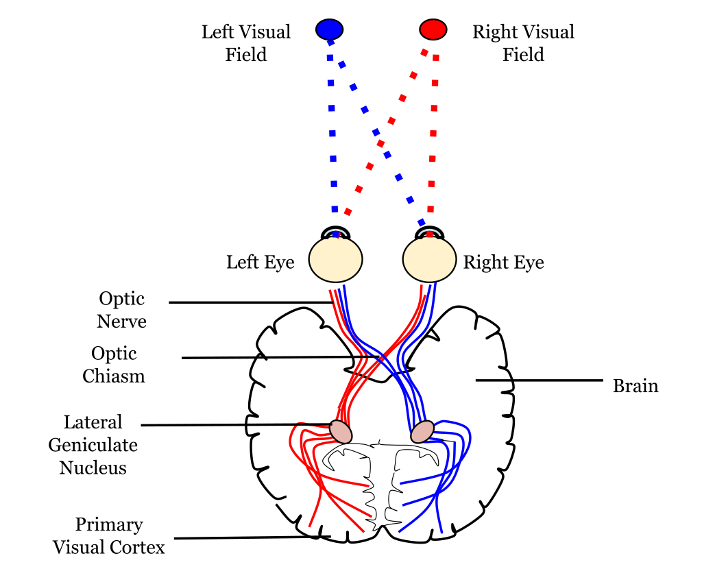{ height=200px }

## Der Visuelle Cortex, cont'd

- Desweiteren reagieren manche Neuronen nur auf horizontale bzw. vertikale Linien oder andere geometrische Formen
- Zudem gibt es verschieden große receptive fields und somit reagieren manche Neuronen auf _low level_ Details (Linien, Kurven ...) und andere auf komplexere _high level_ Formen
- Diese Beobachtungen haben zur Vermutung geführt, dass die high level Neuronen auf dem Input der low level Neuronen basieren
- Schlussendlich hat dies zur Idee von _convolutional neural networks_ geführt

## Convolution (Faltung)

- Faltungen werden in der Bildverarbeitung als _Filter_ eingesetzt
- Es können zahlreiche Effekte erreicht werden wie z.B. Glättung, Schärfen, Kantenerkennung, ...
- Dies kann auch in verschiedene Richtungen erreicht werden wie z.B. erhalte mir nur Kanten die horizontal laufen

  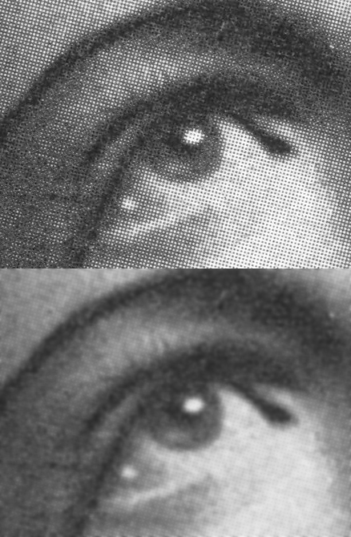{ height=200px }

## Convolution (Faltung), Definition

- Eine Faltung besteht aus einem Input Signal $I$ und einem Faltungskern $k$
- Das gefaltete Signal $I^{*}$ mit dem Faltungskern $k$ definiert sich über

  $$
  I^{*}(x,y) = \sum_{i=1}^{n} \sum_{j=1}^{n} I(x-i+a,\; y-j+a) k(i,j)
  $$

- Der Gaußfilterkern sieht z.B. so aus und stellt im geglätteten Bild ein Pixel als Mittelwert der Umgebung dar
  $$
  k(x,y) =
  \frac{1}{9}   \cdot
  \begin{pmatrix}
  1   &   1   &   1 \\
  1   &   1   &   1 \\
  1   &   1   &   1
  \end{pmatrix}
  $$

## CNN Layer

- Diese Faltungen können als Layer in ein NN eingebaut werden
- Neuronen in diesem Netzwerk sind dann nur mit Teilen des vorhergehenden Convolution Layer verbunden
- Das Netz lernt im ersten Layer dann die low level Details
- Diese Low Level features werden zu komplexeren Strukturen zusammen gesetzt und diese wiederum im nächsten Layer in noch komplexere Strukturen usw...

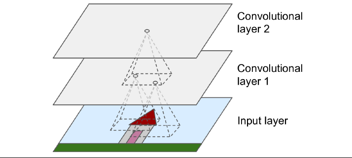{ height=150px }

## Randbehandlung mit Padding

- An den Rändern des Bildes kann es zu Problemen kommen, da die Bildgröße eventuell kein Vielfaches der Faltungskerngröße
- Hier benutzt man das sogenannte _Padding_:
  - _zero padding_ (TensorFlow: same padding): hier wird mit 0 aufgefüllt
  - _no padding_ (TensorFlow: valid padding): hier wird einfach abgeschnitten

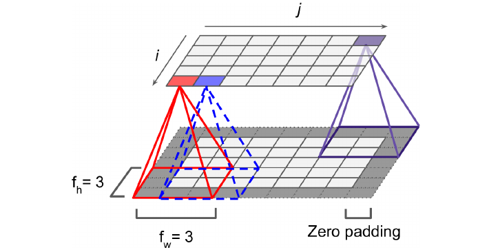{ height=150px }

## Dimensionsreduktion mit Strides

- Um die Dimension des Bildes zu verkleinern kann der Filter einen Versatz (_Stride_) haben
- Hierbei wird ein größerer Abstand zwischen den receptive fields angesetzt

**Beispiel**: Input Layer $5 \times 7 \rightarrow 3 \times 4$ Layer mit einem $3 \times 3$ receptive field und einem Stride von 2

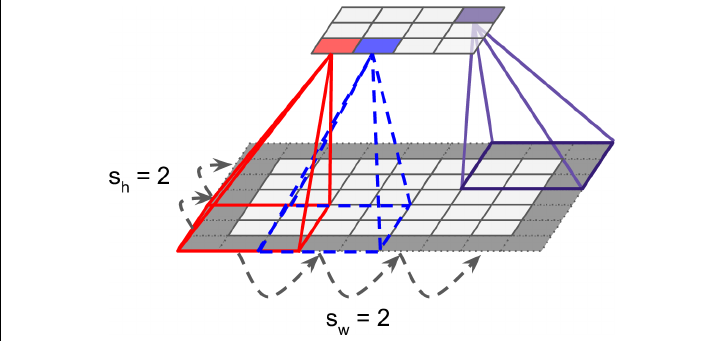{ height=150px }

## Feature Maps

- Die Anwendung eines Faltungskern (= Filter) auf eine Eingabe nennen wir das _Feature Map_
- Faltungskerne werden **nicht** vordefiniert, sondern das CNN lernt die besten Filter anhand der Trainingsdaten

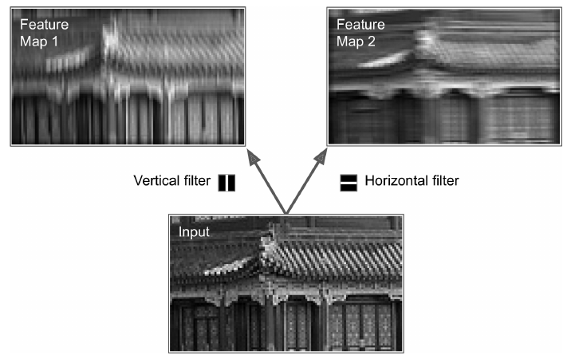{ height=150px }

## Stapel von Feature Maps

- Ein Convolutional kann viele Kernel und somit auch viele Feature Maps haben
- Die Gewichte sind aber für alle Feature Maps gleich und werden gleichzeitig trainiert

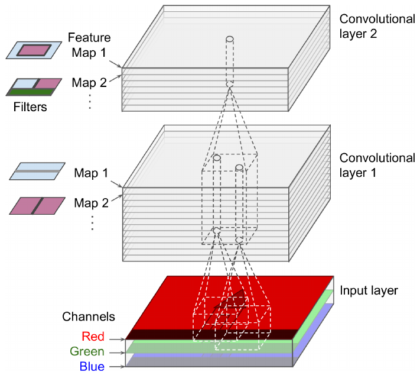{ height=250px }

## Pooling

- Ein _Pooling Layer_ funktioniert ähnlich wie ein Convolutional Layer
- Im Gegensatz zum Convolutional Layer hat er aber **keine** Gewichte die trainiert werden können
- Auch er hat Parameter wie größe, stride und padding
- Die Ausgabe eines Pooling Layer hängt ab vom Typ
  - **Max Pooling**: gibt maximum des receptive field zurück
  - **Average Pooling**: gibt Mittelwert des receptive field zurück

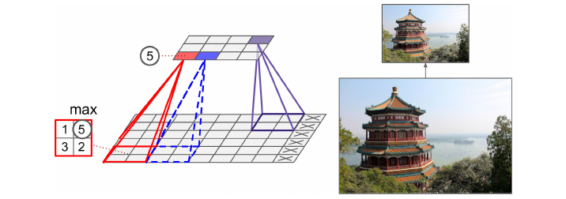{ height=150px }

## Architektur von Convolutional Neural Networks

#### Ein typisches CNN hat die folgende Form

- Input
- Convolution
- Pooling
- Convolution
- Pooling
- ...
- Fully Connected Neural Network (klassische Architektur) mit Regularisierung (Dropout)
- Output

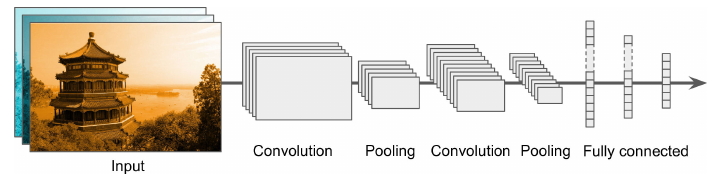{ height=100px }

## Implementierung in TensorFlow mit Keras

- TensorFlow wird von Google entwickelt und stellt eine Python Schnittstelle für die GPU bereit
- Keras basiert auf TensorFlow und implementiert typische Machine Learning Elemente

#### Keras / TF Implementierung einer CNN Architektur

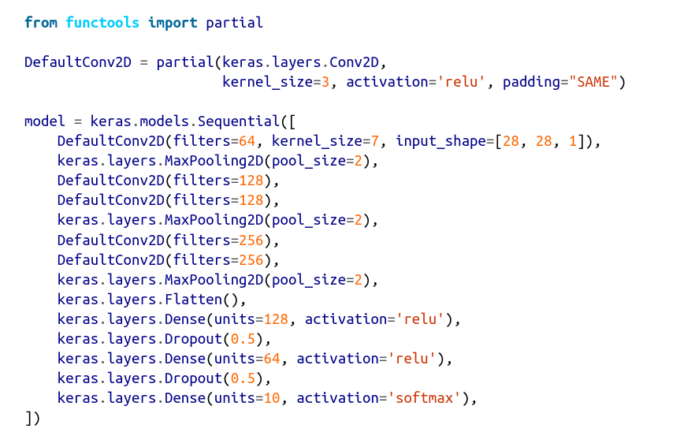{ height=230px }

## LeNet-5

- Eines der ersten CNN Netze war _LeNet-5_ von Yann LeCun (1988!)
- Es wurde u.a. erfolgreich genutzt um handgeschriebene Zahlen zu erkennen (MNIST)

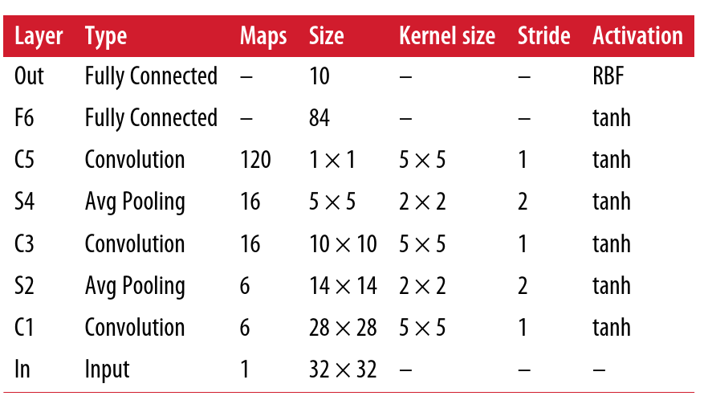{ height=230px }

## Anwendung: ImageNet Large Scale Visual Recognition Challenge

- 2012: 150.000 Bilder und 1000 Kategorien
- Ziel: möglichst wenig Fehler bei der Kategorisierung
- CNN haben die Fehlerrate von 26% auf 17% gedrückt
- Die nächsten Jahre ging die Fehlerrate auf unter 0.1% zurück

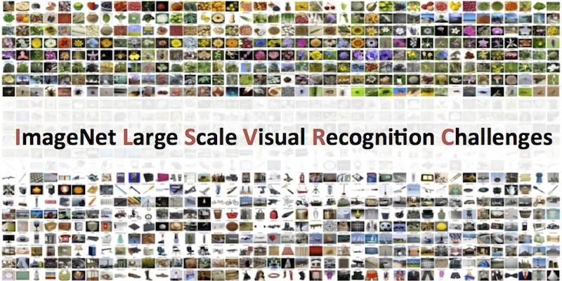{ height=230px }

## ImageNet Statistik

{ height=230px }

## AlexNet

- AlexNet gewann das 2012 ImaeNet Challenge
- Als Regularisierung wurde Dropout verwendet aber auch Data Augmentation

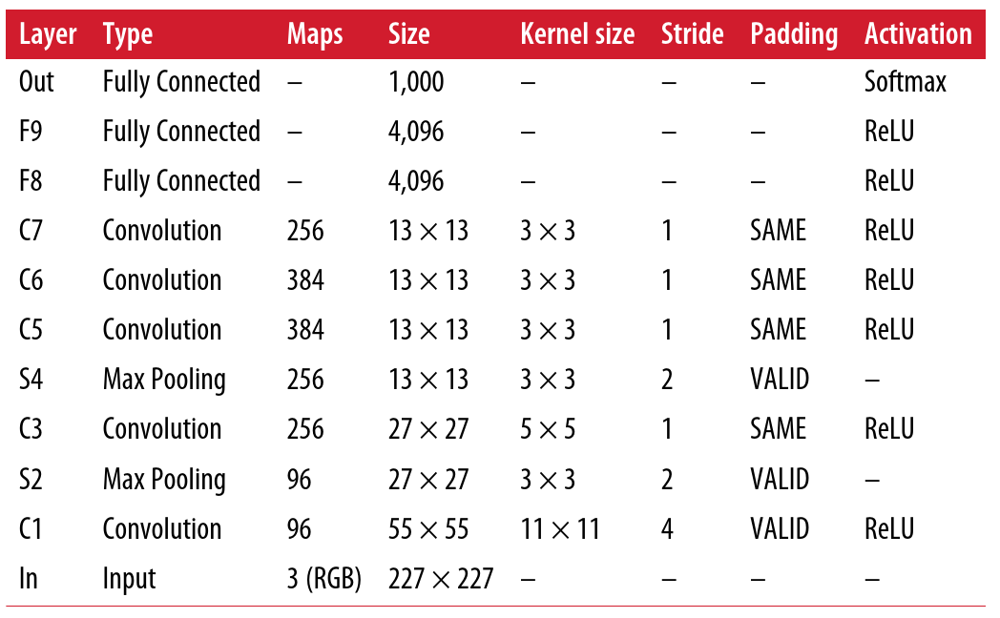{ height=230px }

## Weitere Netze und Transfer Learning

#### Es gibt noch viele weitere Netztopologien

- GoogLeNet
- VGGNet
- ResNet
- Xception
- SENet

Diese sind meist frei verfügbar und können für eigene Experimente verwendet werden

## Transfer Learning

- Statt komplett neue CNN Netze zu trainieren verwendet man meistens _Transfer Learning_
- Bei Transfer Learning wird ein bestehendes Netz mit bereits trainierten Gewichten als Basis genommen (ohne Output Layer)
- Diesem Netz werden dann weitere Schichten hinzugefügt und die neuen Schichten trainiert, wobei das Basisnetz nicht verändert wird
- Hiermit kann ausgenutzt werden das viele Strukturen eventuell schon gelernt wurden
- Gegebenenfalls kann auch das Basisnetz mit trainiert werden

<!-- > "Wenn Intelligenz ein Kuchen wäre, dann wäre unüberwachtes Lernen der Kuchen und überwachtes Lernen wäre die Glasur..." -- Yann LeCun -->

<!-- ## Das Problem von Supervised Learning -->

<!-- - Bis jetzt haben wir uns noch Techniken für überwachtes Lernen angeschaut, hier wird davon ausgegangen, dass wir einen Datensatz $X$ und einen Labelvektor $y$ haben -->
<!-- - Labels müssen (meistens) manuell, von teuren Expert\*innen, generiert werden -->
<!-- - Datenmengen können so groß sein, dass labeln von Hand kaum möglich ist (z.B. Erkennung von Schäden an Werkstücken an einem schnellen Fließband) -->
<!-- - Änderungen an den Daten können die Label unbrauchbar machen -->

<!-- ## Clustering -->

<!-- Clustering hat sehr viele Anwendungen in der Praxis: Datenanalyse, Aufteilung von Patientenkohorten, Empfehlungen von Behandlungen, Suchmaschinen, Segmentierung von Bildern, ... -->

<!-- Ähnlich wie bei den bereits bekannten Kategorisierungsaufgaben werden hier Beobachtungseinheiten in Klassen eingeteilt. Der große Unterschied beim Clutering ist aber, dass nur mit der Beobachtungseinheit gelernt wird und **kein** Label für das Training verwendet wird. Einige Algorithmen erwarten, dass die Anzahl der Label vorgegeben wird, aber alle finden dann die Kategorien selbständig. -->

<!-- **Definition**: Unter Clustering verstehen wir die automatische _Einteilung von Beobachtungseinheiten in Kategorien ohne Labeldaten_. -->

<!-- ## Clustering Anwendung -->

<!-- #### Einteilung von Patientenkohorten -->

<!-- Man kann Patienten mit der Hilfe von Clustering in Kohorten aufteilen und auch Behandlungsempfehlungen abgeben. Es können auch bislang unbekannte Zusammenhänge zwischen Krankheiten erkannt werden. -->

<!-- #### Datenanalyse -->

<!-- Für einen komplett neuen Datensatz kann es hilfreich sein ihn zuerst in Cluter aufzuteilen und dann einzeln zu analysieren. -->

<!-- ## Clustering Anwendung, cont'd -->

<!-- #### Dimensionsreduktion -->

<!-- Mit manchen Clustering Algorithmen kann man die Distanz angeben wie nahe ein Vektor dem Zentrum (Definition später) eines Clusters steht. Wenn es $k$ Cluster gibt, dann reduziert sich der Feature Vektor auf die Größe $k$ in dem man die Distanzen zu den Zentren einträgt. Dies ist meist deutlich kleiner als die eigentliche Beobachtungseinheit und somit reduziert sich die Dimension. -->

<!-- ### Anomalie Erkennung -->

<!-- Erkennung von Objekten die von einer Norm abweichen, z.B. ist das Bild einer Leber normal, oder gibt es eine Abweichung die auf eine Krankheit hinweisen kann? -->

<!-- ## K-Means Algorithmus -->

<!-- Einer der bekanntesten und schnellsten Algorithmen für Clustering ist _K-Means_. Es hat als Eingabe nur die Anzahl $k$ der Cluster. -->

<!-- #### Beispiel: Hier bietet sich $k=5$ an. -->

<!-- { width=500px } -->

<!-- ## K-Means Algorithmus, Ergebnis -->

<!-- Ergebnis sind 5 Zentren der Cluster. Aus diesen kann ein sogenanntes _Voronoi Diagramm_ erstellt werden. Das Voronoi Diagramm stellt die Region da in der die Punkte minimalen Abstand zum nächsten Zentrum haben. -->

<!-- { width=500px } -->

<!-- ## K-Means Algorithmus -->

<!-- #### Input: $X$ die Beobachtungseinheiten, $k$ als Anzahl der Cluster -->

<!-- 1. Wähle zufällig $k$ verschiedene initiale Zentren $Z_i^{(0)}$ für $i = 1,...,k$. -->

<!-- für $s = 1,...,\infty$: -->

<!-- 2. Zuweisungsschritt: bestimme für jede Beobachtungseinheit $x$ von $X$ das Zentrum $Z_i^{(s)}$ mit dem geringsten Abstand und weise ihnen dem Cluster $i$ zu. -->
<!-- 3. Updateschritt: für alle Beobachtungseinheiten im Cluster $i$ bestimme das neue Zentrum $Z_i^{(s+1)}$ als Schwerpunkt alle dem Cluster zugewiesenen Punkte. -->
<!-- 4. Abbruch: wenn sich die neu bestimmten Zentren zum Schritt davor nicht mehr signifikant ändern, dann breche ab. -->

<!-- ## Hinweise zu Kmeans -->

<!-- - Eine Metrik zur Beurteilung der Qualität der Lösung ist die _Inertia_ (Trägheit) der Lösung und ist definiert als _Summe der (quadrierten) Abstände der Beobachtungseinheiten zum jeweils nächsten Cluster_. -->
<!-- - Desweiteren ist es wichtig die Daten vorher zu skalieren, KMeans reagiert stark auf Skalierung. -->

<!-- ## K-Means Algorithmus, Visualisierung -->

<!-- { height=300px } -->

<!-- ## K-Means Algorithmus, Wahl der Zentren -->

<!-- #### Qualität hängt stark von den initialen Zentren ab -->

<!-- { width=500px } -->

<!-- #### Mögliche Lösungen -->

<!-- - Algorithmus mehrfach laufen lassen und die beste Lösung wählen (mit geringstem Inertia). -->
<!-- - Initiale Zentren besser wählen $\rightarrow$ _K-Means++_ (nicht hier) -->

<!-- ## K-Means Algorithmus, Wahl der von $k$ -->

<!-- #### Was ist wenn wir den Anzahl der Zenten nicht kennen? -->

<!-- Wenn uns die richtige Anzahl der Cluster unbekannt ist und nur raten, dann ist das Clustering ineffektiv sein. -->

<!-- { width=500px } -->

<!-- <!-1- ## K-Means Algorithmus, Wahl der von $k$ -1-> -->

<!-- <!-1- #### Was ist wenn wir den Anzahl der Zentren nicht kennen? -1-> -->

<!-- <!-1-  width=500px } -1-> -->

<!-- ## K-Means Algorithmus, Wahl der von $k$ cont'd -->

<!-- Es gibt mehrere Möglichkeiten die Anzahl der Cluster zu bestimmen -->

<!-- #### Wendepunktmethode: wähle den Wendepunkt des Inertia Plot als Anzahl der Cluster -->

<!-- { width=500px } -->

<!-- Dieses Methode ist auch Ellenbogen (Elbow) Kriterium bekannt. Es gibt auch noch weitere Methoden wie z.B. den Silhoutte Score. -->

<!-- ## Die Grenzen von K-Means -->

<!-- K-Means ist ein sehr guter Clustering Algorithmus, insbesondere ist er schnell und skaliert auch gut. -->

<!-- Es gibt aber auch einige Nachteile: -->

<!-- - Cluster müssen oft mehrfach berechnet werden, da er oft nicht direkt das beste Ergebnis liefert -->
<!-- - Die Anzahl der Cluster muss vorher angegeben werden was oft sehr schwierig ist -->
<!-- - Wenn die Skalen der verschiedenen Cluster stark abweichen sinkt die Performance, Skalierung kann hier helfen -->
<!-- - Der Algorithmus bevorzugt aufgrund der benutzten $L_2$ Norm sphärische Cluster und kann nur schlecht mit länglichen Clustern umgehen -->

<!-- ## Die Grenzen von K-Means, cont'd -->

<!-- { width=500px } -->

<!-- ## Andere Clustering Algorithmen -->

<!-- Es gibt eine Vielzahl anderer Clustering Algorithmen, z.B. DBSCAN die z.B mit länglichen Regionen gut umgehen können (nicht hier). -->

<!-- { width=500px } -->

<!-- ## Semi-Supervised Learning -->

<!-- Bei _Semi Supervised Learning_ wird nur ein geringer Teil der Daten mit Labeln versehen und dann mit unsupervised learning kombiniert. Dies kann dazu führen, dass die Performance des Algorithmus beträchtlich gesteigert wird. -->

<!-- #### Active Learning -->

<!-- Eine weit verbreitete Methode von Semi-supervised Learning ist das sogenannte _Active Learning_: -->

<!-- 1. Das Modell wird mit den soweit gelabelten Daten trainiert und gibt eine Einschätzung für die ungelabelten Daten. -->
<!-- 2. Für die Beobachtungseinheiten bei denen sich der Algorithmus am unsichersten ist wird ein Mensch gebeten die Daten zu labeln. -->
<!-- 3. Iteriere 1. und 2. bis keine signifikate Steigerung der Performance zu beobachten ist. -->
