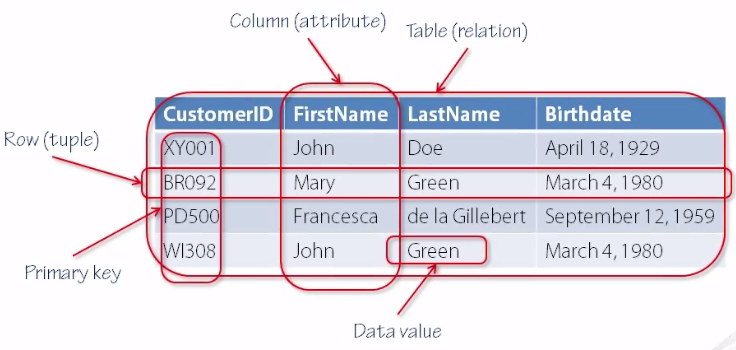

---
title:
  - Healthcare Data Analytics
author:
  - Dr. Michael Strobel
subtitle:
  - Introduction to Big Data
date:
  - 27.06.2022
classoption:
  - aspectratio=1610,9pt
---

## Inhalt

### Letzte Vorlesung

- Motivation durch visuellen Cortex
- Convolution (Faltung)
- Pooling
- Deep Convolution Neural Networks

### Diese Woche

- Datenbanksysteme
- Data Warehousing
  - OLAP vs OLTP
  - Sterne und Schneeflocken
- Batch Processing of Big Data
  - Was ist Big Data?
  - MapReduce
  - Hadoop / Spark

## Erinnerung: Relationale Datenbanken

- Die meist verwendeten Datenbanken arbeiten relational (PostgreSQL, MySQL, Oracle...)
- Daten werden in Zeilen gespeichert
- Operationen sind Transaktionen und folgen den Regeln von ACID
  - atomicity
  - consistency
  - isolation
  - durability

{ height=150px }

## Use Cases von Relationalen Datenbanken

#### Typische Anfrage an relationale Datenbank

- Anfragen sind in der Regel eng begrenzt und beziehen sich auf eine einzelne Zeilen der Datenbank
- Performance wird auf Transaktionen / Requests optimiert

{ height=300px }

## Online Transaction Processing (OLTP)

Das typische Zugriffsmuster von System wie relationalen Datenbanken nennen wir _Online Transaction Processing (OLAP)_

|        Eigenschaft         |      Online Transaction Processing System (OLTP)      |
| :------------------------: | :---------------------------------------------------: |
|  Häufigste Leseoperation   | Kleine Anzahl von Records pro query, Anfrage über key |
| Häufigste Schreiboperation |  Random Zugriff, geringe Antwortzeit von User Input   |
| Häufigster Anwendungszweck |             Endkunde über Web Applikation             |
|    Typische Datengröße     |                 Gigabyte bis Terabyte                 |

## Analytics

#### Wie steht es aber mit Analytics auf relationalen Datenbanken?

- Typische Fragestellungen von Analytics sind statistische Kennzahlen von Gruppierten Daten
  - Wie viele Patient:innen haben wir im Juni behandelt?
  - Was sind die häufigst auftretenden Krankheitsbilder?
  - Welche Medikamente werden am wenigsten verordnet?
- Analytics kann durchaus auf Online Transaction Processing Systemen erfolgen, aber
- Typischerweise sind die Workloads **nicht** auf Analytics Fragestellungen optimiert

## Online Analytics Processing (OLAP)

Systeme die auf Analytics optimiert sind nennen wir **Online Analytics Processing (OLAP)**

|        Eigenschaft         |       Online Transaction Processing System (OLAP)       |
| :------------------------: | :-----------------------------------------------------: |
|  Häufigste Leseoperation   |     Aggregation über eine große Anzahl von Records      |
| Häufigste Schreiboperation |        Bulk / Batch Processing oder Event Stream        |
| Häufigster Anwendungszweck | Analyst / Data Scientist für Entscheidungsunterstützung |
| Was stellen die Daten da?  |                Historie von Ereignissen                 |
|    Typische Datengröße     |                  Terabyte bis Petabyte                  |

## Medizinische Datenbanken

#### In medizinischen Einrichtungen sind Zahlreiche Datenbanken vorhanden

- Bilder (PACS)
- Krankenhausinformationsystem (KIS)
- Radiologieinformationssystem (RIS)
- Laborinformationssystem (LIS)
- ...
- Abrechnungssystem
- Verwaltungssystem

## Medizinische Datenbanken, Visualisierung

{ height=300px }

## Data Warehousing

- Medizinische Einrichtungen haben Systeme die Ärzt:innen bzw. Patient:innen zur Verfügung stehen, diese sind meistens OLTP Systeme
- Die OLTP System müssen hoch-verfügbar sein und sind meistens kritisch für die Versorgung
- Aufgrund der Verfügbarkeitsanforderungen stehen diese Systeme nicht direkt für Analytics zur Verfügung, da diese mindestens Performance oder auch Verfügbarkeit beeinträchtigen
- Daher wird oft ein Zusätzlich System eingeführt auf dem Analytics Anwendungen zugreifen können, das **Data Warehouse**

## Das Data Warehouse

- Data Warehouses sind Systeme die aus aus verschiedenen Datenquellen, meist OLTP Systeme speisen
- Die Daten werden über den **Extract-Transform-Load (ETL)** aus den OLTP System geladen
  - **Extract**: lädt die Daten aus den OLTP Systemen
  - **Transform** : die Daten werden in für Analytics optimierte Datenformate überführt
  - **Load**: die Daten werden ins das Data Warehouse geladen
- Die ETL Prozesse können _periodisch_ (z.B. täglicher DB dump) oder als _Stream_ stattfinden
- Aufgrund der Flexibilität von SQL benutzen Data Warehouses diese Sprache ebenfalls

## Das Data Warehouse, Visualisierung

{ height=300px }

## Stern- und Schneeflocken Schemas

Ein Schema für Datenbanken das sich für Analytics Zwecke gut eignet ist das **Star Schema**:

#### Im Zentrum steht die **Fakten Tabelle (fact table)**:

- in diesem werden Events und deren Zeitpunkte gesammelt (zeilenweise), dies kann z.B. eine Behandlung eines Patienten sein
- Fakten sind in der Regel individuelle Event, da diese maximale Flexibilität für spätere Analysen erlaubt, können entsprechend aber sehr groß (petabyte oder mehr)
- Zu den eigentlichen Fakten im Fact table gibt es Referenzen (foreign keys) zu den _Dimensions Tabellen_ (dimension tables)

## Stern- und Schneeflocken Schemas, cont'd

#### Dimensions Tabellen (dimension tables)

- In den _Dimensions Tabellen_ werden weitere Daten wie das _wer, was, wo, wann, wie und warum_ gespeichert
- Typische Dimensionstabellen sind z.B. Nutzer, Behandlungen, Standorte, Datum-Details, ...

Da ausgehend von der Fakten Tabelle sich mehrere Dimensions Tabellen sich Sternförmig ausbreiten wird dies auch das _Stern Schema_ genannt. Wenn dies iteriert wird (also wieder Dimensionstabellen auch wieder Dimensionstabellen haben) wird dies _Schneeflocken Schema_ genannt.

## Stern- und Schneeflocken Schemas, Visualisierung

{ height=300px }
