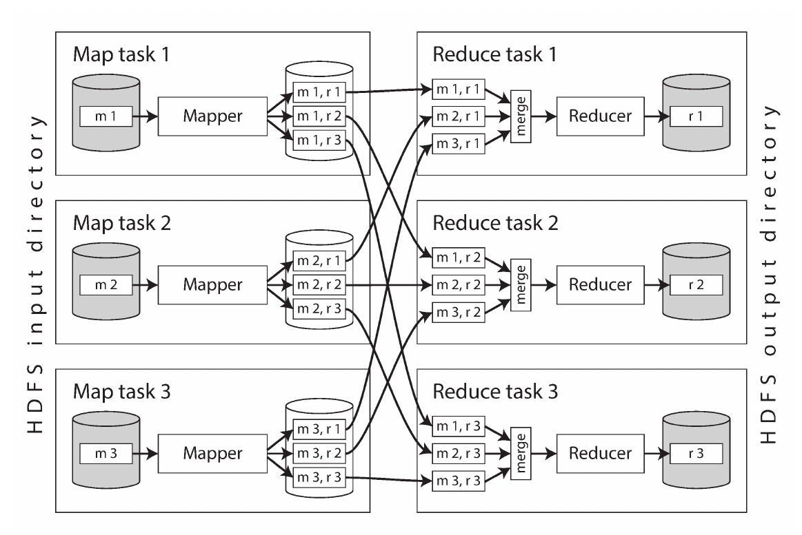

---
title:
  - Healthcare Data Analytics
author:
  - Dr. Michael Strobel
subtitle:
  - Big Data Processing & Spark
date:
  - 04.07.2022
classoption:
  - aspectratio=1610,9pt
---

## Inhalt

### Letzte Vorlesung

- Datenbanksysteme
- Data Warehousing
  - OLAP vs OLTP
  - Sterne und Schneeflocken
- Intro zu Big Data

### Diese Woche

- UNIX Philosophie
- Big Data Processing
- Spark
- Stream Processing
- GraphDB

## Online Services / Batch Processing / Stream Processing

- Daten Anwendungen können unterschiedliche Anforderungen haben, letzte Woche haben wir OLTP und OLAP Systeme gesehen
- Wir unterscheiden drei verschiedene Systeme Arten
  - Online Services
  - Batch Processing
  - Stream Processing
- Die verschiedenen Anforderungen resultieren in sehr unterschiedlichen Algorithmen und Implementierungen

## Online Services

- Das System wartet auf eingehende Request und startet daraufhin Berechnungen
- Die Bearbeitung erfolgt so schnell wie möglich und mit geringer Zeitverzögerung
- Die Datenmengen sind verhältnismäßig gering
- Wichtigste Performance Metriken: response time und availability
- Beispiele: REST Api und OLTP Systeme

## Batch Processing

- Batch Processing verarbeitet in der Regel **große Datenmengen**
- Anwendungsgebiet sind Datenverarbeitung: Input Daten werden zu Output Daten verarbeitet und abgelegt
- Daten sind zu Begin des Batch Processing bekannt und fixiert
- Die Laufzeit ist lang: Minuten bis Tage
- Der User wartet in der Regel nicht auf das Ergebnis, normalerweise laufen die Anfragen auf periodischer Basis (täglich, wöchentlich, ...)
- Wichtigste Performance Metrik: Datendurchsatz

## Stream Processing

- Mittelweg aus Online Services und Batch Processing
- Anwendungsgebiet sind Datenverarbeitung: Input Daten werden zu Output Daten verarbeitet und abgelegt
- Stream Processing reagiert auf auf Events (z.B. Eingang von Daten)
- Verarbeitung findet zeitnah statt
- Datengröße variiert und ist zum Start des Stream Processing unbekannt
- Die Laufzeit ist geringer als beim Batch Processing

## UNIX Philosophie

## UNIX Philosophie, Beispiel

#### HL7 V2 Beispiel

```
OBX|1|NM|^Body Height||1.80|m^Meter^ISO+|||||F
OBX|1|NM|^Body Height||1.50|m^Meter^ISO+|||||F
OBX|1|NM|^Body Height||1.70|m^Meter^ISO+|||||F
OBX|1|NM|^Body Height||1.80|m^Meter^ISO+|||||F
OBX|1|NM|^Body Height||1.90|m^Meter^ISO+|||||F
OBX|1|NM|^Body Height||1.70|m^Meter^ISO+|||||F
OBX|1|NM|^Body Height||1.40|m^Meter^ISO+|||||F
OBX|1|NM|^Body Height||2.00|m^Meter^ISO+|||||F
OBX|1|NM|^Body Height||1.70|m^Meter^ISO+|||||F
OBX|1|NM|^Body Height||1.50|m^Meter^ISO+|||||F
```

## UNIX Philosophie, Beispiel cont'd

Wie berechnet man mit UNIX tools die drei Pantient:innen mit der größten Körpergröße?

```bash
cat hl7.txt |
awk -F\| '{print $6}' |
sort |
uniq -c |
sort -r -n |
head -n 3

> 3 1.70
> 2 1.80
> 2 1.50
```

- cat: liest die Datei in die UNIX Pipeline ein
- awk extrahiert die Größe (-F gibt das Zeichen an bei dem der Split erfolgen soll)
- sort sortiert lexikographisch aufsteigend, sort -n -r sortiert numerisch absteigend
- uniq -c, zählt die Anzahl gleicher und aufeinander folgender Zeilen
- head -n 3 gibt die 3 größten Instanzen aus

## MapReduce

- MapReduce generalisiert die Idee UNIX Pipelines auf große Datenmengen
- Die Datenmengen werden ein Cluster von Rechnern verteilt und parallel abgearbeitet
- Die Idee von MapReduce wurde von Google popularisiert um den Google Suchindex zu erstellen
- Mit MapReduce können Operationen auf mehreren Petabyte Daten verarbeitet werden

## MapReduce, cont'd

- MapReduce besteht aus zwei Phasen
  - Map: die Map Funktion wird auf jeden Eintrag (Record) der Daten angewendet, dabei wird ein _Key/Value_ Paar generiert
  - Reduce: die Ergebnisse von der Map Phase werden nach Keys sortiert und dann zu einem Endergebnis weiter verarbeitet
- Map und Reduce sind von der funktionalen Programmierung inspiriert und haben keine Seiteneffekte
- Im Unix Beispiel:
  - Map: cat hl7.txt | awk -F\| '{print $6}' | sort | uniq -c
  - Reduce: sort -r -n | head -n 3

## MapReduce, Visualisierung

{ height=300px }

### SQL Beispiel: wie viel Patientinnen wurden jeweils in einem Monat behandelt?

#### Klassich via SQL

```sql
SELECT date_trunc('month', observation_timestamp) AS observation_month,
sum(num_patients) AS total_patients
FROM treatments
WHERE gender = 'female'
GROUP BY observation_month;
```

### MapReduce Beispiel: wie viel Patientinnen wurden jeweils in einem Monat behandelt?

### Beispiel: wie viel Patientinnen wurden jeweils in einem Monat behandelt?

```javascript
db.observations.mapReduce(
  function map() {
    const year = this.observationTimestamp.getFullYear();
    const month = this.observationTimestamp.getMonth() + 1;
    emit(year + "-" + month, this.numPatients);
  },
  function reduce(key, values) {
    return Array.sum(values);
  },
  {
    query: { gender: "female" },
    out: "monthlyPatientReport",
  }
);
```

## MapReduce: Datenbeispiel

Gegeben seien folgende Input Daten für MapReduce

```javascript
[
  {
    observationTimestamp: Date.parse("Mon, 25 Dec 1995 12:34:56 GMT"),
    gender: "female",
    names: ["Patient A", "Patient B", "Patient C"],
    numPatients: 3,
  },
  {
    observationTimestamp: Date.parse("Mon, 25 Dec 1995 18:30:06 GMT"),
    gender: "male",
    names: ["Patient X", "Patient Z"],
    numPatients: 2,
  },
  {
    observationTimestamp: Date.parse("Tue, 12 Dec 1995 16:17:18 GMT"),
    gender: "female",
    names: ["Patient B", "Patient D", "Patient E", "Patient F"],
    numPatients: 4,
  },
];
```

Dieser Code würde: emit("1995-12", 3) und emit("1995-12", 4) ausführen und zu reduce("1995-12", [3, 4]) mit Ergebnis 7 führen.

## Hadoop

## HDFS

## Beyond MapReduce

## Pig, Hive et. al.

## Spark

## Future Work

## Stream Processing

## GraphDB

## Reinforced Learning

## GANN

## Referenzen

- Kleppmann, M. (2017). Designing data-intensive applications: The big ideas behind reliable, scalable, and maintainable systems. " O'Reilly Media, Inc.".
- https://www.oracle.com/de/big-data/what-is-big-data/
